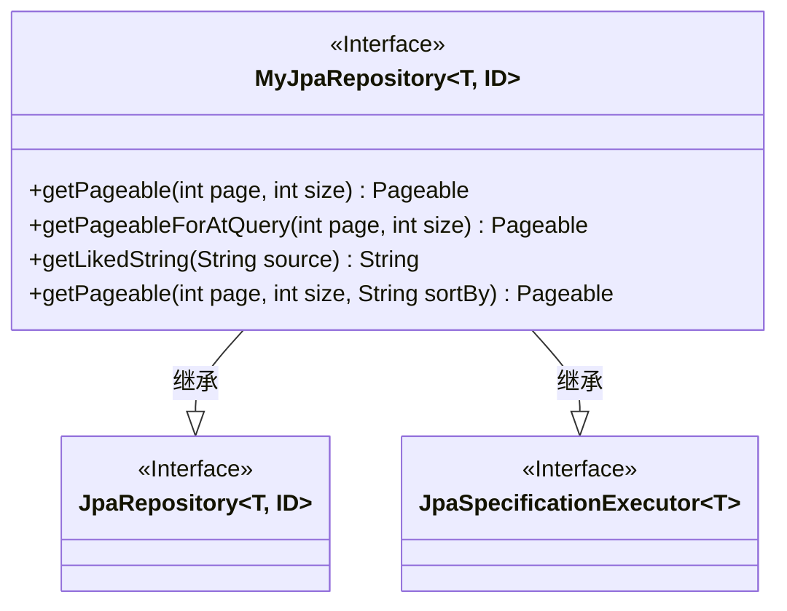
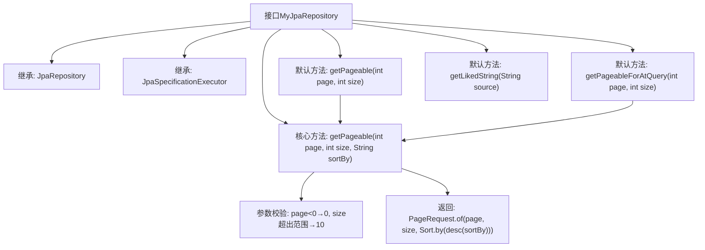

# 基础信息

|      |      |
|------|------|
| 名称 | MyJpaRepository |
| 编码语言 | .java |
| 代码路径 | WeFe/common/java/common-data-mysql/src/main/java/com/welab/wefe/common/data/mysql/repository/MyJpaRepository.java |
| 包名 | com.welab.wefe.common.data.mysql.repository |
| 依赖项 | ['com.welab.wefe.common.constant.Constant', 'org.springframework.data.domain.PageRequest', 'org.springframework.data.domain.Pageable', 'org.springframework.data.domain.Sort', 'org.springframework.data.jpa.repository.JpaRepository', 'org.springframework.data.jpa.repository.JpaSpecificationExecutor'] |
| 概述说明 | 自定义JPA仓库接口，提供分页查询和字符串模糊匹配的默认方法，支持动态排序和参数校验。 |

# 说明

该接口MyJpaRepository扩展了JpaRepository和JpaSpecificationExecutor，提供了默认方法用于分页查询和字符串处理。包含四个默认方法：getPageable根据页码、大小和排序字段生成分页对象，默认按created_time降序；getPageableForAtQuery调用getPageable并使用常量字段排序；getLikedString为字符串添加通配符；getPageable核心方法处理分页参数校验并创建分页请求对象。方法均包含参数校验逻辑，确保分页参数有效。

# 类列表 Class Summary

| 名称   | 类型  | 说明 |
|-------|------|-------------|
| MyJpaRepository | interface | MyJpaRepository接口扩展JpaRepository和JpaSpecificationExecutor，提供默认分页方法和模糊查询字符串处理。分页方法支持页码、大小和排序字段，自动处理边界值。 |

## 类 MyJpaRepository

|      |      |
|------|------|
| 访问范围 | public |
| 类型 | interface |
| 名称 | MyJpaRepository |
| 说明 | MyJpaRepository接口扩展JpaRepository和JpaSpecificationExecutor，提供默认分页方法和模糊查询字符串处理。分页方法支持页码、大小和排序字段，自动处理边界值。 |

### UML类图

该代码定义了一个泛型接口`MyJpaRepository<T, ID>`，它继承自Spring Data JPA的`JpaRepository`和`JpaSpecificationExecutor`接口。接口提供了四个默认方法，主要用于分页查询和字符串处理：`getPageable`方法创建分页请求对象并处理非法参数；`getPageableForAtQuery`是特定场景的分页方法；`getLikedString`生成模糊查询字符串。接口通过泛型支持不同类型实体和ID，体现了Spring Data JPA的扩展性设计。

### 内部方法调用关系图

该流程图展示了MyJpaRepository接口的继承关系和默认方法调用链。接口继承自JpaRepository和JpaSpecificationExecutor，提供四个默认方法，其中getPageable(page,size)和getPageableForAtQuery都调用核心方法getPageable(page,size,sortBy)。核心方法包含参数校验逻辑，最终构造分页请求对象。所有方法均围绕分页查询功能展开，通过方法重载提供不同排序字段的默认值。

### 字段列表 Field List

| 名称  | 类型  | 说明 |
|-------|-------|------|

### 方法列表

| 名称  | 类型  | 说明 |
|-------|-------|------|
| getPageableForAtQuery | Pageable | 该方法返回可分页对象，用于查询时指定页码、每页大小，默认按创建时间排序。 |
| getPageable | Pageable | 方法getPageable接收页码和大小参数，默认按创建时间排序返回分页对象。 |
| getLikedString | String | 方法getLikedString接收字符串source，返回前后添加百分号的新字符串。 |
| getPageable | Pageable | 方法getPageable接收页码、每页大小和排序字段，默认页码不小于0，每页大小限制在10-1000之间，返回按指定字段降序的分页请求对象。 |

