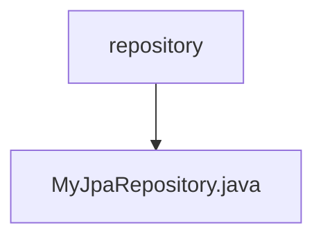

# 基础信息

|      |      |
|------|------|
| 名称 | repository |
| 编码语言 | .java |
| 代码路径 | WeFe/common/java/common-data-mysql/src/main/java/com/welab/wefe/common/data/mysql/repository |
| 包名 | docs.common.java.common-data-mysql.src.main.java.com.welab.wefe.common.data.mysql.repository |
| 概述说明 | 自定义JPA仓库接口，提供分页查询和字符串模糊匹配的默认方法，支持动态排序和参数校验。 |

# 说明

该接口MyJpaRepository扩展了JpaRepository和JpaSpecificationExecutor，提供了默认方法用于分页查询和字符串处理。包含四个默认方法：getPageable根据页码、大小和排序字段生成分页对象，默认按created_time降序；getPageableForAtQuery调用getPageable并使用常量字段排序；getLikedString为字符串添加通配符；getPageable核心方法处理分页参数校验并创建分页请求对象。方法均包含参数校验逻辑，确保分页参数有效。

### 包内部结构视图

该流程图展示了repository文件夹与MyJpaRepository.java文件之间的层级关系。repository作为父目录包含了一个具体的Java类文件MyJpaRepository.java，这种结构常见于Maven项目的repository层实现，用于定义数据访问接口。

# 文件列表

| 名称   | 类型  | 说明 |
|-------|------|-------------|
| [MyJpaRepository.java](MyJpaRepository.md) | file | 自定义JPA仓库接口，提供分页查询和字符串模糊匹配的默认方法，支持动态排序和参数校验。 |

