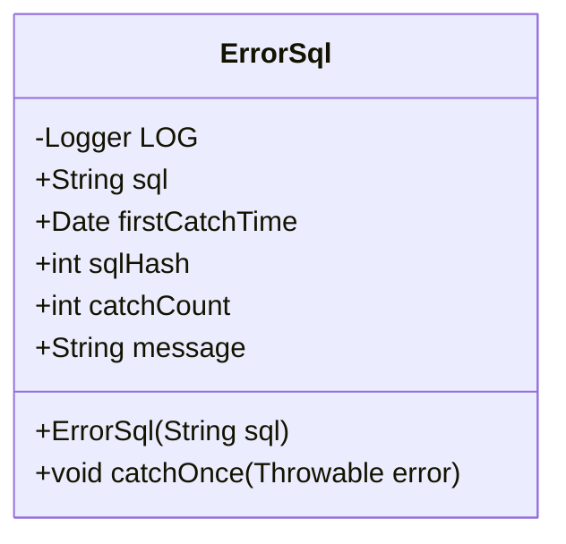
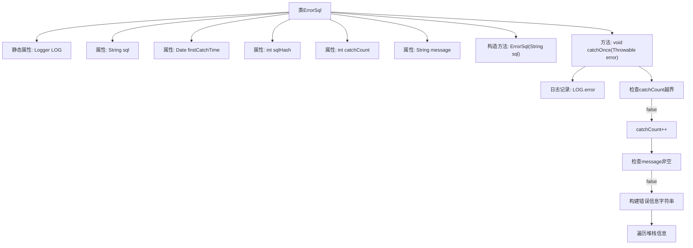

# 基础信息

|      |      |
|------|------|
| 名称 | ErrorSql |
| 编码语言 | .java |
| 代码路径 | WeFe/common/java/common-data-mysql/src/main/java/com/welab/wefe/common/data/mysql/sql_monitor/ErrorSql.java |
| 包名 | com.welab.wefe.common.data.mysql.sql_monitor |
| 依赖项 | ['org.slf4j.Logger', 'org.slf4j.LoggerFactory', 'java.util.Date'] |
| 概述说明 | ErrorSql类记录错误SQL信息，包括SQL语句、首次捕获时间、哈希值、捕获次数和错误详情。catchOnce方法捕获异常并更新错误信息和捕获次数。 |

# 说明

ErrorSql类用于记录SQL错误信息，包含SQL语句、首次捕获时间、SQL哈希值、捕获次数和错误消息。首次捕获时间默认为当前时间，SQL哈希值由SQL语句生成。catchOnce方法用于捕获错误，记录错误日志并增加捕获次数，若捕获次数超过最大值则停止。错误消息包含异常类名、消息和堆栈跟踪，仅在首次捕获时生成。

# 类列表 Class Summary

| 名称   | 类型  | 说明 |
|-------|------|-------------|
| ErrorSql | class | ErrorSql类记录错误SQL信息，包括SQL语句、首次捕获时间、哈希值、捕获次数和错误消息。catchOnce方法捕获错误并更新计数和消息。 |

## 类 ErrorSql

|      |      |
|------|------|
| 访问范围 | public |
| 类型 | class |
| 名称 | ErrorSql |
| 说明 | ErrorSql类记录错误SQL信息，包括SQL语句、首次捕获时间、哈希值、捕获次数和错误消息。catchOnce方法捕获错误并更新计数和消息。 |

### UML类图

这段代码定义了一个`ErrorSql`类，用于记录SQL执行错误的相关信息。类中包含SQL语句、首次捕获时间、SQL哈希值、捕获次数和错误消息等属性。`catchOnce`方法用于记录错误信息，包括异常类型、消息和堆栈跟踪，并通过日志记录错误。该类主要用于跟踪和分析SQL执行过程中出现的错误情况。

### 内部方法调用关系图

该流程图展示了ErrorSql类的结构和主要方法调用关系。类包含5个成员变量和2个核心方法，其中catchOnce方法实现了错误捕获的核心逻辑：先记录日志，然后检查计数器是否越界，未越界时递增计数，最后当message为空时构建包含异常类型、信息和堆栈跟踪的详细错误消息。流程通过条件判断控制不同分支的执行路径。

### 字段列表 Field List

| 名称  | 类型  | 说明 |
|-------|-------|------|
| message | String | 声明一个公开的字符串变量message。 |
| sqlHash | int | 变量sqlHash，类型为public int，用于存储SQL哈希值。 |
| firstCatchTime = new Date() | Date | 定义公共变量firstCatchTime，初始化为当前日期时间对象。 |
| sql | String | 定义了一个公开的字符串变量sql。 |
| catchCount | int | 变量catchCount记录捕获次数，类型为整型。 |
| LOG = LoggerFactory.getLogger(ErrorSql.class) | Logger | 定义ErrorSql类的私有静态日志常量LOG，使用LoggerFactory获取日志实例。 |

### 方法列表

| 名称  | 类型  | 说明 |
|-------|-------|------|
| catchOnce | void | 捕获SQL错误并记录日志，若未达到最大捕获次数且消息为空，则生成包含错误类和堆栈的详细消息。 |

