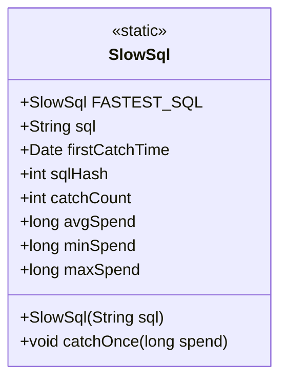
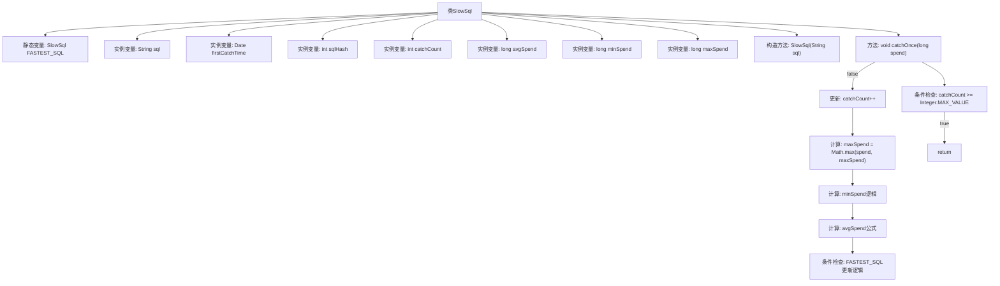

# 基础信息

|      |      |
|------|------|
| 名称 | SlowSql |
| 编码语言 | .java |
| 代码路径 | WeFe/common/java/common-data-mysql/src/main/java/com/welab/wefe/common/data/mysql/sql_monitor/SlowSql.java |
| 包名 | com.welab.wefe.common.data.mysql.sql_monitor |
| 依赖项 | ['java.util.Date'] |
| 概述说明 | SlowSql类记录慢SQL信息，包括SQL语句、首次捕获时间、哈希值、捕获次数、平均/最小/最大耗时。提供捕获方法更新统计并记录全局最快慢SQL。 |

# 说明

SlowSql类用于记录慢SQL查询的统计信息。该类包含静态变量FASTEST_SQL，用于记录所有慢SQL中平均耗时最短的实例。每个实例存储SQL语句字符串、首次捕获时间、SQL哈希值、捕获次数、平均耗时、最小耗时和最大耗时。构造函数初始化SQL语句和其哈希值。catchOnce方法用于更新捕获次数和耗时统计，包括最大、最小和平均耗时，并维护FASTEST_SQL全局变量。当捕获次数达到最大值时停止更新。

# 类列表 Class Summary

| 名称   | 类型  | 说明 |
|-------|------|-------------|
| SlowSql | class | SlowSql类记录慢SQL信息，包括SQL语句、首次捕获时间、哈希值、捕获次数、平均/最小/最大耗时。catchOnce方法更新统计并记录全局最快慢SQL。 |

## 类 SlowSql

|      |      |
|------|------|
| 访问范围 | public |
| 类型 | class |
| 名称 | SlowSql |
| 说明 | SlowSql类记录慢SQL信息，包括SQL语句、首次捕获时间、哈希值、捕获次数、平均/最小/最大耗时。catchOnce方法更新统计并记录全局最快慢SQL。 |

### UML类图

这段代码定义了一个SlowSql类，用于记录慢SQL查询的统计信息。类中包含静态变量FASTEST_SQL记录平均耗时最短的慢SQL实例，实例变量包括SQL语句、首次捕获时间、哈希值、捕获次数以及各种耗时统计（平均、最小、最大）。catchOnce方法用于更新SQL执行统计，并维护FASTEST_SQL的引用。该类主要用于监控和优化数据库查询性能。

### 内部方法调用关系图

该流程图展示了SlowSql类的完整结构，包含静态变量、实例变量、构造方法和核心业务方法catchOnce。catchOnce方法通过5个步骤处理SQL性能数据：先检查捕获次数上限，然后更新计数、最大耗时、最小耗时和平均耗时，最后维护全局最快慢SQL记录。所有耗时计算均采用防溢出设计，且通过条件判断确保数据有效性。流程图清晰呈现了类成员关系和方法内部逻辑分支。

### 字段列表 Field List

| 名称  | 类型  | 说明 |
|-------|-------|------|
| FASTEST_SQL | SlowSql | 声明一个公共静态SlowSql类型的常量FASTEST_SQL。 |
| avgSpend | long | 公共长整型变量，表示平均花费。 |
| sqlHash | int | 变量sqlHash，整型，用于存储SQL哈希值。 |
| firstCatchTime = new Date() | Date | 定义公共变量firstCatchTime，初始化为当前日期时间对象。 |
| sql | String | 声明一个公共字符串变量sql，用于存储SQL语句。 |
| maxSpend | long | 声明一个公共长整型变量maxSpend，用于存储最大花费值。 |
| minSpend | long | 定义长整型变量minSpend，表示最小花费。 |
| catchCount | int | 整型变量catchCount用于记录捕获次数。 |

### 方法列表

| 名称  | 类型  | 说明 |
|-------|-------|------|
| catchOnce | void | 方法catchOnce统计SQL执行时间：更新最大、最小和平均耗时，并记录全局最快SQL。若catchCount超限则直接返回。 |

