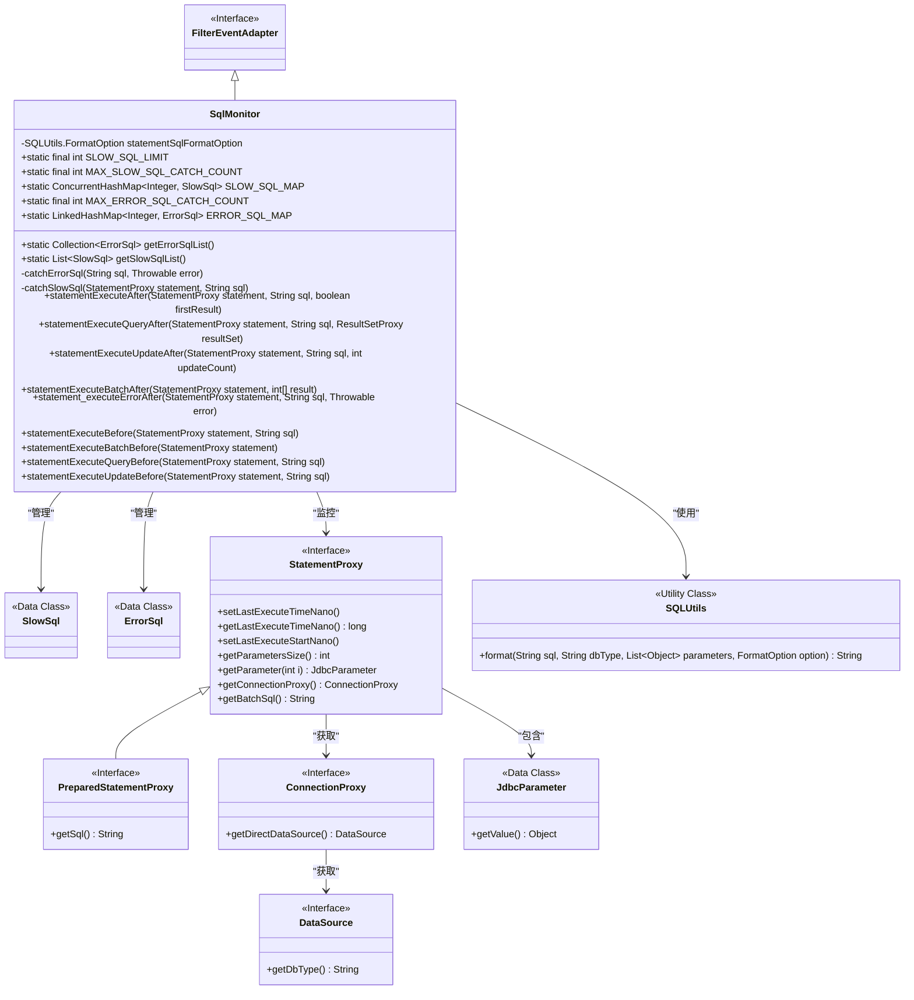

# 基础信息

|      |      |
|------|------|
| 名称 | SqlMonitor |
| 编码语言 | .java |
| 代码路径 | WeFe/common/java/common-data-mysql/src/main/java/com/welab/wefe/common/data/mysql/sql_monitor/SqlMonitor.java |
| 包名 | com.welab.wefe.common.data.mysql.sql_monitor |
| 依赖项 | ['com.alibaba.druid.filter.FilterEventAdapter', 'com.alibaba.druid.proxy.jdbc.JdbcParameter', 'com.alibaba.druid.proxy.jdbc.PreparedStatementProxy', 'com.alibaba.druid.proxy.jdbc.ResultSetProxy', 'com.alibaba.druid.proxy.jdbc.StatementProxy', 'com.alibaba.druid.sql.SQLUtils', 'java.util', 'java.util.concurrent.ConcurrentHashMap'] |
| 概述说明 | SqlMonitor类监控SQL执行，捕获慢SQL（耗时≥100ms）和失败SQL，上限各100条。慢SQL按耗时排序，失败SQL记录错误信息。通过钩子方法在SQL执行前后记录时间并触发捕获逻辑。 |

# 说明

SqlMonitor类继承自FilterEventAdapter，用于监控SQL执行情况。它定义了慢SQL和执行失败SQL的判定标准，慢SQL耗时阈值为100毫秒，最大捕获数量均为100条。使用ConcurrentHashMap存储慢SQL，LinkedHashMap存储失败SQL。提供获取慢SQL和失败SQL列表的方法，慢SQL列表按平均耗时降序排列。通过重写多个statement执行前后的方法，捕获慢SQL和失败SQL。慢SQL捕获时会检查耗时是否达标，并维护数量上限；失败SQL捕获时会对参数化SQL进行格式化处理。所有SQL执行时间均通过纳秒级计时统计。

# 类列表 Class Summary

| 名称   | 类型  | 说明 |
|-------|------|-------------|
| SqlMonitor | class | SqlMonitor类用于监控SQL执行，捕获慢SQL（耗时超过100ms）和失败SQL，上限各100条。慢SQL按耗时排序，失败SQL记录错误信息。通过重写StatementProxy方法实现监控。 |

## 类 SqlMonitor

|      |      |
|------|------|
| 访问范围 | public |
| 类型 | class |
| 名称 | SqlMonitor |
| 说明 | SqlMonitor类用于监控SQL执行，捕获慢SQL（耗时超过100ms）和失败SQL，上限各100条。慢SQL按耗时排序，失败SQL记录错误信息。通过重写StatementProxy方法实现监控。 |

### UML类图

这段代码描述了一个SQL监控系统，SqlMonitor类继承自FilterEventAdapter接口，主要用于捕获和分析慢SQL和执行失败的SQL。它通过StatementProxy监控SQL执行前后的时间，使用ConcurrentHashMap和LinkedHashMap分别存储慢SQL和错误SQL，并通过SQLUtils格式化SQL语句。系统能自动清理不满足条件的记录，确保存储的SQL都是最慢或最关键的。

### 内部方法调用关系图

```mermaid
graph TD
    A["类SqlMonitor"]
    B["属性: FormatOption statementSqlFormatOption"]
    C["常量: SLOW_SQL_LIMIT=100"]
    D["常量: MAX_SLOW_SQL_CATCH_COUNT=100"]
    E["静态集合: SLOW_SQL_MAP<SlowSql>"]
    F["常量: MAX_ERROR_SQL_CATCH_COUNT=100"]
    G["静态集合: ERROR_SQL_MAP<ErrorSql>"]
    H["方法: getErrorSqlList()"]
    I["方法: getSlowSqlList()"]
    J["私有方法: catchErrorSql(sql, error)"]
    K["私有方法: catchSlowSql(statement, sql)"]
    L["重写方法: statementExecuteAfter()"]
    M["重写方法: statementExecuteQueryAfter()"]
    N["重写方法: statementExecuteUpdateAfter()"]
    O["重写方法: statementExecuteBatchAfter()"]
    P["重写方法: statement_executeErrorAfter()"]
    Q["重写方法: statementExecuteBefore()"]
    R["重写方法: statementExecuteBatchBefore()"]
    S["重写方法: statementExecuteQueryBefore()"]
    T["重写方法: statementExecuteUpdateBefore()"]
    
    A --> B
    A --> C
    A --> D
    A --> E
    A --> F
    A --> G
    A --> H
    A --> I
    A --> J
    A --> K
    A --> L
    A --> M
    A --> N
    A --> O
    A --> P
    A --> Q
    A --> R
    A --> S
    A --> T
    
    L --> K
    M --> K
    N --> K
    O --> K
    P --> J
```

这段代码是一个SQL监控类，主要用于捕获和分析慢SQL和执行失败的SQL。通过静态集合存储SQL记录，提供排序和过滤功能。核心逻辑包括：在执行前后记录时间计算耗时，根据阈值判断是否为慢SQL；对错误SQL进行格式化后存储；通过多个重写方法覆盖不同SQL操作类型（查询/更新/批处理）。采用线程安全的集合存储数据，并实现容量控制机制防止内存溢出。

### 字段列表 Field List

| 名称  | 类型  | 说明 |
|-------|-------|------|
| ERROR_SQL_MAP = new LinkedHashMap<>() | LinkedHashMap<Integer, ErrorSql> | 静态LinkedHashMap变量ERROR_SQL_MAP，键为Integer，值为ErrorSql对象，用于存储错误SQL信息。 |
| SLOW_SQL_MAP = new ConcurrentHashMap<>() | ConcurrentHashMap<Integer, SlowSql> | 静态并发哈希映射，键为整数，值为慢SQL对象，用于线程安全存储。 |
| MAX_SLOW_SQL_CATCH_COUNT = 100 | int | 私有静态常量MAX_SLOW_SQL_CATCH_COUNT值为100，用于限制慢SQL捕获数量。 |
| SLOW_SQL_LIMIT = 100 | int | 定义慢SQL阈值常量，值为100。 |
| statementSqlFormatOption = new SQLUtils.FormatOption(false, true) | SQLUtils.FormatOption | 私有变量statementSqlFormatOption初始化为SQLUtils.FormatOption实例，参数为false和true。 |
| MAX_ERROR_SQL_CATCH_COUNT = 100 | int | 私有静态常量MAX_ERROR_SQL_CATCH_COUNT，值为100，表示SQL错误捕获的最大次数限制。 |

### 方法列表

| 名称  | 类型  | 说明 |
|-------|-------|------|
| getErrorSqlList | Collection<ErrorSql> | 获取错误SQL列表的方法，返回ERROR_SQL_MAP中的所有值。 |
| getSlowSqlList | List<SlowSql> | 该方法获取慢SQL列表，按平均耗时降序排序后返回。 |
| statementExecuteBatchAfter | void | 方法statementExecuteBatchAfter在批处理执行后触发，获取SQL语句并捕获慢查询。如果是PreparedStatementProxy则取getSql，否则取getBatchSql。 |
| statementExecuteQueryAfter | void | 方法重写，执行查询后捕获慢SQL，参数为StatementProxy、SQL语句和ResultSetProxy。 |
| statementExecuteAfter | void | 方法重写，执行SQL后捕获慢查询，参数为Statement代理对象、SQL语句和是否首次结果。 |
| catchErrorSql | void | 方法catchErrorSql捕获错误SQL，若已存在相同哈希值则更新错误，否则在未达上限时新增记录。 |
| catchSlowSql | void | 方法捕获慢SQL，计算执行时间，若未达慢SQL标准则跳过。若SQL数量超限且当前SQL不够慢则跳过，否则移除最不慢的SQL后记录。更新SQL执行时间和统计。 |
| statementExecuteUpdateAfter | void | 方法重写，执行SQL更新后捕获慢查询，参数含Statement代理、SQL语句和更新计数。 |
| statement_executeErrorAfter | void | 方法statement_executeErrorAfter在SQL执行出错后处理：获取参数并格式化SQL，最后捕获错误SQL和异常。 |
| statementExecuteBefore | void | 方法在执行SQL前记录开始时间。 |
| statementExecuteBatchBefore | void | 方法重写，在批处理执行前记录Statement开始时间。 |
| statementExecuteQueryBefore | void | 方法重写，在执行查询前记录Statement的开始时间。 |
| statementExecuteUpdateBefore | void | 方法在执行SQL更新前记录开始时间。 |

