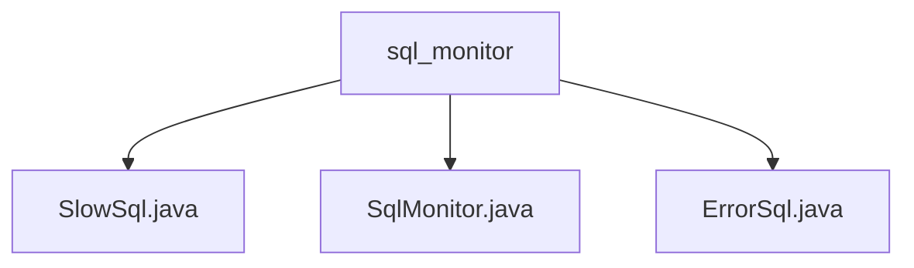

# 基础信息

|      |      |
|------|------|
| 名称 | sql_monitor |
| 编码语言 | .java |
| 代码路径 | WeFe/common/java/common-data-mysql/src/main/java/com/welab/wefe/common/data/mysql/sql_monitor |
| 包名 | docs.common.java.common-data-mysql.src.main.java.com.welab.wefe.common.data.mysql.sql_monitor |
| 概述说明 | SlowSql类记录慢SQL统计信息，包括SQL语句、耗时等，维护最快SQL实例。SqlMonitor类监控SQL执行，捕获慢SQL和失败SQL，设定阈值和上限。ErrorSql类记录SQL错误信息，包括错误消息和捕获次数。 |

# 说明

## 概述  
该模块专注于SQL执行监控，核心职责是捕获慢SQL和失败SQL，并进行统计分析。接口规范包括：慢SQL判定阈值100ms，最大捕获量100条；失败SQL需格式化参数化语句并记录错误详情。关键数据结构包含SlowSql（记录耗时统计）、ErrorSql（存储错误信息）和两个ConcurrentHashMap存储实例。外部依赖仅为Java标准库。例如SlowSql维护全局最快SQL记录，ErrorSql保存异常堆栈。

## 主要业务场景  
模块通过FilterEventAdapter拦截SQL执行，实现全链路监控。业务流程为：SQL执行前开始计时，结束后判定是否慢查询或失败，分别更新SlowSql或ErrorSql实例。交互模式类似事件总线，通过回调方法触发统计逻辑。典型应用包括性能优化（分析慢SQL模式）和故障排查（追踪错误SQL）。例如SqlMonitor重写statement相关方法，实现纳秒级耗时统计和上限控制。

### 包内部结构视图

该流程图展示了sql_monitor目录下的三个Java文件：SlowSql.java、SqlMonitor.java和ErrorSql.java。这三个文件都直接位于sql_monitor目录下，属于同一层级，没有更深层次的嵌套结构。每个文件都与sql_monitor目录形成直接的父子关系，清晰地反映了项目中的文件组织结构。

# 文件列表

| 名称   | 类型  | 说明 |
|-------|------|-------------|
| [SlowSql.java](SlowSql.md) | file | SlowSql类记录慢SQL信息，包括SQL语句、首次捕获时间、哈希值、捕获次数、平均/最小/最大耗时。提供捕获方法更新统计并记录全局最快慢SQL。 |
| [SqlMonitor.java](SqlMonitor.md) | file | SqlMonitor类监控SQL执行，捕获慢SQL（耗时≥100ms）和失败SQL，上限各100条。慢SQL按耗时排序，失败SQL记录错误信息。通过钩子方法在SQL执行前后记录时间并触发捕获逻辑。 |
| [ErrorSql.java](ErrorSql.md) | file | ErrorSql类记录错误SQL信息，包括SQL语句、首次捕获时间、哈希值、捕获次数和错误详情。catchOnce方法捕获异常并更新错误信息和捕获次数。 |

