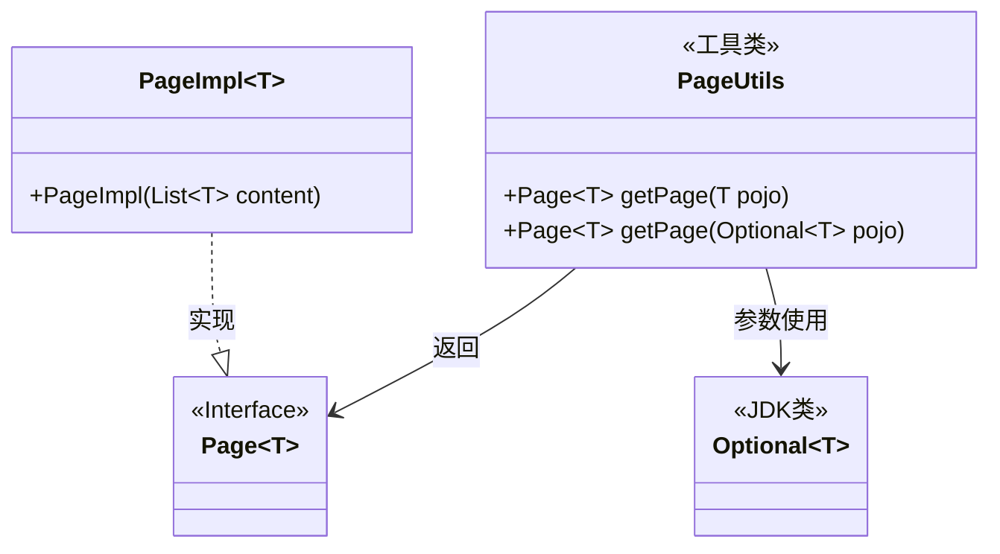
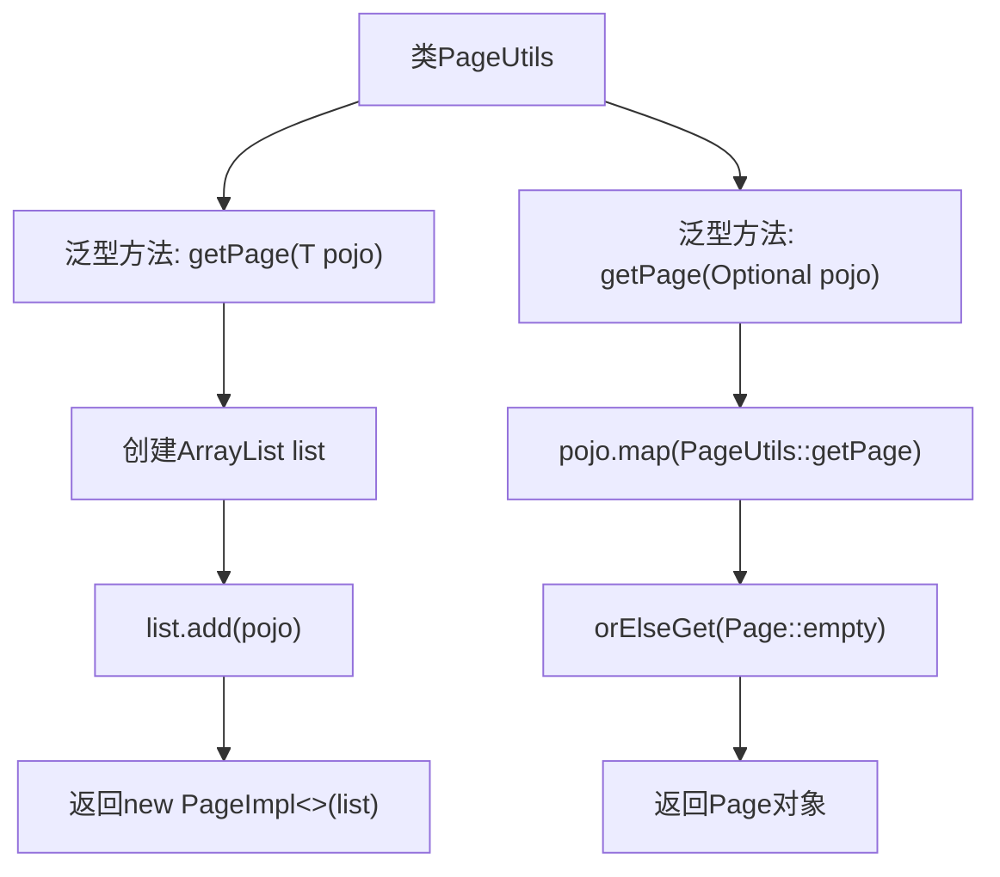

# 基础信息

|      |      |
|------|------|
| 名称 | PageUtils |
| 编码语言 | .java |
| 代码路径 | WeFe/common/java/common-data-mysql/src/main/java/com/welab/wefe/common/data/mysql/utils/PageUtils.java |
| 包名 | com.welab.wefe.common.data.mysql.utils |
| 依赖项 | ['org.springframework.data.domain.Page', 'org.springframework.data.domain.PageImpl', 'java.util.ArrayList', 'java.util.List', 'java.util.Optional'] |
| 概述说明 | PageUtils类提供两个静态方法，将单个对象或Optional对象转换为分页对象，便于统一ID查询。 |

# 说明

PageUtils类提供了两个静态方法用于获取分页对象。第一个方法getPage接受单个对象参数，将其封装到列表中并返回包含该列表的PageImpl对象。第二个方法getPage接受Optional对象参数，若Optional有值则调用第一个方法返回分页对象，否则返回空分页对象。这两个方法主要用于按ID查询时统一处理单个对象的分页情况。

# 类列表 Class Summary

| 名称   | 类型  | 说明 |
|-------|------|-------------|
| PageUtils | class | PageUtils类提供两个静态方法，将单个对象或Optional对象转换为分页对象，便于统一ID查询。 |

## 类 PageUtils

|      |      |
|------|------|
| 访问范围 | public |
| 类型 | class |
| 名称 | PageUtils |
| 说明 | PageUtils类提供两个静态方法，将单个对象或Optional对象转换为分页对象，便于统一ID查询。 |

### UML类图

这段代码展示了一个分页工具类PageUtils，提供了两种静态方法将单个对象或Optional对象转换为Page分页对象。类图中清晰呈现了PageUtils与Page接口、PageImpl实现类以及JDK的Optional类之间的关系。工具类通过泛型方法支持任意类型T，其中PageImpl是Spring Data Commons中Page接口的标准实现，用于包装单条数据为分页结构。Optional的map操作实现了空安全转换，体现了对边缘情况的处理。

### 内部方法调用关系图

这段代码展示了一个PageUtils工具类，包含两个泛型方法用于创建分页对象。第一个方法getPage(T pojo)将单个对象包装成List后创建PageImpl分页实例；第二个方法getPage(Optional<T> pojo)处理可能为空的可选对象，通过Optional的map操作调用第一个方法，为空时返回空分页。流程图清晰展现了两个方法的内部调用关系和数据处理流程，体现了从简单对象到分页对象的转换逻辑。

### 字段列表 Field List

| 名称  | 类型  | 说明 |
|-------|-------|------|

### 方法列表

| 名称  | 类型  | 说明 |
|-------|-------|------|
| getPage | Page<T> | 静态方法getPage接收Optional<T>参数，若存在值则转换为Page对象，否则返回空Page。 |
| getPage | Page<T> | 静态方法getPage接收泛型对象pojo，将其封装为单元素列表并返回PageImpl分页对象。 |

