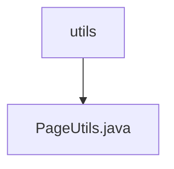

# 基础信息

|      |      |
|------|------|
| 名称 | utils |
| 编码语言 | .java |
| 代码路径 | WeFe/common/java/common-data-mysql/src/main/java/com/welab/wefe/common/data/mysql/utils |
| 包名 | docs.common.java.common-data-mysql.src.main.java.com.welab.wefe.common.data.mysql.utils |
| 概述说明 | PageUtils类提供两个静态方法，将单个对象或Optional对象转换为分页对象，便于统一ID查询。 |

# 说明

PageUtils类提供了两个静态方法用于获取分页对象。第一个方法getPage接受单个对象参数，将其封装到列表中并返回包含该列表的PageImpl对象。第二个方法getPage接受Optional对象参数，若Optional有值则调用第一个方法返回分页对象，否则返回空分页对象。这两个方法主要用于按ID查询时统一处理单个对象的分页情况。

### 包内部结构视图

该流程图展示了WeFe项目中common-data-mysql模块下的utils工具包结构，其中包含一个核心分页工具类PageUtils.java。utils作为父节点，PageUtils.java作为其子节点，体现了简单的单层文件结构关系，适用于处理MySQL数据库分页操作的实用工具类。

# 文件列表

| 名称   | 类型  | 说明 |
|-------|------|-------------|
| [PageUtils.java](PageUtils.md) | file | PageUtils类提供两个静态方法，将单个对象或Optional对象转换为分页对象，便于统一ID查询。 |

