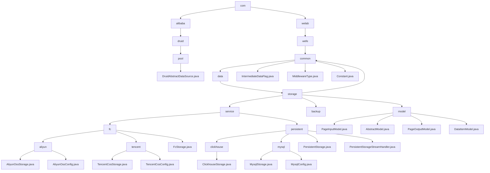

# 基础信息

|      |      |
|------|------|
| 名称 | com |
| 编码语言 | .java |
| 代码路径 | WeFe/common/java/common-data-storage/src/main/java/com |
| 包名 | docs.common.java.common-data-storage.src.main.java.com |
| 概述说明 | DruidAbstractDataSource是Druid连接池核心抽象类，提供连接池配置、监控、线程安全等基础功能。多云存储模块支持异构数据库统一操作，包含分片、分页、流处理等能力，依赖主流云SDK和JDBC驱动。 |

# 说明

## 概述  
该模块核心职责是实现跨云平台与多数据库的统一数据存储及管理，集成连接池控制与动态分片能力。DruidAbstractDataSource作为连接池基类，提供线程安全配置（如maxActive控制连接数）和JMX监控；数据存储模块则封装CRUD操作与分页查询，类似适配器模式。关键数据结构包括分片策略、连接配置（如ClickhouseConfig）和泛型键值对。外部依赖含Druid连接池、云平台SDK（阿里云/腾讯云）及JDBC驱动。例如Druid通过testWhileIdle检测连接有效性，数据模块用hashKeyToPartition实现动态分片。

## 主要业务场景  
模块适用于混合云存储与异构数据库场景，典型流程为配置初始化→分片/序列化→多线程或流式处理→监控回调。Druid连接池支持高并发请求管理，数据模块提供分页查询（如PageInputModel）和键值存取（如DataItemModel）。交互模式为配置驱动，例如阿里云OTS按哈希分区，MySQL通过分页参数查询。集成案例覆盖从Druid连接池初始化到getByStream流式处理，形成端到端数据解决方案。

### 包内部结构视图

该流程图展示了WeFe项目中common-data-storage模块的Java包结构。从根目录com开始，分为alibaba和welab两个主要分支。alibaba分支包含Druid连接池相关类，welab分支则详细展示了数据存储服务的层级结构，包括通用组件、存储服务（含阿里云和腾讯云实现）、持久化存储（如MySQL和ClickHouse）以及数据模型等子模块。

# 文件列表

| 名称   | 类型  | 说明 |
|-------|------|-------------|
| [welab](welab/_module.md) | package | 模块1：定义数据存储通用配置，含序列化模式、中间件类型及数据库连接，依赖MySQL驱动。  模块2：统一多云平台与多数据库存储，支持批量操作、动态分片，依赖云SDK和JDBC。  模块3：提供分页查询基础模型，含分页输入输出及键值对结构，适用于日志等场景。 |
| [alibaba](alibaba/_module.md) | package | DruidAbstractDataSource是Druid连接池的抽象基类，实现了DataSource接口和JMX管理功能。它定义了连接池的核心配置参数，包括连接数控制（initialSize/maxActive/minIdle）、超时设置（maxWait）、验证查询（validationQuery）、空闲检测（timeBetweenEvictionRunsMillis）等。支持过滤器链、SQL监控、连接泄漏检测等功能，通过原子变量统计连接和语句的执行情况。 |

