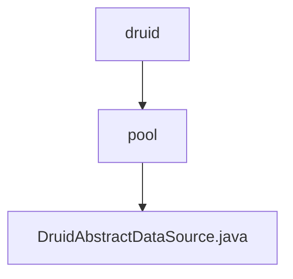

# 基础信息

|      |      |
|------|------|
| 名称 | druid |
| 编码语言 | .java |
| 代码路径 | WeFe/common/java/common-data-storage/src/main/java/com/alibaba/druid |
| 包名 | docs.common.java.common-data-storage.src.main.java.com.alibaba.druid |
| 概述说明 | DruidAbstractDataSource是Druid连接池的抽象基类，实现了DataSource接口和JMX管理功能。它定义了连接池的核心配置参数，包括连接数控制（initialSize/maxActive/minIdle）、超时设置（maxWait）、验证查询（validationQuery）、空闲检测（timeBetweenEvictionRunsMillis）等。支持过滤器链、SQL监控、连接泄漏检测等功能，通过原子变量统计连接和语句的执行情况。 |

# 说明

DruidAbstractDataSource是一个抽象类，实现了DruidAbstractDataSourceMBean、DataSource、DataSourceProxy和Serializable接口。它作为Druid连接池的核心基类，封装了大量连接池配置参数和运行时状态指标。主要特性包括：连接池大小控制（initialSize/maxActive/minIdle）、连接获取超时（maxWait）、连接有效性检测（validationQuery/testWhileIdle）、空闲连接回收策略（timeBetweenEvictionRunsMillis/minEvictableIdleTimeMillis）、监控统计（executeCount/commitCount/rollbackCount）、过滤器机制（filters）、异常连接处理（exceptionSorter）等。类中定义了连接创建、销毁、验证的核心流程，并通过原子变量和锁机制保证线程安全。同时支持JMX监控，提供丰富的运行时统计信息。子类需实现具体的连接池管理逻辑。

### 包内部结构视图

该流程图展示了Druid数据库连接池模块的层级结构。根节点为druid目录，其下包含pool子目录，pool目录中包含核心类文件DruidAbstractDataSource.java。这种结构体现了从基础包到具体实现类的清晰层次关系，符合Java项目常见的包组织方式。

# 文件列表

| 名称   | 类型  | 说明 |
|-------|------|-------------|
| [pool](pool/_module.md) | package | DruidAbstractDataSource是Druid连接池的抽象基类，实现了DataSource接口和JMX管理功能。它定义了连接池的核心配置参数，包括连接数控制（initialSize/maxActive/minIdle）、超时设置（maxWait）、验证查询（validationQuery）、空闲检测（timeBetweenEvictionRunsMillis）等。支持过滤器链、SQL监控、连接泄漏检测等功能，通过原子变量统计连接和语句的执行情况。 |

