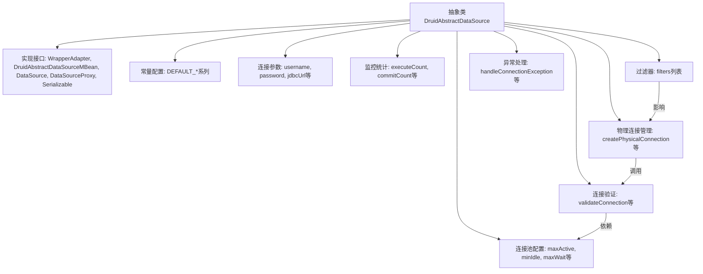
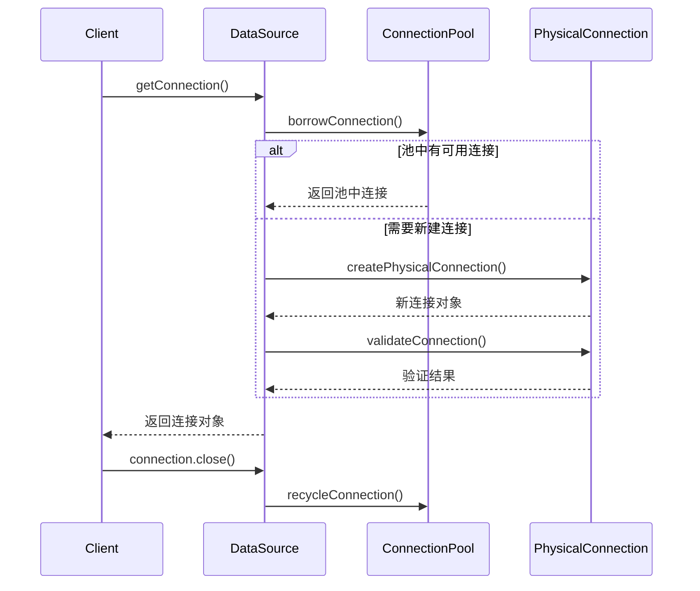

# 基础信息

|      |      |
|------|------|
| 名称 | DruidAbstractDataSource |
| 编码语言 | .java |
| 代码路径 | WeFe/common/java/common-data-storage/src/main/java/com/alibaba/druid/pool/DruidAbstractDataSource.java |
| 包名 | com.alibaba.druid.pool |
| 依赖项 | ['com.alibaba.druid.DruidRuntimeException', 'com.alibaba.druid.filter.Filter', 'com.alibaba.druid.filter.FilterChainImpl', 'com.alibaba.druid.filter.FilterManager', 'com.alibaba.druid.pool.vendor.NullExceptionSorter', 'com.alibaba.druid.proxy.jdbc.DataSourceProxy', 'com.alibaba.druid.proxy.jdbc.TransactionInfo', 'com.alibaba.druid.stat.JdbcDataSourceStat', 'com.alibaba.druid.stat.JdbcSqlStat', 'com.alibaba.druid.stat.JdbcStatManager', 'com.alibaba.druid.support.logging.Log', 'com.alibaba.druid.support.logging.LogFactory', 'com.alibaba.druid.util', 'javax.management.JMException', 'javax.management.ObjectName', 'javax.management.openmbean.CompositeDataSupport', 'javax.security.auth.callback.NameCallback', 'javax.security.auth.callback.PasswordCallback', 'javax.sql.DataSource', 'java.io.PrintWriter', 'java.io.Serializable', 'java.sql', 'java.util.Date', 'java.util', 'java.util.concurrent.CopyOnWriteArrayList', 'java.util.concurrent.ScheduledExecutorService', 'java.util.concurrent.atomic.AtomicIntegerFieldUpdater', 'java.util.concurrent.atomic.AtomicLongFieldUpdater', 'java.util.concurrent.locks.Condition', 'java.util.concurrent.locks.ReentrantLock', 'java.util.logging.Logger'] |
| 概述说明 | DruidAbstractDataSource是Druid连接池的抽象基类，实现了DataSource接口和JMX管理功能。它定义了连接池的核心配置参数，包括连接数控制（initialSize/maxActive/minIdle）、超时设置（maxWait）、验证查询（validationQuery）、空闲检测（timeBetweenEvictionRunsMillis）等。支持过滤器链、SQL监控、连接泄漏检测等功能，通过原子变量统计连接和语句的执行情况。 |

# 说明

DruidAbstractDataSource是一个抽象类，实现了DruidAbstractDataSourceMBean、DataSource、DataSourceProxy和Serializable接口。它作为Druid连接池的核心基类，封装了大量连接池配置参数和运行时状态指标。主要特性包括：连接池大小控制（initialSize/maxActive/minIdle）、连接获取超时（maxWait）、连接有效性检测（validationQuery/testWhileIdle）、空闲连接回收策略（timeBetweenEvictionRunsMillis/minEvictableIdleTimeMillis）、监控统计（executeCount/commitCount/rollbackCount）、过滤器机制（filters）、异常连接处理（exceptionSorter）等。类中定义了连接创建、销毁、验证的核心流程，并通过原子变量和锁机制保证线程安全。同时支持JMX监控，提供丰富的运行时统计信息。子类需实现具体的连接池管理逻辑。

# 类列表 Class Summary

| 名称   | 类型  | 说明 |
|-------|------|-------------|
| DruidAbstractDataSource | class | DruidAbstractDataSource是Druid连接池的抽象基类，实现了DataSource接口及JMX管理功能。它定义了连接池核心配置参数如最大连接数、最小空闲数、验证查询等，并管理连接创建、验证、回收等逻辑。支持过滤器扩展、监控统计及故障处理机制，提供丰富的性能指标与状态监控接口。 |


## 类 DruidAbstractDataSource

|      |      |
|------|------|
| 访问范围 | public abstract |
| 类型 | class |
| 名称 | DruidAbstractDataSource |
| 说明 | DruidAbstractDataSource是Druid连接池的抽象基类，实现了DataSource接口及JMX管理功能。它定义了连接池核心配置参数如最大连接数、最小空闲数、验证查询等，并管理连接创建、验证、回收等逻辑。支持过滤器扩展、监控统计及故障处理机制，提供丰富的性能指标与状态监控接口。 |


### UML类图

```mermaid
classDiagram
    class DruidAbstractDataSource {
        <<abstract>>
        -serialVersionUID: long = 1L
        -LOG: Log
        -DEFAULT_*: static final int/long/boolean/String
        -volatile defaultAutoCommit: boolean
        -volatile defaultReadOnly: Boolean
        -volatile defaultTransactionIsolation: Integer
        -volatile defaultCatalog: String
        -name: String
        -volatile username: String
        -volatile password: String
        -volatile jdbcUrl: String
        -volatile driverClass: String
        -volatile driverClassLoader: ClassLoader
        -volatile connectProperties: Properties
        -volatile passwordCallback: PasswordCallback
        -volatile userCallback: NameCallback
        -volatile initialSize: int
        -volatile maxActive: int
        -volatile minIdle: int
        -volatile maxIdle: int
        -volatile maxWait: long
        -notFullTimeoutRetryCount: int
        -volatile validationQuery: String
        -volatile validationQueryTimeout: int
        -volatile testOnBorrow: boolean
        -volatile testOnReturn: boolean
        -volatile testWhileIdle: boolean
        -volatile poolPreparedStatements: boolean
        -volatile sharePreparedStatements: boolean
        -volatile maxPoolPreparedStatementPerConnectionSize: int
        -volatile inited: boolean
        -volatile initExceptionThrow: boolean
        -logWriter: PrintWriter
        -filters: List~Filter~
        -clearFiltersEnable: boolean
        -volatile exceptionSorter: ExceptionSorter
        -driver: Driver
        -volatile queryTimeout: int
        -volatile transactionQueryTimeout: int
        -createTimespan: long
        -volatile maxWaitThreadCount: int
        -volatile accessToUnderlyingConnectionAllowed: boolean
        -volatile timeBetweenEvictionRunsMillis: long
        -volatile numTestsPerEvictionRun: int
        -volatile minEvictableIdleTimeMillis: long
        -volatile maxEvictableIdleTimeMillis: long
        -volatile keepAliveBetweenTimeMillis: long
        -volatile phyTimeoutMillis: long
        -volatile phyMaxUseCount: long
        -volatile removeAbandoned: boolean
        -volatile removeAbandonedTimeoutMillis: long
        -volatile logAbandoned: boolean
        -volatile maxOpenPreparedStatements: int
        -volatile connectionInitSqls: List~String~
        -volatile dbType: String
        -volatile timeBetweenConnectErrorMillis: long
        -volatile validConnectionChecker: ValidConnectionChecker
        -activeConnections: Map~DruidPooledConnection, Object~
        -PRESENT: static final Object
        -id: long
        -connectionErrorRetryAttempts: int
        -breakAfterAcquireFailure: boolean
        -transactionThresholdMillis: long
        -createdTime: Date
        -initedTime: Date
        -volatile errorCount: long
        -volatile dupCloseCount: long
        -volatile startTransactionCount: long
        -volatile commitCount: long
        -volatile rollbackCount: long
        -volatile cachedPreparedStatementHitCount: long
        -volatile preparedStatementCount: long
        -volatile closedPreparedStatementCount: long
        -volatile cachedPreparedStatementCount: long
        -volatile cachedPreparedStatementDeleteCount: long
        -volatile cachedPreparedStatementMissCount: long
        -transactionHistogram: Histogram
        -dupCloseLogEnable: boolean
        -objectName: ObjectName
        -volatile executeCount: long
        -volatile executeQueryCount: long
        -volatile executeUpdateCount: long
        -volatile executeBatchCount: long
        -volatile createError: Throwable
        -volatile lastError: Throwable
        -volatile lastErrorTimeMillis: long
        -volatile lastCreateError: Throwable
        -volatile lastCreateErrorTimeMillis: long
        -volatile lastCreateStartTimeMillis: long
        -isOracle: boolean
        -isMySql: boolean
        -useOracleImplicitCache: boolean
        -lock: ReentrantLock
        -notEmpty: Condition
        -empty: Condition
        -activeConnectionLock: ReentrantLock
        -volatile createErrorCount: int
        -volatile creatingCount: int
        -volatile directCreateCount: int
        -volatile createCount: long
        -volatile destroyCount: long
        -volatile createStartNanos: long
        -useUnfairLock: Boolean
        -useLocalSessionState: boolean
        -timeBetweenLogStatsMillis: long
        -statLogger: DruidDataSourceStatLogger
        -asyncCloseConnectionEnable: boolean
        -maxCreateTaskCount: int
        -failFast: boolean
        -volatile failContinuous: int
        -volatile failContinuousTimeMillis: long
        -destroyScheduler: ScheduledExecutorService
        -createScheduler: ScheduledExecutorService
        -initVariants: boolean
        -initGlobalVariants: boolean
        -volatile onFatalError: boolean
        -volatile onFatalErrorMaxActive: int
        -volatile fatalErrorCount: int
        -volatile fatalErrorCountLastShrink: int
        -volatile lastFatalErrorTimeMillis: long
        -volatile lastFatalErrorSql: String
        -volatile lastFatalError: Throwable
        -volatile connectionIdSeed: long
        -volatile statementIdSeed: long
        -volatile resultSetIdSeed: long
        -volatile transactionIdSeed: long
        -volatile metaDataIdSeed: long

        +DruidAbstractDataSource(boolean lockFair)
        +isUseLocalSessionState(): boolean
        +setUseLocalSessionState(boolean): void
        +getStatLogger(): DruidDataSourceStatLogger
        +setStatLoggerClassName(String): void
        +setStatLogger(DruidDataSourceStatLogger): void
        +getTimeBetweenLogStatsMillis(): long
        +setTimeBetweenLogStatsMillis(long): void
        +isOracle(): boolean
        +setOracle(boolean): void
        +isUseUnfairLock(): boolean
        +setUseUnfairLock(boolean): void
        +isUseOracleImplicitCache(): boolean
        +setUseOracleImplicitCache(boolean): void
        +getLastCreateError(): Throwable
        +getLastError(): Throwable
        +getLastErrorTimeMillis(): long
        +getLastErrorTime(): Date
        +getLastCreateErrorTimeMillis(): long
        +getLastCreateErrorTime(): Date
        +getTransactionQueryTimeout(): int
        +setTransactionQueryTimeout(int): void
        +getExecuteCount(): long
        +getExecuteUpdateCount(): long
        +getExecuteQueryCount(): long
        +getExecuteBatchCount(): long
        +getAndResetExecuteCount(): long
        +getExecuteCount2(): long
        +incrementExecuteCount(): void
        +incrementExecuteUpdateCount(): void
        +incrementExecuteQueryCount(): void
        +incrementExecuteBatchCount(): void
        +isDupCloseLogEnable(): boolean
        +setDupCloseLogEnable(boolean): void
        +getObjectName(): ObjectName
        +setObjectName(ObjectName): void
        +getTransactionHistogram(): Histogram
        +incrementCachedPreparedStatementCount(): void
        +decrementCachedPreparedStatementCount(): void
        +incrementCachedPreparedStatementDeleteCount(): void
        +incrementCachedPreparedStatementMissCount(): void
        +getCachedPreparedStatementMissCount(): long
        +getCachedPreparedStatementAccessCount(): long
        +getCachedPreparedStatementDeleteCount(): long
        +getCachedPreparedStatementCount(): long
        +incrementClosedPreparedStatementCount(): void
        +getClosedPreparedStatementCount(): long
        +incrementPreparedStatementCount(): void
        +getPreparedStatementCount(): long
        +incrementCachedPreparedStatementHitCount(): void
        +getCachedPreparedStatementHitCount(): long
        +getTransactionThresholdMillis(): long
        +setTransactionThresholdMillis(long): void
        +logTransaction(TransactionInfo): abstract void
        +getTransactionHistogramValues(): long[]
        +getTransactionHistogramRanges(): long[]
        +getCommitCount(): long
        +incrementCommitCount(): void
        +getRollbackCount(): long
        +incrementRollbackCount(): void
        +getStartTransactionCount(): long
        +incrementStartTransactionCount(): void
        +isBreakAfterAcquireFailure(): boolean
        +setBreakAfterAcquireFailure(boolean): void
        +getConnectionErrorRetryAttempts(): int
        +setConnectionErrorRetryAttempts(int): void
        +getDupCloseCount(): long
        +getMaxPoolPreparedStatementPerConnectionSize(): int
        +setMaxPoolPreparedStatementPerConnectionSize(int): void
        +isSharePreparedStatements(): boolean
        +setSharePreparedStatements(boolean): void
        +incrementDupCloseCount(): void
        +getValidConnectionChecker(): ValidConnectionChecker
        +setValidConnectionChecker(ValidConnectionChecker): void
        +getValidConnectionCheckerClassName(): String
        +setValidConnectionCheckerClassName(String): void
        +getDbType(): String
        +setDbType(String): void
        +addConnectionProperty(String, String): void
        +getConnectionInitSqls(): Collection~String~
        +setConnectionInitSqls(Collection~? extends Object~): void
        +getTimeBetweenConnectErrorMillis(): long
        +setTimeBetweenConnectErrorMillis(long): void
        +getMaxOpenPreparedStatements(): int
        +setMaxOpenPreparedStatements(int): void
        +isLogAbandoned(): boolean
        +setLogAbandoned(boolean): void
        +getRemoveAbandonedTimeout(): int
        +setRemoveAbandonedTimeout(int): void
        +setRemoveAbandonedTimeoutMillis(long): void
        +getRemoveAbandonedTimeoutMillis(): long
        +isRemoveAbandoned(): boolean
        +setRemoveAbandoned(boolean): void
        +getMinEvictableIdleTimeMillis(): long
        +setMinEvictableIdleTimeMillis(long): void
        +getKeepAliveBetweenTimeMillis(): long
        +setKeepAliveBetweenTimeMillis(long): void
        +getMaxEvictableIdleTimeMillis(): long
        +setMaxEvictableIdleTimeMillis(long): void
        +getPhyTimeoutMillis(): long
        +setPhyTimeoutMillis(long): void
        +getPhyMaxUseCount(): long
        +setPhyMaxUseCount(long): void
        +getNumTestsPerEvictionRun(): int
        +setNumTestsPerEvictionRun(int): void
        +getTimeBetweenEvictionRunsMillis(): long
        +setTimeBetweenEvictionRunsMillis(long): void
        +getMaxWaitThreadCount(): int
        +setMaxWaitThreadCount(int): void
        +getValidationQuery(): String
        +setValidationQuery(String): void
        +getValidationQueryTimeout(): int
        +setValidationQueryTimeout(int): void
        +isAccessToUnderlyingConnectionAllowed(): boolean
        +setAccessToUnderlyingConnectionAllowed(boolean): void
        +isTestOnBorrow(): boolean
        +setTestOnBorrow(boolean): void
        +isTestOnReturn(): boolean
        +setTestOnReturn(boolean): void
        +isTestWhileIdle(): boolean
        +setTestWhileIdle(boolean): void
        +isDefaultAutoCommit(): boolean
        +setDefaultAutoCommit(boolean): void
        +getDefaultReadOnly(): Boolean
        +setDefaultReadOnly(Boolean): void
        +getDefaultTransactionIsolation(): Integer
        +setDefaultTransactionIsolation(Integer): void
        +getDefaultCatalog(): String
        +setDefaultCatalog(String): void
        +getPasswordCallback(): PasswordCallback
        +setPasswordCallback(PasswordCallback): void
        +setPasswordCallbackClassName(String): void
        +getUserCallback(): NameCallback
        +setUserCallback(NameCallback): void
        +isInitVariants(): boolean
        +setInitVariants(boolean): void
        +isInitGlobalVariants(): boolean
        +setInitGlobalVariants(boolean): void
        +getQueryTimeout(): int
        +setQueryTimeout(int): void
        +getName(): String
        +setName(String): void
        +isPoolPreparedStatements(): boolean
        +setPoolPreparedStatements(boolean): abstract void
        +getMaxWait(): long
        +setMaxWait(long): void
        +getNotFullTimeoutRetryCount(): int
        +setNotFullTimeoutRetryCount(int): void
        +getMinIdle(): int
        +setMinIdle(int): void
        +getMaxIdle(): int
        +setMaxIdle(int): void
        +getInitialSize(): int
        +setInitialSize(int): void
        +getCreateErrorCount(): long
        +getMaxActive(): int
        +setMaxActive(int): abstract void
        +getUsername(): String
        +setUsername(String): void
        +getPassword(): String
        +setPassword(String): void
        +getConnectProperties(): Properties
        +setConnectProperties(Properties): abstract void
        +setConnectionProperties(String): void
        +getUrl(): String
        +getRawJdbcUrl(): String
        +setUrl(String): void
        +getDriverClassName(): String
        +setDriverClassName(String): void
        +getDriverClassLoader(): ClassLoader
        +setDriverClassLoader(ClassLoader): void
        +getLogWriter(): PrintWriter
        +setLogWriter(PrintWriter): void
        +setLoginTimeout(int): void
        +getLoginTimeout(): int
        +getDriver(): Driver
        +setDriver(Driver): void
        +getDriverMajorVersion(): int
        +getDriverMinorVersion(): int
        +getExceptionSorter(): ExceptionSorter
        +getExceptionSorterClassName(): String
        +setExceptionSorter(ExceptionSorter): void
        +setExceptionSorterClassName(String): void
        +setExceptionSorter(String): void
        +getProxyFilters(): List~Filter~
        +setProxyFilters(List~Filter~): void
        +getFilterClasses(): String[]
        +setFilters(String): void
        +addFilters(String): void
        +clearFilters(): void
        +validateConnection(Connection): void
        +testConnectionInternal(Connection): boolean
        +testConnectionInternal(DruidConnectionHolder, Connection): boolean
        +getActiveConnections(): Set~DruidPooledConnection~
        +getActiveConnectionStackTrace(): List~String~
        +getCreateTimespanNano(): long
        +getCreateTimespanMillis(): long
        +getRawDriver(): Driver
        +isClearFiltersEnable(): boolean
        +setClearFiltersEnable(boolean): void
        +createConnectionId(): long
        +createStatementId(): long
        +createMetaDataId(): long
        +createResultSetId(): long
        +createTransactionId(): long
        +initStatement(DruidPooledConnection, Statement): void
        +handleConnectionException(DruidPooledConnection, Throwable): void
        +handleConnectionException(DruidPooledConnection, Throwable, String): abstract void
        +recycle(DruidPooledConnection): abstract void
        +createPhysicalConnection(String, Properties): Connection
        +createPhysicalConnection(): PhysicalConnectionInfo
        +setCreateError(Throwable): void
        +isFailContinuous(): boolean
        +setFailContinuous(boolean): void
        +initPhysicalConnection(Connection): void
        +initPhysicalConnection(Connection, Map~String, Object~, Map~String, Object~): void
        +getActivePeak(): abstract int
        +getCompositeData(): CompositeDataSupport
        +getID(): long
        +getCreatedTime(): Date
        +getRawDriverMajorVersion(): abstract int
        +getRawDriverMinorVersion(): abstract int
        +getProperties(): abstract String
        +getParentLogger(): Logger
        +closePreapredStatement(PreparedStatementHolder): void
        +cloneTo(DruidAbstractDataSource): void
        +discardConnection(Connection): abstract void
        +discardConnection(DruidConnectionHolder): void
        +isAsyncCloseConnectionEnable(): boolean
        +setAsyncCloseConnectionEnable(boolean): void
        +getCreateScheduler(): ScheduledExecutorService
        +setCreateScheduler(ScheduledExecutorService): void
        +getDestroyScheduler(): ScheduledExecutorService
        +setDestroyScheduler(ScheduledExecutorService): void
        +isInited(): boolean
        +getMaxCreateTaskCount(): int
        +setMaxCreateTaskCount(int): void
        +isFailFast(): boolean
        +setFailFast(boolean): void
        +getOnFatalErrorMaxActive(): int
        +setOnFatalErrorMaxActive(int): void
        +isOnFatalError(): boolean
        +isInitExceptionThrow(): boolean
        +setInitExceptionThrow(boolean): void
    }

    class PhysicalConnectionInfo {
        -connection: Connection
        -connectStartNanos: long
        -connectedNanos: long
        -initedNanos: long
        -validatedNanos: long
        -vairiables: Map~String, Object~
        -globalVairiables: Map~String, Object~
        -createTaskId: long

        +PhysicalConnectionInfo(Connection, long, long, long, long)
        +PhysicalConnectionInfo(Connection, long, long, long, long, Map~String, Object~, Map~String, Object~)
        +getPhysicalConnection(): Connection
        +getConnectStartNanos(): long
        +getConnectedNanos(): long
        +getInitedNanos(): long
        +getValidatedNanos


### 内部方法调用关系图





该代码是Druid连接池的核心抽象类，主要功能包括：1) 管理数据库连接的基本配置参数；2) 实现连接创建、验证和回收的完整生命周期管理；3) 提供丰富的监控统计功能；4) 支持通过过滤器链扩展功能。流程图展示了类的主要组成部分和交互关系，时序图描述了获取和释放连接的典型流程。代码通过精细的并发控制和原子操作保证线程安全，并提供了完善的异常处理机制。

### 字段列表 Field List

| 名称  | 类型  | 说明 |
|-------|-------|------|
| activeConnectionLock = new ReentrantLock() | ReentrantLock | 创建可重入锁对象activeConnectionLock，用于线程同步控制。 |
| lastErrorTimeMillis | long | 受保护的可变长整型变量，记录最后一次错误发生的时间戳（毫秒）。 |
| empty | Condition | 保护的空条件变量。 |
| logAbandoned | boolean | 保护的可变布尔值，标记是否记录废弃状态。 |
| lastFatalErrorSql = null | String | 声明一个受保护的易变字符串变量lastFatalErrorSql，初始值为null。 |
| executeBatchCountUpdater = AtomicLongFieldUpdater.newUpdater(DruidAbstractDataSource.class, "executeBatchCount") | AtomicLongFieldUpdater<DruidAbstractDataSource> | DruidAbstractDataSource类中定义了一个原子长整型字段更新器executeBatchCountUpdater，用于线程安全地更新executeBatchCount字段。 |
| removeAbandonedTimeoutMillis = 300 * 1000 | long | 变量removeAbandonedTimeoutMillis设为30万毫秒（5分钟），volatile修饰确保多线程可见性。 |
| password | String | 声明一个受保护的易变字符串类型变量password。 |
| maxOpenPreparedStatements = -1 | int | 保护型可变整数变量maxOpenPreparedStatements，默认值-1，用于控制最大预编译语句数量。 |
| onFatalError = false | boolean | 声明一个受保护的易变布尔变量onFatalError，初始值为false。 |
| executeUpdateCountUpdater = AtomicLongFieldUpdater.newUpdater(DruidAbstractDataSource.class, "executeUpdateCount") | AtomicLongFieldUpdater<DruidAbstractDataSource> | DruidAbstractDataSource类中定义了一个原子长整型字段更新器，用于线程安全地更新executeUpdateCount字段。 |
| lastError | Throwable | 受保护的易变异常变量，记录最后错误。 |
| notEmpty | Condition | 保护性条件非空检查 |
| dupCloseCount = 0L | long | 受保护易变长整型变量，记录重复关闭次数，初始值为0。 |
| DEFAULT_NUM_TESTS_PER_EVICTION_RUN = 3 | int | 静态常量DEFAULT_NUM_TESTS_PER_EVICTION_RUN默认值为3，表示每次清理运行时的默认测试次数。 |
| DEFAULT_MAX_EVICTABLE_IDLE_TIME_MILLIS = 1000L * 60L * 60L * 7 | long | 定义默认最大可回收空闲时间7小时，单位为毫秒。 |
| closedPreparedStatementCountUpdater = AtomicLongFieldUpdater.newUpdater(DruidAbstractDataSource.class, "closedPreparedStatementCount") | AtomicLongFieldUpdater<DruidAbstractDataSource> | DruidAbstractDataSource类中closedPreparedStatementCount字段的原子更新器。 |
| maxCreateTaskCount = 3 | int | 最大创建任务数限制为3。 |
| accessToUnderlyingConnectionAllowed = true | boolean | 允许直接访问底层连接的布尔标志，volatile确保线程可见性。 |
| username | String | 声明一个受保护的可变字符串类型变量username，支持多线程访问。 |
| transactionQueryTimeout | int | 受保护的易变整型变量，用于事务查询超时设置。 |
| DEFAULT_TIME_BETWEEN_CONNECT_ERROR_MILLIS = 500 | long | 静态常量DEFAULT_TIME_BETWEEN_CONNECT_ERROR_MILLIS定义连接错误间隔时间为500毫秒。 |
| preparedStatementCountUpdater = AtomicLongFieldUpdater.newUpdater(DruidAbstractDataSource.class, "preparedStatementCount") | AtomicLongFieldUpdater<DruidAbstractDataSource> | DruidAbstractDataSource类中使用AtomicLongFieldUpdater更新preparedStatementCount字段。 |
| startTransactionCount = 0L | long | 声明一个受保护的易变长整型变量startTransactionCount，初始值为0L。 |
| DEFAULT_INITIAL_SIZE = 0 | int | 定义静态常量DEFAULT_INITIAL_SIZE，初始值为0。 |
| LOG = LogFactory.getLog(DruidAbstractDataSource.class) | Log | DruidAbstractDataSource类中定义了一个静态不可变的日志对象LOG，用于记录日志信息。 |
| destroyCount = 0L | long | 保护型易变长整型变量，初始值为0，用于记录销毁次数。 |
| poolPreparedStatements = false | boolean | 声明一个受保护的易变布尔变量poolPreparedStatements，初始值为false。 |
| cachedPreparedStatementHitCount = 0L | long | 这是一个受保护的易变长整型变量，用于缓存已准备语句的命中计数，初始值为0。 |
| createCount = 0L | long | 声明一个受保护的易变长整型变量createCount，初始值为0L。 |
| testWhileIdle = DEFAULT_WHILE_IDLE | boolean | 保护的可变布尔变量testWhileIdle，默认值为DEFAULT_WHILE_IDLE。 |
| commitCountUpdater = AtomicLongFieldUpdater.newUpdater(DruidAbstractDataSource.class, "commitCount") | AtomicLongFieldUpdater<DruidAbstractDataSource> | DruidAbstractDataSource类中定义了一个原子长整型字段更新器commitCountUpdater，用于线程安全地更新commitCount字段。 |
| rollbackCount = 0L | long | 声明一个受保护的易变长整型变量rollbackCount，初始值为0。 |
| logWriter = new PrintWriter(System.out) | PrintWriter | 创建保护类型PrintWriter实例logWriter，输出目标为系统标准输出。 |
| directCreateCount = 0 | int | 受保护的易变整型变量directCreateCount，初始值为0。 |
| timeBetweenLogStatsMillis | long | 日志统计间隔时间（毫秒） |
| createError | Throwable | 声明一个受保护的易变异常变量createError。 |
| destroyCountUpdater = AtomicLongFieldUpdater.newUpdater(DruidAbstractDataSource.class, "destroyCount") | AtomicLongFieldUpdater<DruidAbstractDataSource> | DruidAbstractDataSource类中用于原子更新destroyCount字段的静态AtomicLongFieldUpdater实例。 |
| transactionIdSeedUpdater = AtomicLongFieldUpdater.newUpdater(DruidAbstractDataSource.class, "transactionIdSeed") | AtomicLongFieldUpdater<DruidAbstractDataSource> | DruidAbstractDataSource类中transactionIdSeed字段的原子更新器，用于线程安全操作。 |
| notFullTimeoutRetryCount = 0 | int | 保护变量notFullTimeoutRetryCount，初始值为0，用于记录超时重试次数。 |
| createdTime = new Date() | Date | 定义一个不可变的Date类型变量createdTime，初始化为当前时间。 |
| maxWait = DEFAULT_MAX_WAIT | long | 声明一个受保护的易变长整型变量maxWait，初始值为DEFAULT_MAX_WAIT。 |
| transactionThresholdMillis = 0L | long | 事务处理时间阈值，默认为0毫秒。 |
| resultSetIdSeedUpdater = AtomicLongFieldUpdater.newUpdater(DruidAbstractDataSource.class, "resultSetIdSeed") | AtomicLongFieldUpdater<DruidAbstractDataSource> | DruidAbstractDataSource类中resultSetIdSeed字段的原子更新器，用于线程安全操作。 |
| maxIdle = DEFAULT_MAX_IDLE | int | 保护型可变整型变量maxIdle，默认值为DEFAULT_MAX_IDLE。 |
| breakAfterAcquireFailure = false | boolean | 该代码定义了一个布尔变量breakAfterAcquireFailure，初始值为false，用于控制获取失败后是否中断操作。 |
| statementIdSeedUpdater = AtomicLongFieldUpdater.newUpdater(DruidAbstractDataSource.class, "statementIdSeed") | AtomicLongFieldUpdater<DruidAbstractDataSource> | DruidAbstractDataSource类中声明了一个原子长整型字段更新器statementIdSeedUpdater，用于线程安全地更新statementIdSeed字段。 |
| isMySql = false | boolean | 这是一个布尔变量声明，用于标识是否为MySQL数据库，默认值为false。 |
| isOracle = false | boolean | 声明布尔变量isOracle，默认值为false，表示非Oracle数据库状态。 |
| minIdle = DEFAULT_MIN_IDLE | int | 保护型可变整型变量minIdle，默认值为DEFAULT_MIN_IDLE。 |
| connectionIdSeedUpdater = AtomicLongFieldUpdater.newUpdater(DruidAbstractDataSource.class, "connectionIdSeed") | AtomicLongFieldUpdater<DruidAbstractDataSource> | DruidAbstractDataSource类中connectionIdSeed字段的原子更新器，用于线程安全操作。 |
| initedTime | Date | 声明一个受保护的Date类型变量initedTime。 |
| lastCreateStartTimeMillis | long | 保护型易变长整型变量，记录最后一次创建操作的开始时间（毫秒）。 |
| id | long | 声明一个受保护的长整型变量id。 |
| validationQuery = DEFAULT_VALIDATION_QUERY | String | 声明一个受保护的易变字符串变量validationQuery，初始值为DEFAULT_VALIDATION_QUERY。 |
| useOracleImplicitCache = true | boolean | 该代码定义了一个布尔型保护变量，用于控制是否启用Oracle隐式缓存，默认值为true。 |
| maxActive = DEFAULT_MAX_ACTIVE_SIZE | int | 声明一个受保护的易变整型变量maxActive，初始值为DEFAULT_MAX_ACTIVE_SIZE。 |
| metaDataIdSeed = 80000L | long | 保护型可变长整型变量metaDataIdSeed，初始值80000L。 |
| lastCreateErrorTimeMillis | long | 受保护的易变长整型变量，记录最后一次创建错误的时间戳（毫秒）。 |
| PRESENT = new Object() | Object | 定义一个受保护的静态不可变对象PRESENT，用于共享引用。 |
| initialSize = DEFAULT_INITIAL_SIZE | int | 声明一个受保护的易变整型变量initialSize，初始值为DEFAULT_INITIAL_SIZE。 |
| transactionIdSeed = 60000L | long | 变量transactionIdSeed初始值为60000L，使用volatile修饰确保多线程可见性，protected限定子类访问。 |
| lastCreateError | Throwable | 保护的可变变量，记录最近创建错误。 |
| activeConnections = new IdentityHashMap<DruidPooledConnection, Object>() | Map<DruidPooledConnection, Object> | 使用IdentityHashMap存储DruidPooledConnection及其关联对象，保护并发访问。 |
| validConnectionChecker = null | ValidConnectionChecker | 受保护的易变验证连接检查器，初始为空。 |
| statementIdSeed = 20000L | long | 保护型可变长整型变量statementIdSeed，初始值20000L。 |
| connectionErrorRetryAttempts = 1 | int | 连接错误重试次数默认为1次。 |
| inited = false | boolean | 声明一个受保护的易变布尔变量inited，初始值为false。 |
| createStartNanosUpdater = AtomicLongFieldUpdater.newUpdater(DruidAbstractDataSource.class, "createStartNanos") | AtomicLongFieldUpdater<DruidAbstractDataSource> | 使用AtomicLongFieldUpdater为DruidAbstractDataSource类的createStartNanos字段提供原子更新能力。 |
| errorCount = 0L | long | 声明一个受保护的可变长整型变量errorCount，初始值为0。 |
| connectProperties = new Properties() | Properties | 声明一个受保护的易变属性集合对象。 |
| connectionIdSeed = 10000L | long | 声明一个受保护的易变长整型变量connectionIdSeed，初始值为10000L。 |
| timeBetweenConnectErrorMillis = DEFAULT_TIME_BETWEEN_CONNECT_ERROR_MILLIS | long | 声明一个受保护的易变长整型变量timeBetweenConnectErrorMillis，初始值为默认连接错误间隔毫秒数。 |
| driverClassLoader | ClassLoader | 受保护的易变类加载器，用于驱动类加载。 |
| validationQueryTimeout = -1 | int | 数据库连接验证查询超时时间，默认-1表示无限制，volatile确保多线程可见性。 |
| lock | ReentrantLock | 保护性可重入锁变量。 |
| lastFatalError = null | Throwable | 声明一个受保护的易变变量lastFatalError，用于存储最近发生的致命错误，初始值为null。 |
| driverClass | String | 声明一个受保护的易变字符串变量driverClass。 |
| passwordCallback | PasswordCallback | 受保护的易变密码回调对象。 |
| executeCountUpdater = AtomicLongFieldUpdater.newUpdater(DruidAbstractDataSource.class, "executeCount") | AtomicLongFieldUpdater<DruidAbstractDataSource> | DruidAbstractDataSource类中定义了一个原子长整型字段更新器executeCountUpdater，用于线程安全地更新executeCount字段。 |
| resultSetIdSeed = 50000L | long | 保护型可变长整型变量，初始值50000L，用于生成结果集ID种子。 |
| jdbcUrl | String | 受保护的易变字符串类型数据库连接地址。 |
| errorCountUpdater = AtomicLongFieldUpdater.newUpdater(DruidAbstractDataSource.class, "errorCount") | AtomicLongFieldUpdater<DruidAbstractDataSource> | DruidAbstractDataSource类中errorCount字段的原子更新器，用于线程安全操作。 |
| initGlobalVariants = false | boolean | 初始化全局变量标志，默认值为false。 |
| phyMaxUseCount = -1 | long | 声明一个受保护的易变长整型变量phyMaxUseCount，初始值为-1。 |
| onFatalErrorMaxActive = 0 | int | 保护型易变整型变量，用于记录致命错误最大活跃数，初始值为0。 |
| initVariants = false | boolean | 初始化变体标志，默认值为false。 |
| defaultCatalog = null | String | 声明一个受保护的易变字符串变量defaultCatalog，初始值为null。 |
| phyTimeoutMillis = DEFAULT_PHY_TIMEOUT_MILLIS | long | 声明一个受保护的易变长整型变量phyTimeoutMillis，初始值为默认物理超时毫秒数。 |
| failContinuousUpdater = AtomicIntegerFieldUpdater.newUpdater(DruidAbstractDataSource.class, "failContinuous") | AtomicIntegerFieldUpdater<DruidAbstractDataSource> | DruidAbstractDataSource类中failContinuous字段的原子更新器，用于线程安全操作。 |
| defaultTransactionIsolation | Integer | 受保护的易变整数类型变量，表示默认事务隔离级别。 |
| name | String | 声明一个受保护的字符串变量name。 |
| executeCount = 0L | long | 声明一个受保护的易变长整型变量executeCount，初始值为0，用于记录执行次数。 |
| keepAliveBetweenTimeMillis = DEFAULT_TIME_BETWEEN_EVICTION_RUNS_MILLIS * 2 | long | 保护型可变长整型变量，默认值为默认回收间隔时间的两倍，用于控制存活检测间隔。 |
| objectName | ObjectName | 私有对象名称变量objectName。 |
| connectionInitSqls | List<String> | 声明一个受保护的易变列表，存储字符串类型的SQL初始化语句。 |
| failContinuousTimeMillisUpdater = AtomicLongFieldUpdater.newUpdater(DruidAbstractDataSource.class, "failContinuousTimeMillis") | AtomicLongFieldUpdater<DruidAbstractDataSource> | DruidAbstractDataSource类中failContinuousTimeMillis字段的原子更新器，用于线程安全操作。 |
| userCallback | NameCallback | 受保护的易变NameCallback类型成员变量userCallback。 |
| defaultReadOnly | Boolean | 受保护的易变布尔变量，表示默认只读状态。 |
| DEFAULT_MAX_WAIT = -1 | int | 静态常量DEFAULT_MAX_WAIT值为-1，表示默认无限等待。 |
| maxEvictableIdleTimeMillis = DEFAULT_MAX_EVICTABLE_IDLE_TIME_MILLIS | long | 变量maxEvictableIdleTimeMillis是受保护的volatile长整型，默认值为DEFAULT_MAX_EVICTABLE_IDLE_TIME_MILLIS。 |
| dupCloseLogEnable = false | boolean | 私有布尔变量dupCloseLogEnable默认值为false，用于控制重复关闭日志功能是否启用。 |
| removeAbandoned | boolean | 受保护的易变布尔变量，标记是否移除被遗弃的资源。 |
| createScheduler | ScheduledExecutorService | 创建受保护的定时任务执行服务。 |
| fatalErrorCount = 0 | int | 声明一个受保护的易变整型变量fatalErrorCount，初始值为0。 |
| defaultAutoCommit = true | boolean | 声明一个受保护的易变布尔变量defaultAutoCommit，初始值为true。 |
| executeQueryCount = 0L | long | 变量executeQueryCount用于记录查询执行次数，类型为long，volatile确保线程可见性。 |
| transactionHistogram = new Histogram(1,            10,            100,            1000,            10 * 1000,            100 * 1000) | Histogram | 定义一个受保护的最终直方图对象transactionHistogram，用于记录事务时间分布，分桶范围为1微秒至100毫秒。 |
| minEvictableIdleTimeMillis = DEFAULT_MIN_EVICTABLE_IDLE_TIME_MILLIS | long | 变量minEvictableIdleTimeMillis是受保护的volatile长整型，默认值为DEFAULT_MIN_EVICTABLE_IDLE_TIME_MILLIS。 |
| destroyScheduler | ScheduledExecutorService | 保护类型的定时任务执行器服务，用于销毁操作。 |
| DEFAULT_PHY_TIMEOUT_MILLIS = -1 | long | 静态常量DEFAULT_PHY_TIMEOUT_MILLIS默认超时毫秒值设为-1。 |
| cachedPreparedStatementMissCountUpdater = AtomicLongFieldUpdater.newUpdater(DruidAbstractDataSource.class, "cachedPreparedStatementMissCount") | AtomicLongFieldUpdater<DruidAbstractDataSource> | DruidAbstractDataSource类中cachedPreparedStatementMissCount字段的原子更新器，用于线程安全操作。 |
| failContinuousTimeMillis = 0L | long | 受保护的可变长整型变量，记录连续失败时间（毫秒），初始值为0。 |
| DEFAULT_TEST_ON_RETURN = false | boolean | 静态常量DEFAULT_TEST_ON_RETURN默认值为false，不可修改。 |
| maxWaitThreadCount = -1 | int | 声明一个受保护的易变整型变量maxWaitThreadCount，初始值为-1。 |
| DEFAULT_MIN_EVICTABLE_IDLE_TIME_MILLIS = 1000L * 60L * 30L | long | 静态常量DEFAULT_MIN_EVICTABLE_IDLE_TIME_MILLIS默认值为30分钟（1800000毫秒）。 |
| cachedPreparedStatementCountUpdater = AtomicLongFieldUpdater.newUpdater(DruidAbstractDataSource.class, "cachedPreparedStatementCount") | AtomicLongFieldUpdater<DruidAbstractDataSource> | DruidAbstractDataSource类中cachedPreparedStatementCount字段的原子长整型更新器。 |
| executeUpdateCount = 0L | long | 受保护的可变长整型变量executeUpdateCount，初始值为0。 |
| fatalErrorCountLastShrink = 0 | int | 变量fatalErrorCountLastShrink用于记录上次缩减时的致命错误数，protected表示子类可见，volatile确保线程可见性。 |
| failFast = false | boolean | 类成员变量failFast，布尔类型，默认值false，控制是否快速失败。 |
| asyncCloseConnectionEnable = false | boolean | 异步关闭连接功能默认禁用。 |
| queryTimeout | int | 受保护的易变整型变量，用于设置查询超时时间。 |
| DEFAULT_TIME_BETWEEN_EVICTION_RUNS_MILLIS = 60 * 1000L | long | 定义静态常量DEFAULT_TIME_BETWEEN_EVICTION_RUNS_MILLIS，默认值60秒（60000毫秒）。 |
| cachedPreparedStatementHitCountUpdater = AtomicLongFieldUpdater.newUpdater(DruidAbstractDataSource.class, "cachedPreparedStatementHitCount") | AtomicLongFieldUpdater<DruidAbstractDataSource> | DruidAbstractDataSource类中用于原子更新cachedPreparedStatementHitCount字段的静态工具。 |
| cachedPreparedStatementDeleteCountUpdater = AtomicLongFieldUpdater.newUpdater(DruidAbstractDataSource.class, "cachedPreparedStatementDeleteCount") | AtomicLongFieldUpdater<DruidAbstractDataSource> | 为DruidAbstractDataSource类的cachedPreparedStatementDeleteCount字段创建原子长整型更新器。 |
| statLogger = new DruidDataSourceStatLoggerImpl() | DruidDataSourceStatLogger | Druid数据源状态记录器实例化，使用默认实现类DruidDataSourceStatLoggerImpl。 |
| failContinuous = 0 | int | 受保护的易变整型变量，记录连续失败次数。 |
| driver | Driver | 声明一个受保护的Driver类型变量driver。 |
| executeBatchCount = 0L | long | 声明一个受保护的易变长整型变量executeBatchCount，初始值为0L。 |
| lastFatalErrorTimeMillis = 0 | long | 声明一个受保护的易变长整型变量，记录最后一次致命错误发生的时间（毫秒）。 |
| useUnfairLock = null | Boolean | 私有布尔变量useUnfairLock，初始值为null，用于控制是否使用非公平锁。 |
| rollbackCountUpdater = AtomicLongFieldUpdater.newUpdater(DruidAbstractDataSource.class, "rollbackCount") | AtomicLongFieldUpdater<DruidAbstractDataSource> | DruidAbstractDataSource类中rollbackCount字段的原子更新器，用于线程安全操作。 |
| exceptionSorter = null | ExceptionSorter | 声明一个受保护的易变异常排序器变量，初始值为空。 |
| createTimespan | long | 创建时间间隔的长整型变量。 |
| dbType | String | 声明一个受保护的易变字符串变量dbType，用于存储数据库类型。 |
| timeBetweenEvictionRunsMillis = DEFAULT_TIME_BETWEEN_EVICTION_RUNS_MILLIS | long | 保护型可变长整型变量，默认值DEFAULT_TIME_BETWEEN_EVICTION_RUNS_MILLIS，用于控制驱逐任务间隔时间。 |
| executeQueryCountUpdater = AtomicLongFieldUpdater.newUpdater(DruidAbstractDataSource.class, "executeQueryCount") | AtomicLongFieldUpdater<DruidAbstractDataSource> | DruidAbstractDataSource类中定义了一个原子长整型字段更新器executeQueryCountUpdater，用于线程安全地更新executeQueryCount字段。 |
| clearFiltersEnable = true | boolean | 允许清除过滤器，默认启用。 |
| createCountUpdater = AtomicLongFieldUpdater.newUpdater(DruidAbstractDataSource.class, "createCount") | AtomicLongFieldUpdater<DruidAbstractDataSource> | DruidAbstractDataSource类中创建原子长整型字段更新器createCountUpdater，用于线程安全地更新createCount字段。 |
| dupCloseCountUpdater = AtomicLongFieldUpdater.newUpdater(DruidAbstractDataSource.class, "dupCloseCount") | AtomicLongFieldUpdater<DruidAbstractDataSource> | DruidAbstractDataSource类中定义了一个原子长整型字段更新器dupCloseCountUpdater，用于线程安全地更新dupCloseCount字段。 |
| cachedPreparedStatementMissCount = 0L | long | 受保护易变长整型变量，记录缓存预编译语句未命中次数。 |
| filters = new CopyOnWriteArrayList<Filter>() | List<Filter> | 线程安全的过滤器列表初始化。 |
| directCreateCountUpdater = AtomicIntegerFieldUpdater.newUpdater(DruidAbstractDataSource.class, "directCreateCount") | AtomicIntegerFieldUpdater<DruidAbstractDataSource> | DruidAbstractDataSource类中directCreateCount字段的原子更新器。 |
| initExceptionThrow = true | boolean | 声明一个受保护的易变布尔变量initExceptionThrow，初始值为true。 |
| cachedPreparedStatementDeleteCount = 0L | long | 变量cachedPreparedStatementDeleteCount用于记录缓存的预编译删除语句数量，类型为volatile long，初始值为0。 |
| DEFAULT_MIN_IDLE = 0 | int | 公共静态常量DEFAULT_MIN_IDLE默认值为0。 |
| DEFAULT_MAX_IDLE = 8 | int | 静态常量DEFAULT_MAX_IDLE值为8，表示默认最大空闲数。 |
| DEFAULT_WHILE_IDLE = true | boolean | 静态常量DEFAULT_WHILE_IDLE，类型为boolean，默认值为true。 |
| DEFAULT_VALIDATION_QUERY = null | String | 声明一个不可变的静态字符串常量DEFAULT_VALIDATION_QUERY，初始值为null。 |
| creatingCountUpdater = AtomicIntegerFieldUpdater.newUpdater(DruidAbstractDataSource.class, "creatingCount") | AtomicIntegerFieldUpdater<DruidAbstractDataSource> | DruidAbstractDataSource类中创建原子整数字段更新器，用于线程安全更新creatingCount字段。 |
| cachedPreparedStatementCount = 0L | long | 声明一个受保护的易变长整型变量cachedPreparedStatementCount，初始值为0。 |
| startTransactionCountUpdater = AtomicLongFieldUpdater.newUpdater(DruidAbstractDataSource.class, "startTransactionCount") | AtomicLongFieldUpdater<DruidAbstractDataSource> | DruidAbstractDataSource类中定义了一个原子长整型字段更新器，用于原子更新startTransactionCount字段。 |
| DEFAULT_MAX_ACTIVE_SIZE = 8 | int | 定义静态常量DEFAULT_MAX_ACTIVE_SIZE，默认最大活跃数为8。 |
| createErrorCountUpdater = AtomicIntegerFieldUpdater.newUpdater(DruidAbstractDataSource.class, "createErrorCount") | AtomicIntegerFieldUpdater<DruidAbstractDataSource> | DruidAbstractDataSource类中创建了一个原子整数字段更新器createErrorCountUpdater，用于原子性地更新createErrorCount字段。 |
| maxPoolPreparedStatementPerConnectionSize = 10 | int | 这是一个受保护的易变整型变量，用于设置每个连接池预编译语句的最大数量，默认值为10。 |
| useLocalSessionState = true | boolean | 该代码定义了一个布尔变量useLocalSessionState，初始值为true，用于控制是否使用本地会话状态。 |
| numTestsPerEvictionRun = DEFAULT_NUM_TESTS_PER_EVICTION_RUN | int | 保护型可变整型变量，默认测试次数控制回收操作频率。 |
| createStartNanos = 0L | long | 声明一个受保护的易变长整型变量createStartNanos，初始值为0L。 |
| sharePreparedStatements = false | boolean | 声明一个受保护的易变布尔变量sharePreparedStatements，初始值为false。 |
| DEFAULT_TEST_ON_BORROW = false | boolean | 静态常量DEFAULT_TEST_ON_BORROW默认值为false，表示默认不测试借用对象。 |
| preparedStatementCount = 0L | long | 声明一个受保护的易变长整型变量preparedStatementCount，初始值为0。 |
| testOnReturn = DEFAULT_TEST_ON_RETURN | boolean | 变量testOnReturn是受保护的volatile布尔类型，默认值为DEFAULT_TEST_ON_RETURN。 |
| serialVersionUID = 1L | long | 声明一个私有静态不可变的序列化版本ID，初始值为1L。 |
| commitCount = 0L | long | 声明一个受保护的易变长整型变量commitCount，初始值为0。 |
| closedPreparedStatementCount = 0L | long | 保护型易变长整型变量，记录已关闭预处理语句数量，初始值为0。 |
| creatingCount = 0 | int | 声明一个受保护的易变整型变量creatingCount，初始值为0。 |
| testOnBorrow = DEFAULT_TEST_ON_BORROW | boolean | 保护的可变布尔变量testOnBorrow，默认值为DEFAULT_TEST_ON_BORROW。 |
| createErrorCount = 0 | int | 声明一个受保护的易变整型变量createErrorCount，初始值为0。 |
| metaDataIdSeedUpdater = AtomicLongFieldUpdater.newUpdater(DruidAbstractDataSource.class, "metaDataIdSeed") | AtomicLongFieldUpdater<DruidAbstractDataSource> | DruidAbstractDataSource类中定义了一个静态原子长整型字段更新器metaDataIdSeedUpdater，用于原子更新metaDataIdSeed字段。 |

### 方法列表

| 名称  | 类型  | 说明 |
|-------|-------|------|
| isTestOnBorrow | boolean | 方法返回布尔值testOnBorrow，表示是否在借用时测试。 |
| isOnFatalError | boolean | 方法isOnFatalError返回布尔值onFatalError，表示是否处于致命错误状态。 |
| getMaxWaitThreadCount | int | 方法返回最大等待线程数。 |
| setMinEvictableIdleTimeMillis | void | 设置最小可回收空闲时间，若小于30000毫秒则报错。 |
| setRemoveAbandoned | void | 设置是否移除被遗弃的对象，通过布尔参数控制。 |
| isRemoveAbandoned | boolean | 方法返回布尔值removeAbandoned的状态。 |
| isLogAbandoned | boolean | 方法isLogAbandoned返回布尔值logAbandoned，用于检查是否记录废弃状态。 |
| getMaxOpenPreparedStatements | int | 该方法返回每个连接池中预编译语句的最大数量。 |
| setTimeBetweenConnectErrorMillis | void | 设置连接错误重试间隔时间（毫秒）。 |
| getTimeBetweenConnectErrorMillis | long | 获取连接错误间隔时间（毫秒）。 |
| setConnectionInitSqls | void | 方法设置连接初始化SQL集合，过滤空值并修剪字符串后存入新列表，非空有效则赋值，否则设为null。 |
| setLogAbandoned | void | 设置是否记录废弃连接，参数为布尔值。 |
| setPasswordCallbackClassName | void | 该方法设置密码回调类名，加载类并实例化，失败则记录错误并置空回调对象。 |
| getConnectionInitSqls | Collection<String> | 该方法返回数据库连接初始化SQL集合。若集合为空则返回空列表，否则返回原集合。 |
| addConnectionProperty | void | 该方法用于添加连接属性，若属性名和值已存在则直接返回；若已初始化则抛出异常；否则添加属性。 |
| setDbType | void | 设置数据库类型的方法，将输入参数dbType赋值给类的dbType属性。 |
| getValidationQuery | String | 获取验证查询字符串的方法。 |
| getRemoveAbandonedTimeout | int | 该方法将毫秒单位的超时时间转换为秒并返回整数值。 |
| setValidConnectionCheckerClassName | void | 该方法用于设置有效连接检查器的类名。通过类名加载并实例化检查器对象，若加载失败则记录错误日志。 |
| getValidConnectionCheckerClassName | String | 方法返回有效连接检查器的类名，若检查器为空则返回null。 |
| setValidConnectionChecker | void | 该方法用于设置数据库连接校验器，接收一个ValidConnectionChecker对象并赋值给当前实例的对应属性。 |
| setRemoveAbandonedTimeout | void | 设置废弃连接超时时间，将输入秒数转为毫秒存储。 |
| incrementStartTransactionCount | void | 方法`incrementStartTransactionCount`通过原子操作递增`startTransactionCountUpdater`的计数。 |
| setConnectionErrorRetryAttempts | void | 设置连接错误重试次数的公共方法。 |
| getRemoveAbandonedTimeoutMillis | long | 该方法返回移除废弃连接的超时时间，单位为毫秒。 |
| getStartTransactionCount | long | 获取事务开始计数值的方法，返回长整型数据startTransactionCount。 |
| incrementRollbackCount | void | 方法 incrementRollbackCount 调用 rollbackCountUpdater 的 incrementAndGet 方法递增当前对象的回滚计数。 |
| getRollbackCount | long | 获取回滚次数的公共方法，返回长整型变量rollbackCount的值。 |
| getDupCloseCount | long | 获取重复关闭计数的方法，返回长整型数值dupCloseCount。 |
| incrementCommitCount | void | 方法incrementCommitCount调用commitCountUpdater的incrementAndGet来增加计数。 |
| getTransactionHistogramRanges | long[] | 该方法返回交易直方图的范围数组。 |
| getTransactionHistogramValues | long[] | 方法返回交易直方图数据的数组形式。 |
| incrementDupCloseCount | void | 该方法用于原子性地增加dupCloseCount的值，通过并发安全的incrementAndGet操作实现。 |
| getMaxPoolPreparedStatementPerConnectionSize | int | 获取连接池中每个连接的最大预处理语句数。 |
| logTransaction | void | 抽象方法logTransaction，用于记录交易信息，参数为TransactionInfo对象。 |
| setTransactionThresholdMillis | void | 设置事务处理时间阈值（毫秒）。 |
| getTransactionThresholdMillis | long | 方法返回事务阈值毫秒数。 |
| getCachedPreparedStatementHitCount | long | 获取缓存预处理语句命中次数的长整型数值。 |
| setMaxPoolPreparedStatementPerConnectionSize | void | 设置每个连接的最大预编译语句池大小，大于0时启用池化，否则禁用，并更新对应属性值。 |
| incrementCachedPreparedStatementHitCount | void | 方法用于增加缓存预处理语句命中计数，通过原子更新器实现线程安全递增。 |
| setMaxActive | void | 抽象方法，设置最大活动数，参数为maxActive。 |
| setDestroyScheduler | void | 该方法用于设置销毁调度器，若数据源已初始化则抛出异常，否则赋值。 |
| validateConnection | void | 验证数据库连接有效性：检查连接是否关闭，使用验证查询或自定义检查器测试连接，处理异常和致命错误状态，确保线程安全并释放资源。 |
| getPreparedStatementCount | long | 获取预编译语句数量的方法，返回长整型值preparedStatementCount。 |
| setUseLocalSessionState | void | 设置是否使用本地会话状态的布尔值方法。 |
| setName | void | 这是一个Java方法，用于设置对象的名称属性。方法接受一个字符串参数name，并将其赋值给当前对象的name字段。 |
| incrementPreparedStatementCount | void | 方法 incrementPreparedStatementCount 通过原子操作递增 preparedStatementCountUpdater 的计数器。 |
| getDestroyScheduler | ScheduledExecutorService | 获取销毁调度器方法，返回类型为ScheduledExecutorService的destroyScheduler实例。 |
| setCreateError | void | 方法setCreateError处理创建错误：若ex为空，清空createError；否则增加错误计数，记录错误和时间。使用锁确保线程安全。 |
| getCachedPreparedStatementMissCount | long | 获取缓存预处理语句未命中次数的方法。 |
| setMaxOpenPreparedStatements | void | 设置最大预编译语句数，调用方法设置连接池中每个连接的最大预编译语句数。 |
| setCreateScheduler | void | 方法setCreateScheduler用于设置创建调度器，若数据源已初始化则抛出异常，否则赋值。 |
| getCachedPreparedStatementAccessCount | long | 该方法返回缓存的预处理语句访问总次数，即命中次数与未命中次数之和。 |
| setQueryTimeout | void | 设置查询超时时间，单位为秒。 |
| setDefaultCatalog | void | 设置默认目录的方法，参数为字符串defaultCatalog。 |
| setProxyFilters | void | 该方法用于设置代理过滤器列表，若参数非空则将其全部添加到现有过滤器中。 |
| setExceptionSorter | void | 设置异常分类器方法，处理空值或空字符串时使用默认分类器，非空时加载指定类并实例化，失败则记录错误或抛出SQL异常。 |
| setExceptionSorter | void | 方法设置异常分类器，将输入参数赋值给成员变量exceptionSorter。 |
| getUsername | String | 获取用户名的公共方法，返回字符串类型的username变量。 |
| setAsyncCloseConnectionEnable | void | 设置异步关闭连接功能的启用状态。 |
| incrementCachedPreparedStatementMissCount | void | 方法用于增加缓存预处理语句未命中计数，通过原子更新器实现线程安全递增。 |
| getExceptionSorterClassName | String | 该方法返回异常分类器的类名。若异常分类器不存在则返回null。 |
| getQueryTimeout | int | 获取查询超时时间的方法，返回整型变量queryTimeout的值。 |
| getConnectionErrorRetryAttempts | int | 获取连接错误重试次数的整型方法。 |
| getProxyFilters | List<Filter> | 该方法返回一个过滤器列表，用于代理配置。 |
| decrementCachedPreparedStatementCount | void | 方法decrementCachedPreparedStatementCount通过原子操作减少缓存预处理语句计数。 |
| discardConnection | void | 丢弃指定Druid连接持有器中的数据库连接。 |
| getDriverMinorVersion | int | 方法getDriverMinorVersion检查driver是否为空，为空返回-1，否则返回driver的次要版本号。 |
| setPasswordCallback | void | 设置密码回调函数，用于处理密码相关操作。 |
| incrementCachedPreparedStatementCount | void | 方法incrementCachedPreparedStatementCount通过原子操作增加缓存预处理语句计数。 |
| getDriverMajorVersion | int | 获取驱动主版本号方法：若驱动为空返回-1，否则返回驱动的主版本号。 |
| getCachedPreparedStatementDeleteCount | long | 获取缓存的预处理语句删除计数。 |
| getPasswordCallback | PasswordCallback | 获取密码回调对象的方法，返回passwordCallback成员变量。 |
| setStatLoggerClassName | void | 该方法通过反射动态加载指定类名的Druid数据源统计日志记录器实例，若失败则抛出非法参数异常。 |
| getTransactionHistogram | Histogram | 获取交易直方图数据的方法。 |
| cloneTo | void | 该方法将当前数据源对象的属性值复制到目标对象，包括连接配置、连接池参数、验证设置、超时控制、异常处理等关键属性。 |
| closePreapredStatement | void | 关闭预编译语句资源，统计关闭数量并更新缓存计数。若语句为空则直接返回。 |
| getDriver | Driver | 获取当前driver实例的方法。 |
| getDefaultCatalog | String | 获取默认目录的方法，返回默认目录值。 |
| setUserCallback | void | 设置用户回调方法，将传入的NameCallback对象赋值给类的userCallback成员变量。 |
| getObjectName | ObjectName | 获取对象名称的方法，返回objectName。 |
| getParentLogger | Logger | 方法getParentLogger抛出SQLFeatureNotSupportedException异常，表示不支持此功能。 |
| getLoginTimeout | int | 重写getLoginTimeout方法，直接返回DriverManager的登录超时设置。 |
| setDefaultTransactionIsolation | void | 设置默认事务隔离级别的方法，参数为整数类型。 |
| getCachedPreparedStatementCount | long | 获取缓存的预处理语句数量。 |
| setDupCloseLogEnable | void | 设置重复关闭日志启用状态的方法，参数控制是否启用。 |
| getProperties | String | 抽象方法，返回字符串类型的属性信息。 |
| setLoginTimeout | void | 重写setLoginTimeout方法，调用DriverManager设置登录超时时间为指定秒数。 |
| getDefaultTransactionIsolation | Integer | 获取默认事务隔离级别的方法，返回值为整数类型。 |
| isDupCloseLogEnable | boolean | 方法isDupCloseLogEnable返回布尔值dupCloseLogEnable，表示是否启用重复关闭日志。 |
| getRawDriverMinorVersion | int | 获取驱动程序的原始次版本号，抽象方法需子类实现。 |
| setLogWriter | void | Java方法：设置日志输出流，参数为PrintWriter对象，可能抛出SQLException异常。 |
| getFilterClasses | String[] | 获取代理过滤器类名列表，返回字符串数组。遍历过滤器配置列表，提取每个过滤器的类名并存入数组。 |
| setDefaultReadOnly | void | 设置默认只读属性的方法，参数为布尔值defaultReadOnly。 |
| incrementExecuteBatchCount | void | 方法incrementExecuteBatchCount用于将executeBatchCount变量值加1。 |
| getRawDriverMajorVersion | int | 抽象方法，获取驱动主版本号，返回整型值。 |
| getLogWriter | PrintWriter | 方法getLogWriter返回logWriter对象。 |
| getTimeBetweenLogStatsMillis | long | 获取日志统计间隔时间（毫秒）。 |
| getDefaultReadOnly | Boolean | 方法返回默认只读状态布尔值。 |
| incrementClosedPreparedStatementCount | void | 方法用于递增已关闭预处理语句的计数器，通过原子更新器实现线程安全操作。 |
| getCreatedTime | Date | 获取创建时间的方法，返回Date类型的createdTime字段。 |
| setDriverClassLoader | void | 设置驱动类加载器的方法，用于指定驱动程序的类加载器。 |
| setTransactionQueryTimeout | void | 设置事务查询超时时间的方法，参数为超时值，赋值给类变量transactionQueryTimeout。 |
| setDefaultAutoCommit | void | 设置默认自动提交属性的方法，参数为布尔值。 |
| isDefaultAutoCommit | boolean | 该方法返回默认自动提交状态。 |
| incrementExecuteCount | void | 方法 incrementExecuteCount 通过原子操作递增 executeCountUpdater 的计数器。 |
| getCompositeData | CompositeDataSupport | 方法getCompositeData返回包含JDBC数据源统计信息的CompositeDataSupport对象，包括连接、语句和结果集的各种指标，如计数、错误、时间等。 |
| createPhysicalConnection | Connection | 该方法创建物理数据库连接，若无代理过滤器则直接连接，否则通过过滤器链连接，并更新连接计数器。返回建立的连接对象。 |
| setDriverClassName | void | 设置数据库驱动类名，检查长度不超过256，处理Oracle驱动兼容性，已初始化时相同类名直接返回。 |
| setUsername | void | 该方法用于设置用户名，若新用户名与当前相同则直接返回，否则更新为新值。注释部分显示原计划在初始化后禁止修改，但已被禁用。 |
| setFilters | void | 方法`setFilters`接收字符串参数`filters`，若以"!"开头则先清除现有过滤器再添加新过滤器，否则直接添加。可能抛出`SQLException`。 |
| setTestWhileIdle | void | 设置空闲时是否测试的布尔值参数。 |
| setInitVariants | void | 设置初始化变量方法，用于更新initVariants布尔值。 |
| setBreakAfterAcquireFailure | void | 设置获取失败后是否中断的标志。 |
| getDriverClassName | String | 获取数据库驱动类名的方法，返回driverClass变量值。 |
| isTestWhileIdle | boolean | 该方法返回布尔值testWhileIdle，表示空闲时是否进行测试。 |
| setUrl | void | 方法setUrl用于设置jdbcUrl。若新值与当前值相同则直接返回。非空时去除首尾空格后赋值。注释显示原计划支持初始化检查和URL前缀过滤，但已禁用。 |
| setTestOnReturn | void | 设置返回时是否测试的布尔值方法。 |
| recycle | void | 抽象方法，回收Druid连接池连接，可能抛出SQL异常。 |
| isFailContinuous | boolean | 检查连续失败状态，返回布尔值。 |
| getExecuteCount | long | 该方法返回累计执行次数，包括普通执行、查询、更新和批量操作的总和。 |
| isTestOnReturn | boolean | 方法isTestOnReturn返回布尔值testOnReturn的状态。 |
| handleConnectionException | void | 抽象方法，处理数据库连接异常，参数为连接对象、异常和SQL语句，可能抛出SQLException。 |
| addFilters | void | 该方法用于添加过滤器，若输入为空则直接返回。否则按逗号分割字符串，逐个调用FilterManager加载并修剪后的过滤器项。 |
| getTransactionQueryTimeout | int | 获取事务查询超时时间：若未设置（<=0）则返回默认查询超时，否则返回指定的事务查询超时值。 |
| getUrl | String | 获取数据库连接URL的方法，返回jdbcUrl字符串。 |
| getName | String | 方法getName返回对象名称，若name非空则返回name，否则返回带哈希码的默认字符串"DataSource-XXX"。 |
| isInitGlobalVariants | boolean | 该方法返回布尔值，表示全局变量是否已初始化。 |
| handleConnectionException | void | 处理数据库连接异常的方法，接受连接对象和异常参数，调用重载方法处理。 |
| getLastCreateErrorTime | Date | 获取最后一次创建错误的时间，若无错误返回null。 |
| getExecuteUpdateCount | long | 这是一个Java方法，返回名为executeUpdateCount的长整型变量值。 |
| initStatement | void | 初始化数据库语句设置，根据事务状态设置查询超时时间，若非自动提交则使用事务超时，否则使用默认超时。 |
| getLastCreateErrorTimeMillis | long | 获取最后一次创建错误的时间戳（毫秒）。 |
| setAccessToUnderlyingConnectionAllowed | void | 设置是否允许访问底层连接，参数为布尔值。 |
| getPassword | String | 获取密码的方法，直接返回密码字符串。 |
| setFailContinuous | void | 方法setFailContinuous根据参数fail更新连续失败状态和时间戳。若状态未变则直接返回，否则设置新状态并记录日志。日志包含数据源ID和状态值。 |
| createTransactionId | long | 方法createTransactionId通过原子操作递增transactionIdSeedUpdater生成唯一事务ID。 |
| getLastErrorTime | Date | 获取最后错误时间的方法：若时间戳非正数返回null，否则返回对应Date对象。 |
| getMaxActive | int | 获取最大活动数的方法，返回maxActive值。 |
| createResultSetId | long | 生成唯一结果集ID，基于原子递增计数器实现。 |
| getLastErrorTimeMillis | long | 获取最后一次错误时间的毫秒值。 |
| getCreateErrorCount | long | 获取创建错误计数的方法，返回长整型数值createErrorCount。 |
| setPassword | void | 该方法用于设置密码。若新密码与当前密码相同则直接返回；若对象已初始化则记录日志。最后更新密码字段。 |
| createMetaDataId | long | 该方法通过原子递增生成唯一元数据ID，确保线程安全。 |
| getExecuteQueryCount | long | 获取查询执行次数的长整型数值。 |
| setValidationQuery | void | 设置数据库连接验证查询语句的方法，用于指定SQL语句以验证连接有效性。 |
| getLastError | Throwable | 获取最近错误的Throwable对象。 |
| setTimeBetweenEvictionRunsMillis | void | 设置空闲对象回收线程的运行间隔时间（毫秒）。 |
| setInitialSize | void | 方法setInitialSize设置初始大小，若已初始化则抛出异常，否则更新initialSize值。 |
| createStatementId | long | 方法createStatementId返回递增的statementIdSeedUpdater值。 |
| setNumTestsPerEvictionRun | void | 废弃方法：设置每次驱逐检查的测试数量。参数为numTestsPerEvictionRun。 |
| getValidationQueryTimeout | int | 获取验证查询超时时间的方法，返回validationQueryTimeout的值。 |
| setMaxIdle | void | 废弃方法setMaxIdle，设置maxIdle时记录错误日志。 |
| clearFilters | void | 清除过滤器方法：若允许清除则清空所有过滤器，否则直接返回。 |
| setClearFiltersEnable | void | 设置是否启用清除过滤器功能，参数为布尔值。 |
| isUseOracleImplicitCache | boolean | 方法isUseOracleImplicitCache返回布尔值useOracleImplicitCache，表示是否启用Oracle隐式缓存。 |
| getNumTestsPerEvictionRun | int | 这是一个Java方法，返回成员变量numTestsPerEvictionRun的整数值。 |
| getExecuteBatchCount | long | 方法返回executeBatchCount的当前值。 |
| getRawJdbcUrl | String | 该方法返回JDBC连接的原始URL字符串。 |
| getMaxIdle | int | 方法返回maxIdle的值。 |
| getConnectProperties | Properties | 获取连接属性方法，返回Properties类型的connectProperties对象。 |
| isClearFiltersEnable | boolean | 方法返回布尔值clearFiltersEnable，表示是否启用清除过滤器功能。 |
| setPhyMaxUseCount | void | 设置物理最大使用次数的方法，参数为长整型phyMaxUseCount。 |
| setMinIdle | void | 该方法设置最小空闲连接数。若值等于当前值则返回；若已初始化且大于最大活跃数则报错；若小于0也报错；否则更新值。 |
| getRawDriver | Driver | 方法getRawDriver返回driver对象。 |
| isUseUnfairLock | boolean | 该方法检查锁是否为非公平锁，返回布尔值。若锁不公平返回true，否则false。 |
| initPhysicalConnection | void | 初始化数据库连接，设置自动提交、只读模式、事务隔离级别和目录。执行初始化SQL，并获取MySQL或阿里云ADS的变量和全局变量。 |
| getPhyMaxUseCount | long | 获取物理最大使用次数的公共方法，返回长整型变量phyMaxUseCount的值。 |
| getMinIdle | int | 方法返回最小空闲数minIdle。 |
| setOracle | void | 方法setOracle设置是否为Oracle数据库，若已初始化则抛出异常。 |
| getCreateTimespanMillis | long | 该方法将微秒级时间戳转换为毫秒级，返回创建时间的时间戳。 |
| setTestOnBorrow | void | 设置对象借出时是否进行测试的方法，参数为布尔值testOnBorrow。 |
| getClosedPreparedStatementCount | long | 获取已关闭预处理语句的数量。 |
| setPhyTimeoutMillis | void | 设置物理超时毫秒数的方法，将参数phyTimeoutMillis赋值给类成员变量phyTimeoutMillis。 |
| setValidationQueryTimeout | void | 设置验证查询超时时间，若为SQL Server且时间小于0则报错，否则赋值。 |
| incrementExecuteQueryCount | void | 方法 incrementExecuteQueryCount 用于将 executeQueryCount 变量值加1。 |
| getCreateTimespanNano | long | 方法返回创建时间戳的纳秒值。 |
| isOracle | boolean | 这是一个Java方法，返回布尔值isOracle的状态，用于检查是否为Oracle数据库。 |
| getAndResetExecuteCount | long | 获取并重置执行计数：将四个计数器的值累加后归零。 |
| setInitGlobalVariants | void | 设置初始化全局变量的布尔值方法。 |
| getPhyTimeoutMillis | long | 方法返回phyTimeoutMillis的长整型值。 |
| setConnectProperties | void | 抽象方法，用于设置连接属性，参数为Properties对象。 |
| getNotFullTimeoutRetryCount | int | 这是一个Java方法，返回整型变量notFullTimeoutRetryCount的值。 |
| isBreakAfterAcquireFailure | boolean | 方法返回布尔值，表示获取失败后是否中断。 |
| getActiveConnectionStackTrace | List<String> | 获取活跃连接的堆栈跟踪信息，返回字符串列表。遍历所有活跃连接，将每个连接的堆栈跟踪转为字符串存入列表并返回。 |
| setMaxEvictableIdleTimeMillis | void | 设置最大空闲时间方法，检查时间值是否大于30000毫秒且不小于最小空闲时间，否则报错或抛出异常。 |
| setInitExceptionThrow | void | 这是一个Java方法，用于设置是否抛出初始化异常的布尔值参数。 |
| setMaxWait | void | 方法setMaxWait用于设置最大等待时间。若新值与当前值相同则直接返回。未初始化且未指定锁类型时，会创建公平锁及相关条件变量。初始化后修改maxWait会记录日志。最后更新maxWait为新值。 |
| setMaxCreateTaskCount | void | 设置最大创建任务数方法，参数小于1时抛出异常，否则赋值。 |
| getActivePeak | int | 抽象方法getActivePeak，返回int类型，用于获取活动峰值。 |
| getActiveConnections | Set<DruidPooledConnection> | 获取当前活跃连接集合，使用锁确保线程安全，返回副本避免外部修改。 |
| testConnectionInternal | boolean | 方法testConnectionInternal用于验证数据库连接有效性，检查连接是否关闭或超时，处理MySQL空闲连接，并在异常时重置状态。返回布尔值表示连接是否有效。 |
| setKeepAliveBetweenTimeMillis | void | 设置长连接间隔时间，若小于30000毫秒则报错，否则赋值。 |
| setPoolPreparedStatements | void | 抽象方法，用于设置是否启用预编译语句池，参数为布尔值。 |
| setConnectionProperties | void | 方法设置连接属性，若输入为空则清空属性。否则按分号分割键值对，等号分隔键和值存入Properties对象，无值的键设为空字符串，最后更新连接属性。 |
| isInited | boolean | 检查对象是否已初始化，返回布尔值inited的状态。 |
| testConnectionInternal | boolean | 检查数据库连接是否有效，调用内部方法测试连接状态。 |
| setUseUnfairLock | void | 方法setUseUnfairLock根据参数useUnfairLock设置锁的公平性。若未初始化，创建新锁和条件变量，并更新状态。已初始化时若参数与当前状态一致则直接返回。 |
| getKeepAliveBetweenTimeMillis | long | 方法getKeepAliveBetweenTimeMillis返回长整型变量keepAliveBetweenTimeMillis的值。 |
| setTimeBetweenLogStatsMillis | void | 设置日志统计间隔时间（毫秒）。 |
| isPoolPreparedStatements | boolean | 方法返回布尔值，表示是否预编译语句池化。 |
| isFailFast | boolean | 这是一个Java方法，返回布尔值failFast的状态。 |
| setFailFast | void | 设置快速失败模式，控制是否在出错时立即终止。 |
| getOnFatalErrorMaxActive | int | 获取致命错误最大活跃数的方法，返回变量onFatalErrorMaxActive的值。 |
| setOnFatalErrorMaxActive | void | 设置致命错误最大活跃数的方法，参数为onFatalErrorMaxActive。 |
| getDbType | String | 这是一个Java方法，返回字符串类型的dbType变量值。 |
| isInitVariants | boolean | 该方法返回布尔值initVariants，表示是否已初始化变量。 |
| getCreateScheduler | ScheduledExecutorService | 获取创建任务的调度器实例。 |
| getValidConnectionChecker | ValidConnectionChecker | 获取有效连接检查器的方法。 |
| setSharePreparedStatements | void | 设置是否共享预处理语句的布尔值方法。 |
| getMinEvictableIdleTimeMillis | long | 方法返回最小可驱逐空闲时间（毫秒）。 |
| isSharePreparedStatements | boolean | 方法返回布尔值，表示是否共享预处理语句。 |
| setRemoveAbandonedTimeoutMillis | void | 设置废弃连接超时时间，单位为毫秒。 |
| setMaxWaitThreadCount | void | 设置最大等待线程数的方法，参数为maxWaithThreadCount，赋值给类变量maxWaitThreadCount。 |
| getCommitCount | long | 获取提交次数的方法，返回commitCount值。 |
| setExceptionSorterClassName | void | 设置异常分类器类名的方法，调用内部setExceptionSorter方法，可能抛出异常。 |
| getUserCallback | NameCallback | 获取用户回调方法，返回userCallback对象。 |
| getStatLogger | DruidDataSourceStatLogger | 获取Druid数据源统计日志记录器实例。 |
| incrementCachedPreparedStatementDeleteCount | void | 方法用于递增缓存预编译语句删除计数，通过原子更新器实现线程安全操作。 |
| isAsyncCloseConnectionEnable | boolean | 方法检查是否启用异步关闭连接：若已启用移除废弃连接则返回true，否则返回asyncCloseConnectionEnable的值。 |
| getExceptionSorter | ExceptionSorter | 获取异常分类器的方法，返回exceptionSorter对象。 |
| discardConnection | void | 抽象方法，用于丢弃指定连接。 |
| setDriver | void | 设置当前对象的driver属性为指定driver实例。 |
| setObjectName | void | 这是一个Java方法，用于设置对象的名称属性。方法接受一个ObjectName参数，并将其赋值给当前对象的objectName字段。 |
| incrementExecuteUpdateCount | void | 方法 incrementExecuteUpdateCount 用于增加 executeUpdateCount 的计数值。 |
| getDriverClassLoader | ClassLoader | 获取驱动类加载器的方法，返回driverClassLoader对象。 |
| createPhysicalConnection | PhysicalConnectionInfo | 该方法创建数据库物理连接，处理用户认证，记录连接耗时，并在异常时关闭连接。成功返回连接信息对象，包含连接实例及时间戳。 |
| setNotFullTimeoutRetryCount | void | 设置非满超时重试次数的方法，参数为notFullTimeoutRetryCount。 |
| getExecuteCount2 | long | 方法getExecuteCount2返回executeCount的长整型值。 |
| getID | long | 方法返回当前对象的id值。 |
| getLastCreateError | Throwable | 获取最近创建错误的方法，返回最后一次创建错误对象。 |
| getTimeBetweenEvictionRunsMillis | long | 获取空闲连接检测间隔时间（毫秒）。 |
| getInitialSize | int | 获取初始大小的公共方法，返回initialSize值。 |
| initPhysicalConnection | void | 初始化物理数据库连接，调用重载方法并传递空参数。 |
| createConnectionId | long | 生成唯一连接ID，通过原子递增确保线程安全。 |
| setUseOracleImplicitCache | void | 设置Oracle隐式缓存使用状态，若状态改变且为Oracle 10驱动且启用缓存，则设置释放内存属性，否则移除该属性。 |
| getMaxEvictableIdleTimeMillis | long | 获取最大可回收空闲时间（毫秒）。 |
| getMaxWait | long | 获取maxWait值的公共方法。 |
| setStatLogger | void | 设置数据源统计日志记录器。 |
| getMaxCreateTaskCount | int | 这是一个Java方法，返回maxCreateTaskCount变量的值。 |
| isInitExceptionThrow | boolean | 方法isInitExceptionThrow返回布尔值initExceptionThrow的状态。 |
| isAccessToUnderlyingConnectionAllowed | boolean | 该方法返回是否允许访问底层连接的布尔值。 |
| isUseLocalSessionState | boolean | 方法返回布尔值，表示是否使用本地会话状态。 |


