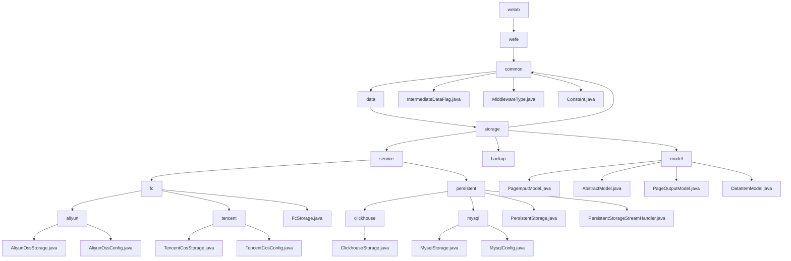

# 基础信息

|      |      |
|------|------|
| 名称 | welab |
| 编码语言 | .java |
| 代码路径 | WeFe/common/java/common-data-storage/src/main/java/com/welab |
| 包名 | docs.common.java.common-data-storage.src.main.java.com.welab |
| 概述说明 | 模块1：定义数据存储通用配置，含序列化模式、中间件类型及数据库连接，依赖MySQL驱动。  模块2：统一多云平台与多数据库存储，支持批量操作、动态分片，依赖云SDK和JDBC。  模块3：提供分页查询基础模型，含分页输入输出及键值对结构，适用于日志等场景。 |

# 说明

## 概述  
该模块核心职责是实现多云平台与多数据库的统一数据存储，支持批量操作、动态分片及跨平台持久化，同时提供基础模型支持类似ORM功能。接口规范聚合静态常量、枚举类型、标准CRUD操作及分页查询API，类似适配器模式。关键数据结构包含分片策略、连接配置（如ClickhouseConfig）、分页参数及泛型键值对。外部依赖涵盖主流云SDK（阿里云/腾讯云）、JDBC驱动及Druid连接池。例如阿里云通过hashKeyToPartition动态分片，ClickHouse支持流式处理。

## 主要业务场景  
模块适用于多云存储与异构数据库混合场景，典型流程包括配置初始化→数据分片/序列化→多线程或流式处理→回调跟踪。支持分页查询（如PageInputModel传递参数）和键值存取（如DataItemModel）。交互模式统一为配置驱动，例如阿里云OTS按哈希分区，MySQL分页查询。集成案例覆盖从initWithAliyun云初始化到getByStream流处理，形成端到端解决方案。

### 包内部结构视图

该流程图展示了WeFe项目中common-data-storage模块的完整层级结构，从根目录welab开始逐级展开至最终实现类。核心分为storage目录下的四个子模块：common包含基础枚举类，service实现存储服务(分fc和persistent两类)，backup为备份模块，model定义数据模型。其中fc服务细分为阿里云和腾讯云实现，persistent包含Clickhouse和MySQL两种数据库存储方案。

# 文件列表

| 名称   | 类型  | 说明 |
|-------|------|-------------|
| [wefe](wefe/_module.md) | package | 模块1：定义数据存储通用配置，含序列化模式、中间件类型及数据库连接，依赖MySQL驱动。  模块2：统一多云平台与多数据库存储，支持批量操作、动态分片，依赖云SDK和JDBC。  模块3：提供分页查询基础模型，含分页输入输出及键值对结构，适用于日志等场景。 |

