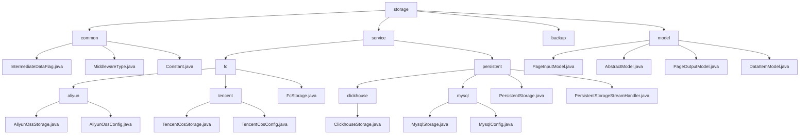

# 基础信息

|      |      |
|------|------|
| 名称 | storage |
| 编码语言 | .java |
| 代码路径 | WeFe/common/java/common-data-storage/src/main/java/com/welab/wefe/common/data/storage |
| 包名 | docs.common.java.common-data-storage.src.main.java.com.welab.wefe.common.data.storage |
| 概述说明 | 模块1：定义数据存储通用配置，含序列化模式、中间件类型及数据库连接，依赖MySQL驱动。  模块2：统一多云平台与多数据库存储，支持批量操作、动态分片，依赖云SDK和JDBC。  模块3：提供分页查询基础模型，含分页输入输出及键值对结构，适用于日志等场景。 |

# 说明

## 概述  
该模块核心职责是实现多云平台与多数据库的统一数据存储，支持批量操作、动态分片及跨平台持久化，同时提供基础模型支持类似ORM功能。接口规范聚合静态常量、枚举类型、标准CRUD操作及分页查询API，类似适配器模式。关键数据结构包含分片策略、连接配置（如ClickhouseConfig）、分页参数及泛型键值对。外部依赖涵盖主流云SDK（阿里云/腾讯云）、JDBC驱动及Druid连接池。例如阿里云通过hashKeyToPartition动态分片，ClickHouse支持流式处理。

## 主要业务场景  
模块适用于多云存储与异构数据库混合场景，典型流程包括配置初始化→数据分片/序列化→多线程或流式处理→回调跟踪。支持分页查询（如PageInputModel传递参数）和键值存取（如DataItemModel）。交互模式统一为配置驱动，例如阿里云OTS按哈希分区，MySQL分页查询。集成案例覆盖从initWithAliyun云初始化到getByStream流处理，形成端到端解决方案。

### 包内部结构视图

该流程图展示了一个数据存储模块的完整层级结构，从顶层storage目录开始，向下分为common、service、backup和model四个主要分支。service分支进一步细分为fc（文件存储）和persistent（持久化存储）两个子模块，其中fc包含阿里云和腾讯云的具体实现，persistent包含ClickHouse和MySQL的实现。model分支则包含各种数据模型类文件。整个结构清晰展示了模块化设计思想，便于扩展和维护。

# 文件列表

| 名称   | 类型  | 说明 |
|-------|------|-------------|
| [backup](backup/_module.md) | package |  |
| [model](model/_module.md) | package | PageInputModel封装分页参数pageSize和pageNum。AbstractModel抽象类管理eventDate字段。PageOutputModel泛型类存储分页结果数据。DataItemModel泛型类封装键值对数据。 |
| [service](service/_module.md) | package | 多云存储模块支持阿里云OSS/OTS和腾讯云COS，提供统一接口putAll，实现多线程上传、分片和回调。依赖各云SDK和序列化工具。  多数据库模块支持ClickHouse和MySQL，提供CRUD、批量操作和表管理。统一接口包括put/get/delete等，依赖JDBC驱动和连接池。 |
| [common](common/_module.md) | package | IntermediateDataFlag类定义了两个序列化类型常量。MiddlewareType枚举仅包含redis类型。Constant类包含数据库驱动和名称常量。 |

