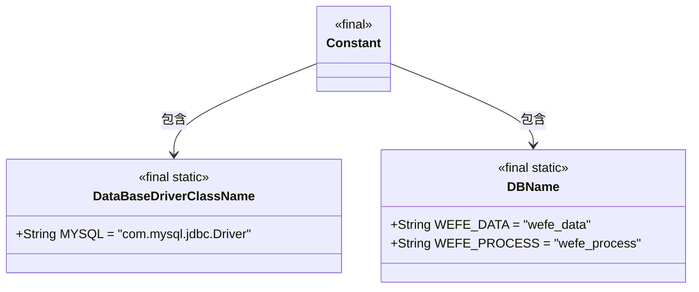
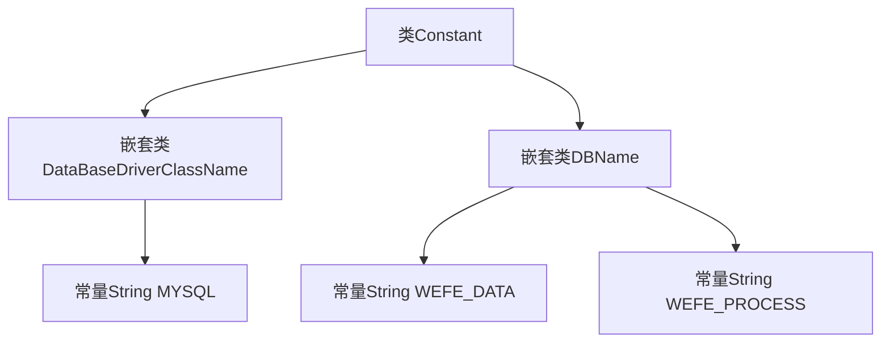

# 基础信息

|      |      |
|------|------|
| 名称 | Constant |
| 编码语言 | .java |
| 代码路径 | WeFe/common/java/common-data-storage/src/main/java/com/welab/wefe/common/data/storage/common/Constant.java |
| 包名 | com.welab.wefe.common.data.storage.common |
| 依赖项 | [] |
| 概述说明 | Java常量类定义数据库驱动名（MySQL）和数据库名（wefe_data、wefe_process）。 |

# 说明

该代码定义了一个名为Constant的公共类，包含两个静态内部类。DataBaseDriverClassName内部类定义了MySQL数据库驱动类名的常量字符串"com.mysql.jdbc.Driver"。DBName内部类定义了两个数据库名称常量字符串："wefe_data"和"wefe_process"。所有字段均为公共、静态且不可修改的最终类型，用于存储数据库相关配置信息。

# 类列表 Class Summary

| 名称   | 类型  | 说明 |
|-------|------|-------------|
| Constant | class | Java类Constant定义数据库驱动和名称常量，包含MySQL驱动类名及两个数据库名：wefe_data和wefe_process。 |

## 类 Constant

|      |      |
|------|------|
| 访问范围 | public |
| 类型 | class |
| 名称 | Constant |
| 说明 | Java类Constant定义数据库驱动和名称常量，包含MySQL驱动类名及两个数据库名：wefe_data和wefe_process。 |

### UML类图

该图展示了一个常量工具类Constant的结构，它包含两个静态嵌套类DataBaseDriverClassName和DBName。DataBaseDriverClassName定义了MySQL驱动类名字符串常量，DBName则存储了两个数据库名称常量。所有类和字段都被标记为final static确保不可变性和全局访问性，这种设计模式常用于集中管理应用程序中的常量配置。

### 内部方法调用关系图

该流程图展示了Constant类的静态嵌套结构，包含两个final静态内部类DataBaseDriverClassName和DBName。DataBaseDriverClassName定义了MySQL驱动字符串常量，DBName则包含两个数据库名称常量。所有元素均为public final static修饰，表示不可变的全局常量。类与嵌套类之间用实线连接，常量作为叶子节点依附于所属类。

### 字段列表 Field List

| 名称  | 类型  | 说明 |
|-------|-------|------|

### 方法列表

| 名称  | 类型  | 说明 |
|-------|-------|------|

