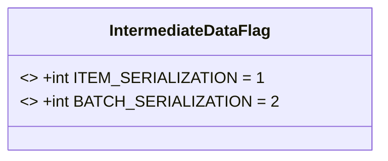
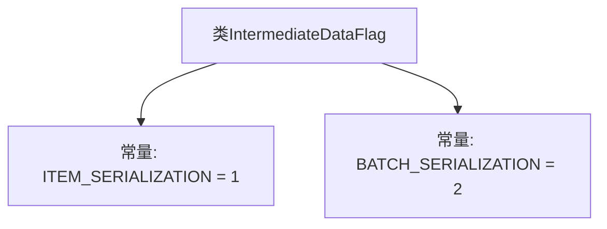

# 基础信息

|      |      |
|------|------|
| 名称 | IntermediateDataFlag |
| 编码语言 | .java |
| 代码路径 | WeFe/common/java/common-data-storage/src/main/java/com/welab/wefe/common/data/storage/common/IntermediateDataFlag.java |
| 包名 | com.welab.wefe.common.data.storage.common |
| 依赖项 | [] |
| 概述说明 | IntermediateDataFlag类定义了两个静态常量：ITEM_SERIALIZATION和BATCH_SERIALIZATION，分别表示序列化类型。 |

# 说明

IntermediateDataFlag是一个Java类，定义了两个静态常量用于标识数据序列化类型。ITEM_SERIALIZATION值为1，表示单个项目序列化；BATCH_SERIALIZATION值为2，表示批量序列化。这些常量用于区分不同的序列化模式。

# 类列表 Class Summary

| 名称   | 类型  | 说明 |
|-------|------|-------------|
| IntermediateDataFlag | class | IntermediateDataFlag类定义了两个静态常量：ITEM_SERIALIZATION（值为1）和BATCH_SERIALIZATION（值为2），用于标识序列化类型。 |

## 类 IntermediateDataFlag

|      |      |
|------|------|
| 访问范围 | public |
| 类型 | class |
| 名称 | IntermediateDataFlag |
| 说明 | IntermediateDataFlag类定义了两个静态常量：ITEM_SERIALIZATION（值为1）和BATCH_SERIALIZATION（值为2），用于标识序列化类型。 |

### UML类图

该代码定义了一个名为`IntermediateDataFlag`的类，包含两个公有静态常量`ITEM_SERIALIZATION`和`BATCH_SERIALIZATION`，分别表示数据序列化的两种模式。类图展示了这两个常量被声明为`final`且具有固定值，用于在程序中作为标志位或枚举类型的替代方案。此类通常用于配置或状态标识场景，通过常量值确保代码可读性和类型安全。

### 内部方法调用关系图

这段代码定义了一个名为IntermediateDataFlag的类，其中包含两个静态常量：ITEM_SERIALIZATION和BATCH_SERIALIZATION，分别被赋值为1和2。这个类可能用于标识或区分不同类型的数据序列化方式，ITEM_SERIALIZATION表示单个项目的序列化，而BATCH_SERIALIZATION表示批量序列化。通过这两个常量，可以在代码中清晰地引用和区分这两种序列化模式。

### 字段列表 Field List

| 名称  | 类型  | 说明 |
|-------|-------|------|
| BATCH_SERIALIZATION = 2 | int | 常量BATCH_SERIALIZATION值为2，用于批量序列化操作。 |
| ITEM_SERIALIZATION = 1 | int | 定义静态常量ITEM_SERIALIZATION，值为1，不可修改。 |

### 方法列表

| 名称  | 类型  | 说明 |
|-------|-------|------|

