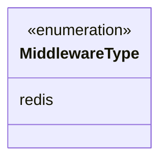
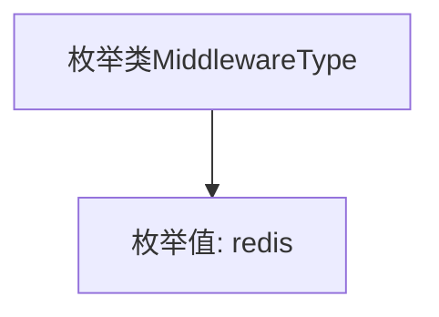

# 基础信息

|      |      |
|------|------|
| 名称 | MiddlewareType |
| 编码语言 | .java |
| 代码路径 | WeFe/common/java/common-data-storage/src/main/java/com/welab/wefe/common/data/storage/common/MiddlewareType.java |
| 包名 | com.welab.wefe.common.data.storage.common |
| 依赖项 | [] |
| 概述说明 | 枚举类型MiddlewareType定义中间件类型，当前仅包含redis。 |

# 说明

该内容定义了一个名为MiddlewareType的公共枚举类型，其中仅包含一个枚举值redis。该枚举可能用于标识或分类不同类型的中间件，当前仅支持redis这一种中间件类型。枚举的设计简洁明确，为系统提供了可扩展的中间件类型定义基础。

# 类列表 Class Summary

| 名称   | 类型  | 说明 |
|-------|------|-------------|
| MiddlewareType | enum | 中间件类型枚举，当前仅支持redis。 |

## 类 MiddlewareType

|      |      |
|------|------|
| 访问范围 | public |
| 类型 | enum |
| 名称 | MiddlewareType |
| 说明 | 中间件类型枚举，当前仅支持redis。 |

### UML类图

该代码定义了一个名为MiddlewareType的枚举类型，目前仅包含一个枚举值redis。枚举类型在类图中用<<enumeration>>标记，表示这是一个固定的值集合。这种设计通常用于表示系统中有限的、预定义的选项，比如在这里可能表示不同类型的中间件。枚举的使用可以提高代码的可读性和类型安全性。

### 内部方法调用关系图

这段代码定义了一个简单的枚举类MiddlewareType，其中只包含一个枚举值redis。枚举在Java中是一种特殊的数据类型，用于定义一组固定的常量。在这个例子中，MiddlewareType枚举可能用于标识中间件类型，当前仅支持redis这一种类型。枚举类通常用于替代常量定义，提供更好的类型安全性和可读性。该枚举结构非常简单，没有定义任何方法或附加属性。

### 字段列表 Field List

| 名称  | 类型  | 说明 |
|-------|-------|------|

### 方法列表

| 名称  | 类型  | 说明 |
|-------|-------|------|

