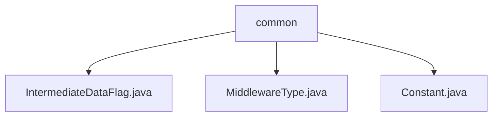

# 基础信息

|      |      |
|------|------|
| 名称 | common |
| 编码语言 | .java |
| 代码路径 | WeFe/common/java/common-data-storage/src/main/java/com/welab/wefe/common/data/storage/common |
| 包名 | docs.common.java.common-data-storage.src.main.java.com.welab.wefe.common.data.storage.common |
| 概述说明 | IntermediateDataFlag类定义了两个序列化类型常量。MiddlewareType枚举仅包含redis类型。Constant类包含数据库驱动和名称常量。 |

# 说明

## 概述  
该模块核心职责是提供数据存储相关的通用定义和配置，包括序列化模式标识、中间件类型枚举及数据库连接信息。接口规范涵盖静态常量（如ITEM_SERIALIZATION）、枚举类型（如MiddlewareType.redis）和数据库配置类（如Constant.DataBaseDriverClassName）。关键数据结构包含IntermediateDataFlag的整型标志位、MiddlewareType的单一枚举值，以及Constant中定义的字符串常量（例如"wefe_data"）。外部依赖仅涉及MySQL驱动（通过JDBC类名引用）。例如，BATCH_SERIALIZATION用于批量数据处理场景。

## 主要业务场景  
模块支持数据存储的基础配置与类型区分，典型应用包括序列化模式选择（如单个或批量处理）、中间件类型标识（当前仅Redis）及数据库连接初始化（如MySQL驱动加载）。交互模式通过常量直接引用实现，类似配置中心模式。功能完整性体现在覆盖数据存储的关键环节，例如通过DBName常量快速定位数据库实例。API类型均为静态定义，集成案例包括驱动类名配置（"com.mysql.jdbc.Driver"）和库名映射（"wefe_process"）。

### 包内部结构视图

该流程图展示了common目录下的三个Java文件：IntermediateDataFlag.java、MiddlewareType.java和Constant.java。这三个文件都直接隶属于common目录，没有更深层的子目录结构。图中清晰呈现了common作为父节点与三个文件子节点之间的层级关系，符合路径信息的实际结构。

# 文件列表

| 名称   | 类型  | 说明 |
|-------|------|-------------|
| [IntermediateDataFlag.java](IntermediateDataFlag.md) | file | IntermediateDataFlag类定义了两个静态常量：ITEM_SERIALIZATION和BATCH_SERIALIZATION，分别表示序列化类型。 |
| [MiddlewareType.java](MiddlewareType.md) | file | 枚举类型MiddlewareType定义中间件类型，当前仅包含redis。 |
| [Constant.java](Constant.md) | file | Java常量类定义数据库驱动名（MySQL）和数据库名（wefe_data、wefe_process）。 |

