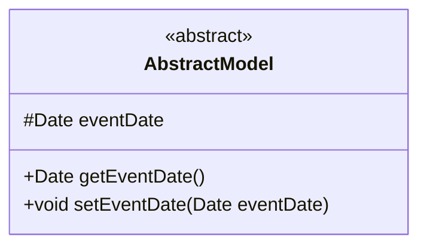
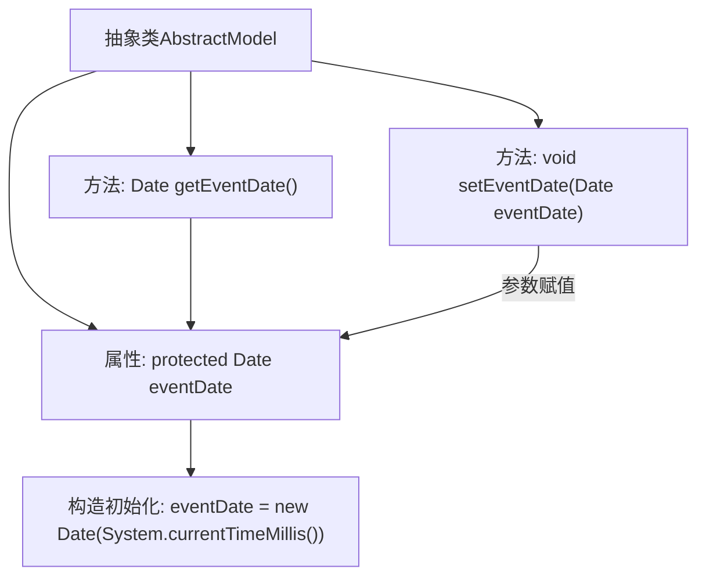

# 基础信息

|      |      |
|------|------|
| 名称 | AbstractModel |
| 编码语言 | .java |
| 代码路径 | WeFe/common/java/common-data-storage/src/main/java/com/welab/wefe/common/data/storage/model/AbstractModel.java |
| 包名 | com.welab.wefe.common.data.storage.model |
| 依赖项 | ['java.sql.Date'] |
| 概述说明 | 抽象类AbstractModel包含受保护的Date类型字段eventDate，提供getter和setter方法用于访问和修改该字段。 |

# 说明

该内容描述了一个名为AbstractModel的抽象类，包含一个受保护的Date类型字段eventDate，初始化为当前系统时间。提供了getEventDate和setEventDate方法用于获取和设置该字段值。eventDate字段注释说明其用于分区用途。整个类结构简洁，专注于日期字段的封装与管理。

# 类列表 Class Summary

| 名称   | 类型  | 说明 |
|-------|------|-------------|
| AbstractModel | class | 抽象类AbstractModel包含受保护的eventDate字段及其getter和setter方法，用于分区。 |

## 类 AbstractModel

|      |      |
|------|------|
| 访问范围 | public abstract |
| 类型 | class |
| 名称 | AbstractModel |
| 说明 | 抽象类AbstractModel包含受保护的eventDate字段及其getter和setter方法，用于分区。 |

### UML类图

这段代码定义了一个名为AbstractModel的抽象类，包含一个受保护的Date类型字段eventDate（初始化为当前系统时间），以及对应的getter和setter方法。该类作为基础模型类，通过抽象化设计允许子类继承日期字段及相关操作，适用于需要事件时间记录的领域模型场景。eventDate字段的protected修饰符表明其可见性仅限于继承层级内部，体现了面向对象设计的封装特性。

### 内部方法调用关系图

这段流程图描述了AbstractModel抽象类的结构和行为。类包含一个受保护的Date类型属性eventDate，该属性在声明时通过当前系统时间初始化。提供两个公共方法：getEventDate()用于获取日期值，setEventDate()用于修改日期值。箭头清晰地展示了属性与方法间的数据流向，其中setter方法通过参数接收新值并更新属性。整个设计体现了对时间戳属性的封装管理，符合面向对象的基本封装原则。

### 字段列表 Field List

| 名称  | 类型  | 说明 |
|-------|-------|------|
| eventDate = new Date(System.currentTimeMillis()) | Date | 声明一个受保护的Date类型变量eventDate，初始化为当前系统时间。 |

### 方法列表

| 名称  | 类型  | 说明 |
|-------|-------|------|
| getEventDate | Date | 获取事件日期的方法，返回eventDate对象。 |
| setEventDate | void | 设置事件日期的方法，将传入的Date对象赋值给类的eventDate属性。 |

