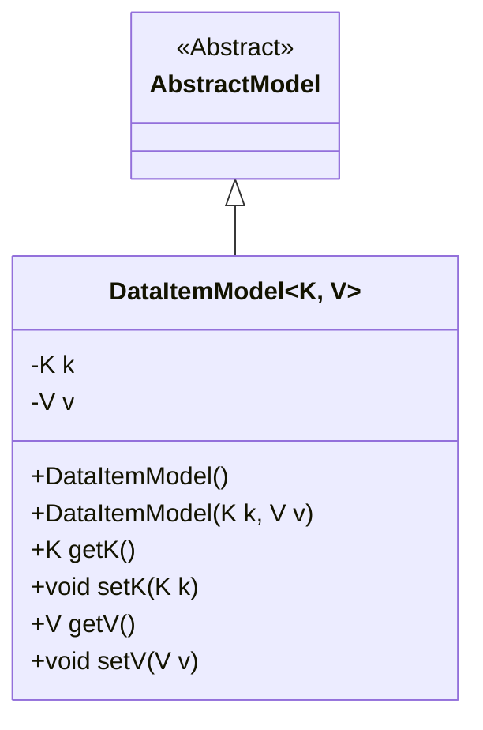
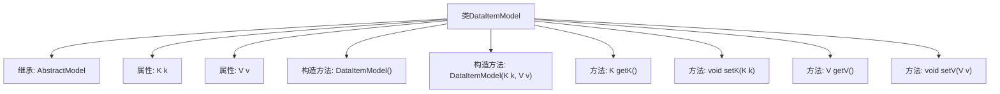

# 基础信息

|      |      |
|------|------|
| 名称 | DataItemModel |
| 编码语言 | .java |
| 代码路径 | WeFe/common/java/common-data-storage/src/main/java/com/welab/wefe/common/data/storage/model/DataItemModel.java |
| 包名 | com.welab.wefe.common.data.storage.model |
| 依赖项 | [] |
| 概述说明 | DataItemModel是泛型类，继承AbstractModel，包含K类型键和V类型值，提供构造方法和getter/setter。 |

# 说明

这是一个名为DataItemModel的泛型类，继承自AbstractModel。它包含两个私有泛型字段k和v，分别表示键和值。类提供了无参构造器和带参构造器，后者可初始化k和v。同时提供了获取和设置k、v的公共方法getK、setK、getV和setV。该类实现了对键值对数据的封装和基本操作。

# 类列表 Class Summary

| 名称   | 类型  | 说明 |
|-------|------|-------------|
| DataItemModel | class | 泛型类DataItemModel继承AbstractModel，包含K类型键和V类型值，提供构造方法和getter/setter。 |

## 类 DataItemModel

|      |      |
|------|------|
| 访问范围 | public |
| 类型 | class |
| 名称 | DataItemModel |
| 说明 | 泛型类DataItemModel继承AbstractModel，包含K类型键和V类型值，提供构造方法和getter/setter。 |

### UML类图

这段代码展示了一个泛型类`DataItemModel<K, V>`，它继承自抽象类`AbstractModel`。该类包含两个私有泛型字段`k`和`v`，分别表示键和值，并提供了相应的构造方法和访问器方法。通过泛型参数`K`和`V`，该类可以灵活地处理不同类型的数据，同时继承了`AbstractModel`的抽象特性，体现了面向对象编程中的继承与泛型结合的设计模式。

### 内部方法调用关系图

该流程图展示了泛型类DataItemModel的结构，包含两个类型参数K和V的属性、两个构造方法（默认构造方法和带参构造方法），以及对应的getter和setter方法。类继承自AbstractModel，完整呈现了类的成员关系和层级结构。

### 字段列表 Field List

| 名称  | 类型  | 说明 |
|-------|-------|------|
| v | V | 私有变量v，类型为V。 |
| k | K | 私有成员变量k，类型为K。 |

### 方法列表

| 名称  | 类型  | 说明 |
|-------|-------|------|
| getK | K | 获取属性k的值的方法。 |
| setK | void | 这是一个Java方法，用于设置类成员变量k的值。方法接受参数k并将其赋值给当前对象的k属性。 |
| getV | V | 方法getV返回私有变量v的值。 |
| setV | void | 这是一个Java方法，用于设置类成员变量v的值。方法接受参数v并将其赋值给当前对象的v属性。 |

