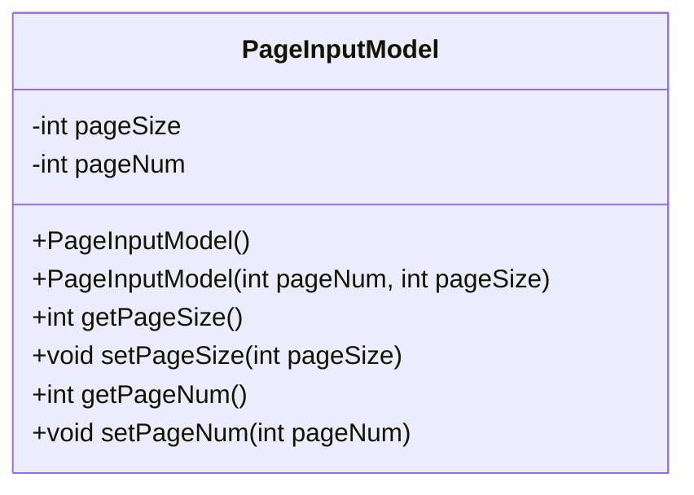
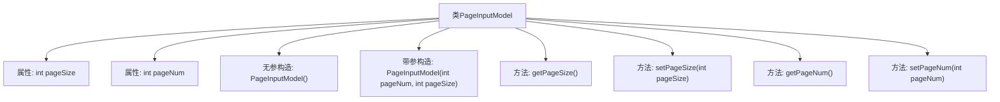

# 基础信息

|      |      |
|------|------|
| 名称 | PageInputModel |
| 编码语言 | .java |
| 代码路径 | WeFe/common/java/common-data-storage/src/main/java/com/welab/wefe/common/data/storage/model/PageInputModel.java |
| 包名 | com.welab.wefe.common.data.storage.model |
| 依赖项 | [] |
| 概述说明 | 分页输入模型类，包含页码和每页大小属性，提供构造方法和getter/setter。 |

# 说明

PageInputModel是一个用于分页查询的输入模型类，包含两个私有整型字段pageSize和pageNum，分别表示每页记录数和当前页码。该类提供了无参构造方法和带参构造方法，支持通过构造函数初始化分页参数。同时为两个字段提供了标准的getter和setter方法，允许外部获取和修改分页参数值。该模型类封装了分页查询所需的基本参数，便于在分页操作中传递和使用。

# 类列表 Class Summary

| 名称   | 类型  | 说明 |
|-------|------|-------------|
| PageInputModel | class | PageInputModel类包含页码和页大小属性，提供构造方法和getter/setter。 |

## 类 PageInputModel

|      |      |
|------|------|
| 访问范围 | public |
| 类型 | class |
| 名称 | PageInputModel |
| 说明 | PageInputModel类包含页码和页大小属性，提供构造方法和getter/setter。 |

### UML类图

这段代码定义了一个名为PageInputModel的类，用于封装分页查询的输入参数。该类包含两个私有字段pageSize和pageNum，分别表示每页记录数和当前页码。提供了无参构造方法和带参构造方法，以及对应的getter和setter方法。这个类的主要作用是作为数据传输对象(DTO)，在分页查询场景中传递分页参数，确保分页信息的封装性和可维护性。

### 内部方法调用关系图

这段代码定义了一个名为PageInputModel的类，用于封装分页查询的输入参数。类中包含两个私有属性pageSize和pageNum，分别表示每页大小和页码。提供了无参构造方法和带参构造方法，以及对应的getter和setter方法。该类的设计目的是为了规范分页查询参数的传递，确保数据的封装性和安全性，便于在不同层之间传递分页信息。

### 字段列表 Field List

| 名称  | 类型  | 说明 |
|-------|-------|------|
| pageSize | int | 私有整型变量pageSize，用于定义页面大小。 |
| pageNum | int | 私有整型变量pageNum，用于表示页码。 |

### 方法列表

| 名称  | 类型  | 说明 |
|-------|-------|------|
| setPageNum | void | 设置当前页码的方法，参数为pageNum。 |
| getPageNum | int | 获取当前页码的方法，返回整型变量pageNum的值。 |
| setPageSize | void | 这是一个Java方法，用于设置页面大小，将传入的pageSize参数赋值给类的pageSize成员变量。 |
| getPageSize | int | 获取当前页面大小的方法，返回整型变量pageSize的值。 |

