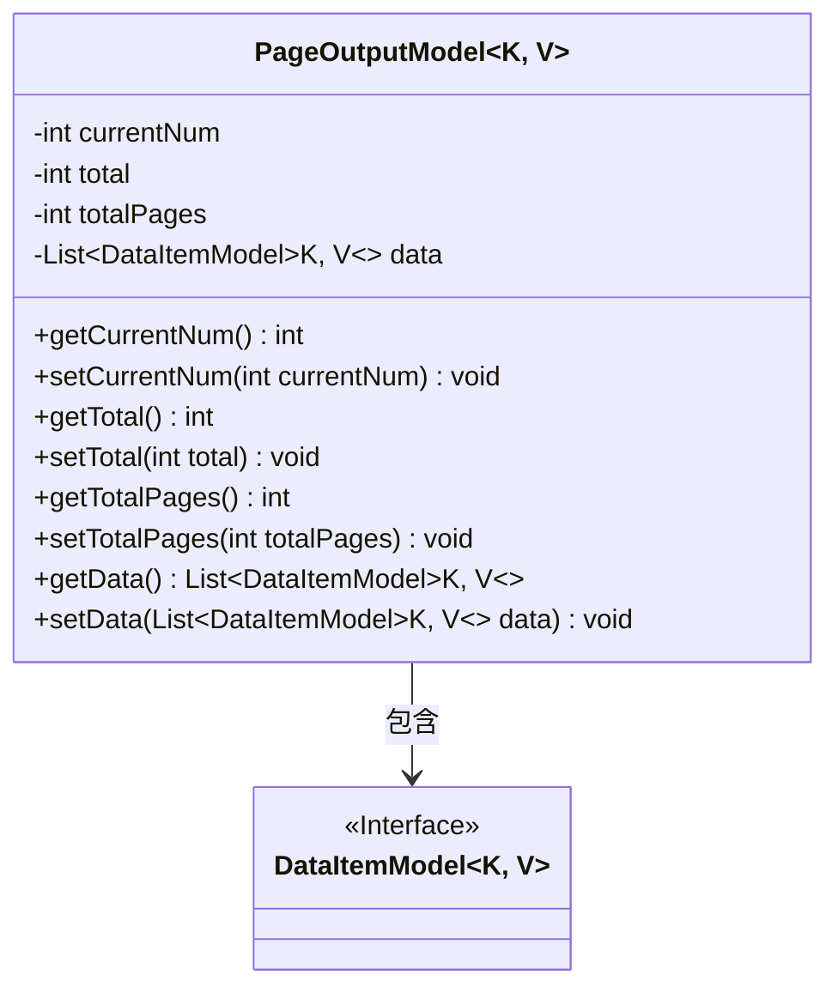

# 基础信息

|      |      |
|------|------|
| 名称 | PageOutputModel |
| 编码语言 | .java |
| 代码路径 | WeFe/common/java/common-data-storage/src/main/java/com/welab/wefe/common/data/storage/model/PageOutputModel.java |
| 包名 | com.welab.wefe.common.data.storage.model |
| 依赖项 | ['java.util.ArrayList', 'java.util.List'] |
| 概述说明 | 分页输出模型类，包含当前页码、总数、总页数和数据列表，支持泛型键值对数据项。 |

# 说明

PageOutputModel是一个泛型类，用于封装分页查询结果。它包含四个核心属性：currentNum表示当前页码，total表示总记录数，totalPages表示总页数，data是一个DataItemModel泛型列表，存储当前页的数据项。类中为每个属性提供了标准的getter和setter方法，确保数据的访问和修改。该模型适用于需要分页展示数据的业务场景。

# 类列表 Class Summary

| 名称   | 类型  | 说明 |
|-------|------|-------------|
| PageOutputModel | class | 分页输出模型类，包含当前页码、总数、总页数和数据列表，支持泛型键值对数据项。 |

## 类 PageOutputModel

|      |      |
|------|------|
| 访问范围 | public |
| 类型 | class |
| 名称 | PageOutputModel |
| 说明 | 分页输出模型类，包含当前页码、总数、总页数和数据列表，支持泛型键值对数据项。 |

### UML类图

这段代码定义了一个泛型类`PageOutputModel<K, V>`，用于表示分页输出的数据模型。该类包含当前页码、总记录数、总页数等分页信息，以及一个泛型数据列表`data`，该列表的元素类型为`DataItemModel<K, V>`接口的实现类。通过getter和setter方法可以访问和修改这些属性。类图清晰地展示了`PageOutputModel`与`DataItemModel`之间的包含关系，体现了分页数据模型的核心结构。

### 内部方法调用关系图

```mermaid
graph TD
    A["泛型类 PageOutputModel<K, V>"]
    B["私有属性: int currentNum"]
    C["私有属性: int total"]
    D["私有属性: int totalPages"]
    E["私有属性: List<DataItemModel<K, V>> data"]
    F["方法: getCurrentNum()"]
    G["方法: setCurrentNum(int)"]
    H["方法: getTotal()"]
    I["方法: setTotal(int)"]
    J["方法: getTotalPages()"]
    K["方法: setTotalPages(int)"]
    L["方法: getData()"]
    M["方法: setData(List<DataItemModel<K, V>>)"]

    A --> B
    A --> C
    A --> D
    A --> E
    A --> F
    A --> G
    A --> H
    A --> I
    A --> J
    A --> K
    A --> L
    A --> M
```

该流程图展示了PageOutputModel泛型类的结构，包含4个私有属性和8个公共方法。属性包括当前页码(currentNum)、总记录数(total)、总页数(totalPages)和数据列表(data)，每个属性都有对应的getter和setter方法。数据列表使用泛型类型DataItemModel<K,V>存储分页数据项，体现了分页查询结果的数据封装模式，适用于各种需要分页展示的业务场景。

### 字段列表 Field List

| 名称  | 类型  | 说明 |
|-------|-------|------|
| totalPages | int | 私有整型变量，记录总页数。 |
| data = new ArrayList<>() | List<DataItemModel<K, V>> | 声明一个名为data的私有列表，存储DataItemModel<K, V>类型元素，初始化为ArrayList实例。 |
| currentNum | int | 私有整型变量currentNum |
| total | int | 私有整型变量total |

### 方法列表

| 名称  | 类型  | 说明 |
|-------|-------|------|
| getData | List<DataItemModel<K, V>> | 这是一个Java方法，返回类型为List<DataItemModel<K, V>>，方法名为getData，直接返回成员变量data。 |
| setData | void | 设置数据项列表，参数为DataItemModel<K, V>类型的集合。 |
| getTotal | int | 方法返回整型变量total的值。 |
| setCurrentNum | void | 这是一个Java方法，用于设置类成员变量currentNum的值。方法接收一个整数参数currentNum，并将其赋值给当前对象的同名成员变量。 |
| setTotal | void | 设置total变量的值。 |
| getTotalPages | int | 获取总页数的方法，直接返回totalPages变量值。 |
| getCurrentNum | int | 方法返回当前数值currentNum。 |
| setTotalPages | void | 设置总页数的方法，将输入参数totalPages赋值给类的同名成员变量。 |

