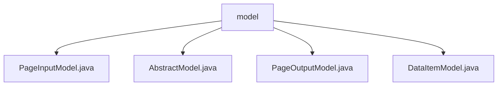

# 基础信息

|      |      |
|------|------|
| 名称 | model |
| 编码语言 | .java |
| 代码路径 | WeFe/common/java/common-data-storage/src/main/java/com/welab/wefe/common/data/storage/model |
| 包名 | docs.common.java.common-data-storage.src.main.java.com.welab.wefe.common.data.storage.model |
| 概述说明 | PageInputModel封装分页参数pageSize和pageNum。AbstractModel抽象类管理eventDate字段。PageOutputModel泛型类存储分页结果数据。DataItemModel泛型类封装键值对数据。 |

# 说明

## 概述  
该模块核心职责是提供数据存储与分页查询的基础模型支持，类似ORM中的实体基类。接口规范包含分页输入(PageInputModel)、分页输出(PageOutputModel)和键值对数据项(DataItemModel)的标准访问方法。关键数据结构包括分页参数(pageSize/pageNum)、日期分区字段(eventDate)和泛型键值对(k/v)。外部依赖仅为Java基础库。例如PageOutputModel通过泛型DataItemModel列表承载分页数据。

## 主要业务场景  
模块支持典型的分页查询流程：PageInputModel传递查询参数→服务层处理→PageOutputModel返回分页结果。交互模式采用Getter/Setter标准化访问，如通过setEventDate()管理分区日期。适用于需要按时间分区存储（如日志系统）或分页展示键值数据的场景。API类型包含基础CRUD操作，例如DataItemModel实现键值对的泛型存取。

### 包内部结构视图

该流程图展示了WeFe项目中common-data-storage模块下的数据存储模型结构。根节点为model文件夹，包含四个Java模型类文件：PageInputModel、AbstractModel、PageOutputModel和DataItemModel。这些类文件都直接位于model目录下，没有更深层次的嵌套关系，形成了简单的扁平结构。

# 文件列表

| 名称   | 类型  | 说明 |
|-------|------|-------------|
| [PageInputModel.java](PageInputModel.md) | file | 分页输入模型类，包含页码和每页大小属性，提供构造方法和getter/setter。 |
| [AbstractModel.java](AbstractModel.md) | file | 抽象类AbstractModel包含受保护的Date类型字段eventDate，提供getter和setter方法用于访问和修改该字段。 |
| [PageOutputModel.java](PageOutputModel.md) | file | 分页输出模型类，包含当前页码、总数、总页数和数据列表，支持泛型键值对数据项。 |
| [DataItemModel.java](DataItemModel.md) | file | DataItemModel是泛型类，继承AbstractModel，包含K类型键和V类型值，提供构造方法和getter/setter。 |

