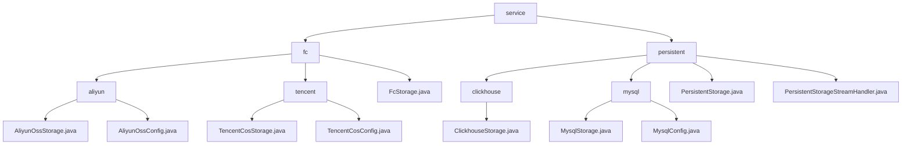

# 基础信息

|      |      |
|------|------|
| 名称 | service |
| 编码语言 | .java |
| 代码路径 | WeFe/common/java/common-data-storage/src/main/java/com/welab/wefe/common/data/storage/service |
| 包名 | docs.common.java.common-data-storage.src.main.java.com.welab.wefe.common.data.storage.service |
| 概述说明 | 多云存储模块支持阿里云OSS/OTS和腾讯云COS，提供统一接口putAll，实现多线程上传、分片和回调。依赖各云SDK和序列化工具。  多数据库模块支持ClickHouse和MySQL，提供CRUD、批量操作和表管理。统一接口包括put/get/delete等，依赖JDBC驱动和连接池。 |

# 说明

## 概述  
该模块核心职责是实现多云平台（阿里云OSS/OTS、腾讯云COS）与多数据库（ClickHouse/MySQL）的统一数据存储，支持高效批量操作、动态分片及跨平台持久化。接口规范聚合为`putAll`批量写入、标准CRUD操作及表管理API，类似适配器模式。关键数据结构包括分片策略（如行数/文件大小限制）、连接配置（如`ClickhouseConfig`/`AliyunOssConfig`）及序列化参数。外部依赖涵盖主流云SDK（阿里云/腾讯云）、JDBC驱动及Druid连接池。例如阿里云通过`hashKeyToPartition`动态分片，ClickHouse支持流式处理。

## 主要业务场景  
模块适用于多云存储与异构数据库混合场景，采用分片上传与适配器混合模式。典型流程为：配置初始化（单例模式）→数据分片/序列化→多线程或流式处理→回调/进度跟踪。例如阿里云OTS按哈希分区，MySQL分页查询，ClickHouse通过`PersistentStorageStreamHandler`处理二进制流。集成案例覆盖从`initWithAliyun`云初始化到`getByStream`大数据处理，形成端到端解决方案。交互模式统一为配置驱动，支持原子操作与批量API混合调用。

### 包内部结构视图

该流程图展示了数据存储服务的层级结构，根节点为service，包含fc和persistent两个主要分支。fc分支下分为aliyun和tencent云存储实现，persistent分支包含clickhouse和mysql数据库存储实现。每个子节点都包含具体的实现类或配置文件，清晰地反映了不同存储类型的组织关系。

# 文件列表

| 名称   | 类型  | 说明 |
|-------|------|-------------|
| [persistent](persistent/_module.md) | package | ClickhouseStorage继承PersistentStorage，实现CRUD、批量操作、分页查询及表管理，支持序列化和流式处理。MysqlStorage类似，依赖JDBC连接MySQL。PersistentStorage为抽象基类，封装数据库操作，支持ClickHouse和MySQL。PersistentStorageStreamHandler接口定义批量数据处理方法。 |
| [fc](fc/_module.md) | package | 模块实现阿里云OSS/OTS和腾讯云COS的高效数据存储，支持分片上传、多线程处理和容错机制。提供批量写入接口如ossPutAll和cosPutAll，依赖对应SDK。采用动态分片策略，如文件大小和行数限制。适用于大数据异步存储场景，支持配置管理和回调处理。FcStorage抽象类提供单例初始化方法。 |

