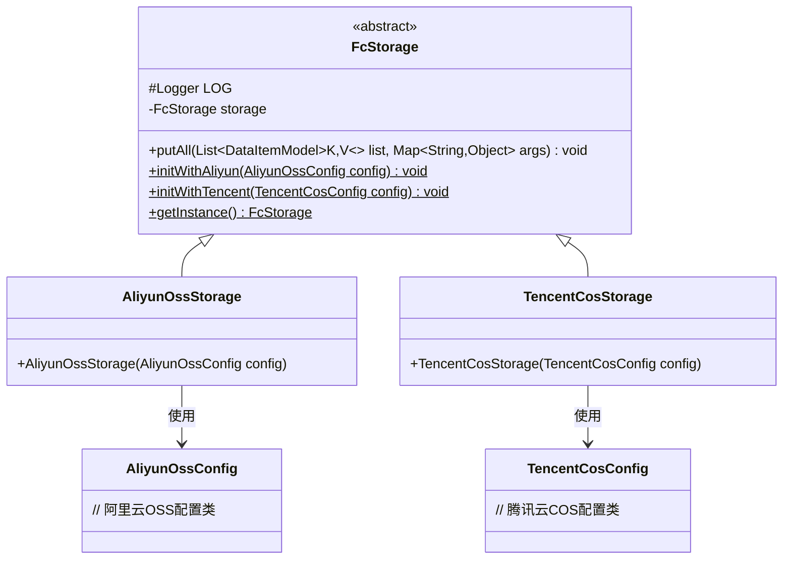
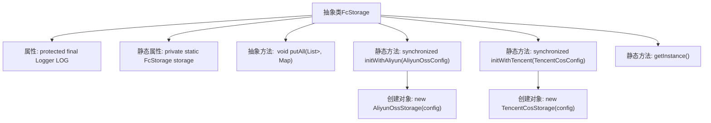

# 基础信息

|      |      |
|------|------|
| 名称 | FcStorage |
| 编码语言 | .java |
| 代码路径 | WeFe/common/java/common-data-storage/src/main/java/com/welab/wefe/common/data/storage/service/fc/FcStorage.java |
| 包名 | com.welab.wefe.common.data.storage.service.fc |
| 依赖项 | ['com.welab.wefe.common.data.storage.model.DataItemModel', 'com.welab.wefe.common.data.storage.service.fc.aliyun.AliyunOssConfig', 'com.welab.wefe.common.data.storage.service.fc.aliyun.AliyunOssStorage', 'com.welab.wefe.common.data.storage.service.fc.tencent.TencentCosConfig', 'com.welab.wefe.common.data.storage.service.fc.tencent.TencentCosStorage', 'org.slf4j.Logger', 'org.slf4j.LoggerFactory', 'java.util.List', 'java.util.Map'] |
| 概述说明 | 抽象类FcStorage提供存储功能，支持阿里云和腾讯云配置初始化，通过静态方法获取实例，包含批量写入数据的抽象方法。 |

# 说明

这是一个名为FcStorage的抽象类，用于实现存储功能。类中包含一个受保护的日志对象和一个静态的FcStorage实例。提供了两个静态同步方法initWithAliyun和initWithTencent，分别用于初始化阿里云OSS和腾讯云COS的存储配置，并创建对应的存储实例。还提供了一个getInstance方法用于获取当前存储实例。抽象方法putAll用于批量存储数据，接受数据项列表和参数字典，可能抛出异常。该类设计为单例模式，配置变更时可通过重新初始化更新实例。

# 类列表 Class Summary

| 名称   | 类型  | 说明 |
|-------|------|-------------|
| FcStorage | class | 抽象类FcStorage提供存储操作，支持阿里云和腾讯云配置初始化，通过getInstance获取实例。包含putAll方法和日志记录。 |

## 类 FcStorage

|      |      |
|------|------|
| 访问范围 | public abstract |
| 类型 | class |
| 名称 | FcStorage |
| 说明 | 抽象类FcStorage提供存储操作，支持阿里云和腾讯云配置初始化，通过getInstance获取实例。包含putAll方法和日志记录。 |

### UML类图

这段代码展示了一个抽象类FcStorage及其两个具体实现类AliyunOssStorage和TencentCosStorage的类图结构。FcStorage作为基类，定义了日志记录器、静态存储实例和核心抽象方法putAll，同时提供了三种静态方法用于初始化和获取实例。两个子类分别对应阿里云OSS和腾讯云COS的存储实现，通过不同的配置类进行初始化。该设计实现了存储功能的抽象与多平台支持，通过静态工厂方法管理唯一实例。

### 内部方法调用关系图

这段代码定义了一个抽象类FcStorage，它包含日志记录器、静态存储实例和三个关键方法。两个静态初始化方法（initWithAliyun和initWithTencent）用于创建不同的云存储实现（阿里云OSS或腾讯云COS），并通过同步机制保证线程安全。getInstance方法提供全局访问点，而putAll是留给子类实现的抽象批量存储方法。该设计实现了存储后端的可配置切换和单例访问模式。

### 字段列表 Field List

| 名称  | 类型  | 说明 |
|-------|-------|------|
| LOG = LoggerFactory.getLogger(this.getClass()) | Logger | 类中定义了一个受保护的final日志对象LOG，用于记录当前类的日志信息。 |
| storage | FcStorage | 私有静态存储变量storage，类型为FcStorage。 |

### 方法列表

| 名称  | 类型  | 说明 |
|-------|-------|------|
| initWithAliyun | void | 同步静态方法，使用阿里云配置初始化存储实例。 |
| initWithTencent | void | 这是一个同步静态方法，用于初始化腾讯云COS存储，接收配置参数并创建存储实例。 |
| putAll | void | 抽象方法putAll，接收DataItemModel泛型列表和Map参数，可能抛出异常。 |
| getInstance | FcStorage | 这是一个静态方法，返回单例对象storage。 |

