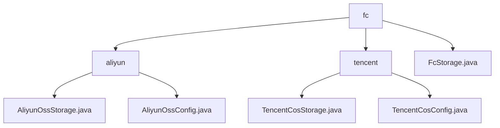

# 基础信息

|      |      |
|------|------|
| 名称 | fc |
| 编码语言 | .java |
| 代码路径 | WeFe/common/java/common-data-storage/src/main/java/com/welab/wefe/common/data/storage/service/fc |
| 包名 | docs.common.java.common-data-storage.src.main.java.com.welab.wefe.common.data.storage.service.fc |
| 概述说明 | 模块实现阿里云OSS/OTS和腾讯云COS的高效数据存储，支持分片上传、多线程处理和容错机制。提供批量写入接口如ossPutAll和cosPutAll，依赖对应SDK。采用动态分片策略，如文件大小和行数限制。适用于大数据异步存储场景，支持配置管理和回调处理。FcStorage抽象类提供单例初始化方法。 |

# 说明

## 概述  
该模块核心职责是实现多云平台（阿里云OSS/OTS、腾讯云COS）的高效数据存储，支持批量写入、动态分片和容错处理。接口规范统一为`putAll`方法（抽象自`FcStorage`类），其实现包括阿里云的`ossPutAll`/`otsPutAll`和腾讯云的`cosPutAll`，均支持多线程上传、哈希分区和回调机制。关键数据结构聚合为分片策略（如阿里云的行数限制、腾讯云的4MB文件限制）和配置参数（如存储桶、密钥管理）。外部依赖包含阿里云OSS/OTS SDK、腾讯云COS SDK及Pickler序列化工具。例如，`AliyunOssConfig`自动生成Endpoint URL，`TencentCosConfig`管理分区规则。

## 主要业务场景  
模块适用于跨云的大数据异步存储场景，采用类似分片上传总线模式。典型流程为：配置初始化（如单例模式`FcStorage`）→数据分片（按行数/文件大小）→多线程上传（如阿里云动态分片、腾讯云SHA1哈希）→回调处理。例如，阿里云通过`hashKeyToPartition`计算OTS分区，腾讯云限制单文件不超过4MB。集成案例覆盖全生命周期，从`initWithAliyun`/`initWithTencent`初始化到`SampleCallback`结果处理，形成多云适配的端到端解决方案。

### 包内部结构视图

该流程图展示了文件存储服务中不同云服务提供商（阿里云和腾讯云）的配置与实现类层级关系。根节点fc包含两个子目录aliyun和tencent，分别对应两家云服务商的存储实现类，同时fc目录下还包含一个通用的FcStorage.java文件。每个云服务商目录下各有存储实现类和配置类，形成清晰的树状结构。

# 文件列表

| 名称   | 类型  | 说明 |
|-------|------|-------------|
| [FcStorage.java](FcStorage.md) | file | 抽象类FcStorage提供存储功能，支持阿里云和腾讯云配置初始化，通过静态方法获取实例，包含批量写入数据的抽象方法。 |
| [tencent](tencent/_module.md) | package | TencentCosStorage类继承FcStorage，实现腾讯云COS数据批量存储，支持分片处理、多线程上传和哈希分区。TencentCosConfig类管理COS认证配置，含密钥、桶名和区域。 |
| [aliyun](aliyun/_module.md) | package | AliyunOssStorage类继承FcStorage，实现阿里云OSS和OTS数据存储，含分片配置及批量存储方法ossPutAll和otsPutAll。AliyunOssConfig类管理OSS配置，含密钥、存储桶等参数，构造函数自动生成内部端点URL。 |

