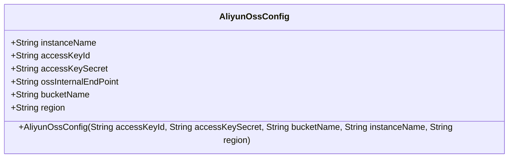
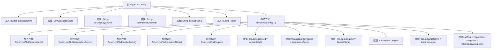

# 基础信息

|      |      |
|------|------|
| 名称 | AliyunOssConfig |
| 编码语言 | .java |
| 代码路径 | WeFe/common/java/common-data-storage/src/main/java/com/welab/wefe/common/data/storage/service/fc/aliyun/AliyunOssConfig.java |
| 包名 | com.welab.wefe.common.data.storage.service.fc.aliyun |
| 依赖项 | ['org.springframework.util.Assert'] |
| 概述说明 | 阿里云OSS配置类，包含实例名、密钥、桶名、区域等字段，构造函数校验非空并生成内部端点URL。 |

# 说明

该内容描述了一个名为AliyunOssConfig的Java类，用于配置阿里云对象存储服务。类包含六个成员变量：instanceName、accessKeyId、accessKeySecret、ossInternalEndPoint、bucketName和region。构造函数接收五个参数（accessKeyId、accessKeySecret、bucketName、instanceName和region），并对这些参数进行非空校验。构造函数内部根据region自动生成ossInternalEndPoint的URL。该类主要用于存储和管理阿里云OSS的配置信息。

# 类列表 Class Summary

| 名称   | 类型  | 说明 |
|-------|------|-------------|
| AliyunOssConfig | class | 阿里云OSS配置类，包含实例名、密钥、存储桶名、区域等字段，构造函数校验非空并生成内部端点URL。 |

## 类 AliyunOssConfig

|      |      |
|------|------|
| 访问范围 | public |
| 类型 | class |
| 名称 | AliyunOssConfig |
| 说明 | 阿里云OSS配置类，包含实例名、密钥、存储桶名、区域等字段，构造函数校验非空并生成内部端点URL。 |

### UML类图

这段代码定义了一个阿里云OSS配置类，包含实例名称、访问密钥ID、访问密钥秘钥、OSS内部端点、存储桶名称和区域等公有字段。构造函数通过参数初始化这些字段，并对关键参数进行非空校验，同时自动生成OSS内部端点URL。该类主要用于存储和管理与阿里云对象存储服务(OSS)相关的配置信息，确保必要参数在创建时即被正确设置。

### 内部方法调用关系图

该流程图展示了AliyunOssConfig类的结构和构造方法逻辑。类包含6个字符串属性，构造方法接收5个参数并进行非空校验，随后完成属性赋值并自动生成ossInternalEndPoint。流程清晰展现了从参数校验到属性初始化的完整过程，特别突出了阿里云OSS内部端点URL的动态拼接逻辑。

### 字段列表 Field List

| 名称  | 类型  | 说明 |
|-------|-------|------|
| bucketName | String | 声明一个公共字符串变量bucketName。 |
| ossInternalEndPoint | String | 声明一个公共字符串变量ossInternalEndPoint，用于存储OSS内部端点地址。 |
| accessKeyId | String | 定义了一个公开的字符串变量accessKeyId。 |
| accessKeySecret | String | 声明了一个公共字符串变量accessKeySecret。 |
| instanceName | String | 声明一个公共字符串变量instanceName。 |
| region | String | 声明一个公共字符串变量region。 |

### 方法列表

| 名称  | 类型  | 说明 |
|-------|-------|------|

