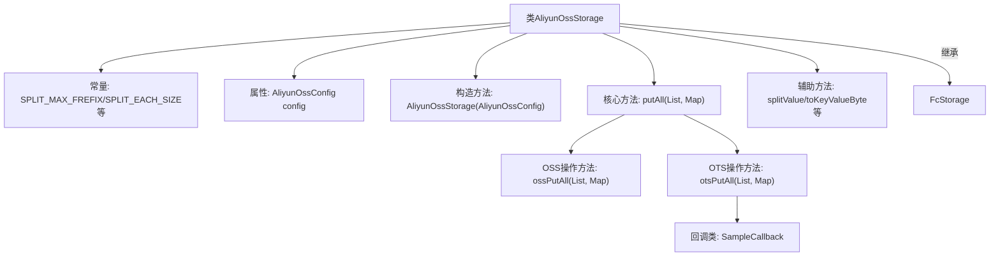
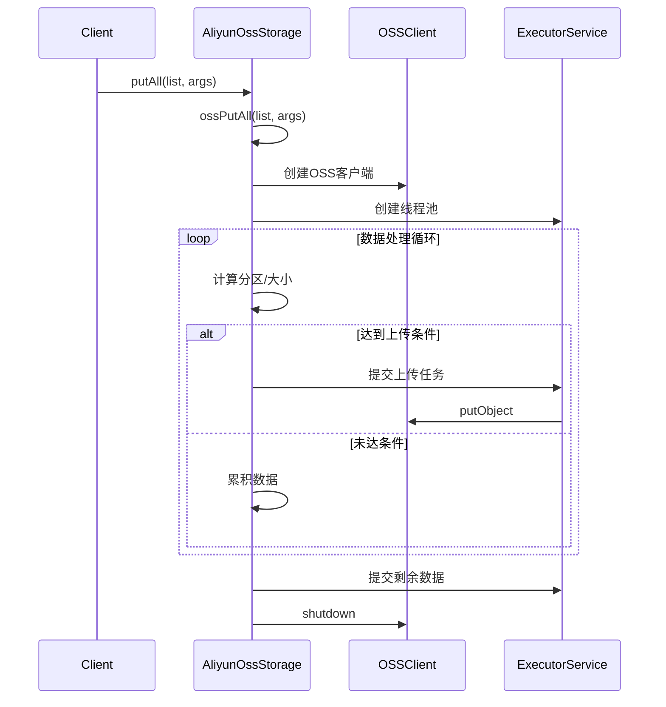

# 基础信息

|      |      |
|------|------|
| 名称 | AliyunOssStorage |
| 编码语言 | .java |
| 代码路径 | WeFe/common/java/common-data-storage/src/main/java/com/welab/wefe/common/data/storage/service/fc/aliyun/AliyunOssStorage.java |
| 包名 | com.welab.wefe.common.data.storage.service.fc.aliyun |
| 依赖项 | ['com.alicloud.openservices.tablestore', 'com.alicloud.openservices.tablestore.model', 'com.alicloud.openservices.tablestore.writer.WriterConfig', 'com.aliyun.oss.ClientBuilderConfiguration', 'com.aliyun.oss.OSS', 'com.aliyun.oss.OSSClientBuilder', 'com.google.protobuf.ByteString', 'com.welab.wefe.common.data.storage.common.IntermediateDataFlag', 'com.welab.wefe.common.data.storage.model.DataItemModel', 'com.welab.wefe.common.data.storage.service.fc.FcStorage', 'com.welab.wefe.common.proto.IntermediateDataOuterClass', 'net.razorvine.pickle.Pickler', 'org.apache.commons.codec.digest.DigestUtils', 'org.apache.commons.lang.ArrayUtils', 'java.io.ByteArrayInputStream', 'java.io.IOException', 'java.math.BigDecimal', 'java.math.BigInteger', 'java.nio.charset.StandardCharsets', 'java.security.MessageDigest', 'java.util', 'java.util.concurrent', 'java.util.concurrent.atomic.AtomicLong'] |
| 概述说明 | 阿里云OSS存储类，支持数据分片存储，单文件最大4MB，行数500-1000，多线程上传，含OTS表存储功能。 |

# 说明

AliyunOssStorage类继承自FcStorage，用于实现阿里云OSS和OTS的数据存储功能。该类包含OSS和OTS的配置参数，如分片大小、文件最大行数限制等。主要方法包括ossPutAll和otsPutAll，分别用于批量存储数据到OSS和OTS。ossPutAll方法通过多线程上传数据，根据文件大小和行数限制动态分片，并生成唯一文件名。otsPutAll方法将数据分片后写入OTS表，支持重试策略和回调处理。类中还包含辅助方法如splitValue用于数据分片，hashKeyToPartition用于计算分区，以及内部回调类SampleCallback用于处理OTS写入结果。整体实现了高效、可靠的大数据量存储方案。

# 类列表 Class Summary

| 名称   | 类型  | 说明 |
|-------|------|-------------|
| AliyunOssStorage | class | 阿里云OSS存储类，继承FcStorage，支持数据分片存储，每文件最大4MB，最少500行最多1000行数据，提供多线程上传和OTS表存储功能，包含数据分片、哈希分区及回调处理。 |

## 类 AliyunOssStorage

|      |      |
|------|------|
| 访问范围 | public |
| 类型 | class |
| 名称 | AliyunOssStorage |
| 说明 | 阿里云OSS存储类，继承FcStorage，支持数据分片存储，每文件最大4MB，最少500行最多1000行数据，提供多线程上传和OTS表存储功能，包含数据分片、哈希分区及回调处理。 |

### UML类图

```mermaid
classDiagram
    class FcStorage {
        <<abstract>>
    }

    class AliyunOssStorage {
        -String SPLIT_MAX_FREFIX
        -int SPLIT_EACH_SIZE
        -int OBJECT_MAX_DATA_COUNT
        -int OBJECT_MIN_DATA_COUNT
        -int OBJECT_FILE_MAX_SIZE
        -AliyunOssConfig config
        +AliyunOssStorage(AliyunOssConfig config)
        +~K,V~ void putAll(List~DataItemModel~K,V~~ list, Map~String,Object~ args)
        -~K,V~ void ossPutAll(List~DataItemModel~K,V~~ list, Map~String,Object~ args)
        -~K,V~ void otsPutAll(List~DataItemModel~K,V~~ list, Map~String,Object~ args)
        +List~byte[]~ splitValue(byte[] vBytes)
        -~K,V~ void ossPutAll(List~DataItemModel~K,V~~ list, String bucketName, String namespace, String name, Integer partitions, OSS ossClient)
        +static String getOssFileName(String namespace, String name, Integer partition, int fileCount)
        +static byte[] toKeyValueByte(byte[] key, byte[] value)
        -~K,V~ void otsPutAll(List~DataItemModel~K,V~~ list, String namespace, String name, Integer partitions, TableStoreWriter tablestoreWriter)
        +static int hashKeyToPartition(byte[] key, int partitions)
        +static BigInteger byteArrayToInt(byte[] array)
    }

    class AliyunOssConfig {
        +String ossInternalEndPoint
        +String accessKeyId
        +String accessKeySecret
        +String bucketName
        +String instanceName
    }

    class DataItemModel~K, V~ {
        +K getK()
        +V getV()
    }

    class IntermediateDataOuterClass {
        <<inner>>
    }

    class OSS {
        <<Interface>>
        +void putObject(String bucketName, String objectName, InputStream input)
        +void shutdown()
    }

    class OSSClientBuilder {
        +OSS build(String endpoint, String accessKeyId, String accessKeySecret, ClientBuilderConfiguration conf)
    }

    class ClientBuilderConfiguration {
        +void setMaxErrorRetry(int maxErrorRetry)
    }

    class AsyncClient {
        +AsyncClient(String endpoint, String accessKeyId, String accessKeySecret, String instanceName, ClientConfiguration cc)
    }

    class TableStoreWriter {
        <<Interface>>
        +void addRowChange(RowChange rowChange)
        +void flush()
        +void close()
    }

    class DefaultTableStoreWriter {
        +DefaultTableStoreWriter(AsyncClient asyncClient, String dstNamespace, WriterConfig config, TableStoreCallback callback, ExecutorService executor)
    }

    class SampleCallback {
        -AtomicLong succeedCount
        -AtomicLong failedCount
        +void onCompleted(RowChange req, ConsumedCapacity res)
        +void onFailed(RowChange req, Exception ex)
    }

    AliyunOssStorage --|> FcStorage : 继承
    AliyunOssStorage --> AliyunOssConfig : 使用
    AliyunOssStorage --> DataItemModel : 处理
    AliyunOssStorage --> OSS : 调用
    AliyunOssStorage --> OSSClientBuilder : 创建
    AliyunOssStorage --> AsyncClient : 使用
    AliyunOssStorage --> TableStoreWriter : 使用
    AliyunOssStorage --> SampleCallback : 使用
    OSSClientBuilder --> ClientBuilderConfiguration : 配置
    DefaultTableStoreWriter --|> TableStoreWriter : 实现
    SampleCallback ..|> TableStoreCallback : 实现
```

这段代码展示了一个阿里云OSS存储实现类AliyunOssStorage，继承自抽象类FcStorage。主要功能包括数据分片处理、批量上传到OSS或OTS（表格存储），具有完善的错误处理机制和并发控制。类结构包含配置类、客户端构建器、回调处理器等组件，通过线程池实现高效并行上传，支持数据分片、哈希分区、大小控制等特性，适用于大规模数据存储场景。关键方法包括splitValue数据分片、ossPutAll/otsPutAll批量上传、hashKeyToPartition分区计算等。

### 内部方法调用关系图

该代码实现了一个阿里云OSS存储服务类，主要功能包括：1) 数据分片处理，通过splitValue方法将大数据分割；2) 多线程批量上传，根据数据量自动触发上传条件；3) 支持两种存储方式（OSS对象存储和OTS表格存储）；4) 包含完善的分区计算、重试机制和回调处理。流程图展示了类结构和主要方法调用关系，时序图详细描述了数据上传的核心流程，包括客户端调用、OSS连接建立、多线程任务提交等关键步骤。

### 字段列表 Field List

| 名称  | 类型  | 说明 |
|-------|-------|------|
| config | AliyunOssConfig | 私有变量config，类型为AliyunOssConfig。 |
| SPLIT_EACH_SIZE = 1024 * 1024 | int | 定义常量SPLIT_EACH_SIZE为1MB大小。 |
| OBJECT_MAX_DATA_COUNT = 1000 | int | 私有静态常量，对象最大数据量为1000。 |
| SPLIT_MAX_FREFIX = "MAX_" | String | 定义静态常量字符串SPLIT_MAX_FREFIX，值为"MAX_"。 |
| OBJECT_MIN_DATA_COUNT = 500 | int | 静态常量OBJECT_MIN_DATA_COUNT定义最小数据量为500。 |
| OBJECT_FILE_MAX_SIZE = 1024 * 1024 * 4 | int | 定义私有静态常量，限制对象文件最大大小为4MB。 |

### 方法列表

| 名称  | 类型  | 说明 |
|-------|-------|------|
| getOssFileName | String | 生成OSS文件名，格式为命名空间/名称/分区/UUID_文件数。 |
| toKeyValueByte | byte[] | 将key和value拼接为字节数组，中间和末尾添加换行符。 |
| putAll | void | Java方法putAll接收数据项列表和参数映射，调用ossPutAll处理批量存储操作，可能抛出异常。 |
| ossPutAll | void | 方法ossPutAll将数据按分区存储到OSS，使用多线程分批上传，满足大小或行数条件时触发上传，最后处理剩余数据并清理资源。 |
| otsPutAll | void | 方法otsPutAll批量写入数据到OTS表，配置包括连接参数、重试策略、批量大小、并发数等，使用异步客户端和线程池处理，统计成功失败计数。 |
| splitValue | List<byte[]> | 将字节数组按指定大小分割成列表，不足部分单独处理，返回分割后的字节数组列表。 |
| ossPutAll | void | 方法ossPutAll接收数据列表和参数，从参数中提取目标命名空间、名称和分区数，配置OSS客户端并设置重试次数为5，最后调用同名方法处理数据。 |
| otsPutAll | void | 方法otsPutAll将数据项列表批量写入TableStore。处理每个数据项时，序列化键值，按分区哈希分配，拆分大值并分批写入。最后刷新并关闭写入器。 |
| hashKeyToPartition | int | 该方法通过SHA1哈希和复杂计算将字节数组键映射到指定分区。首先校验分区数为正数，然后基于大数运算和位操作生成分区索引，确保均匀分布。 |
| byteArrayToInt | BigInteger | 将字节数组转换为大整数，先复制数组并反转字节序（大端转小端），然后生成无符号大整数。 |

