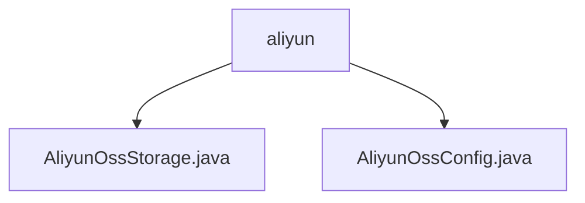

# 基础信息

|      |      |
|------|------|
| 名称 | aliyun |
| 编码语言 | .java |
| 代码路径 | WeFe/common/java/common-data-storage/src/main/java/com/welab/wefe/common/data/storage/service/fc/aliyun |
| 包名 | docs.common.java.common-data-storage.src.main.java.com.welab.wefe.common.data.storage.service.fc.aliyun |
| 概述说明 | AliyunOssStorage类继承FcStorage，实现阿里云OSS和OTS数据存储，含分片配置及批量存储方法ossPutAll和otsPutAll。AliyunOssConfig类管理OSS配置，含密钥、存储桶等参数，构造函数自动生成内部端点URL。 |

# 说明

## 概述  
该模块核心职责是实现阿里云OSS和OTS的高效数据存储，支持批量写入、动态分片和容错处理。接口规范包括`ossPutAll`（多线程分片上传至OSS）和`otsPutAll`（分片写入OTS表），均支持重试和回调机制。关键数据结构包含OSS配置参数（如`bucketName`、`region`）和OTS分片策略（如分片大小、行数限制）。外部依赖仅为阿里云OSS/OTS SDK。例如，`AliyunOssConfig`通过构造函数自动生成内部Endpoint URL。

## 主要业务场景  
模块适用于大数据量异步存储场景，类似事件总线模式。典型流程为：数据分片→多线程上传→回调处理。例如，`ossPutAll`根据文件大小动态分片，`otsPutAll`通过`hashKeyToPartition`计算分区。集成案例包括配置管理（如`AliyunOssConfig`非空校验）和存储执行（如`SampleCallback`处理OTS结果），形成端到端解决方案。

### 包内部结构视图

该流程图展示了阿里云文件存储服务的两个核心配置文件关系。根节点为aliyun文件夹，包含AliyunOssStorage.java和AliyunOssConfig.java两个实现类，分别用于处理OSS存储操作和配置管理。这两个文件共同构成了阿里云对象存储服务的基础功能模块，体现了存储服务实现与配置分离的设计原则。

# 文件列表

| 名称   | 类型  | 说明 |
|-------|------|-------------|
| [AliyunOssStorage.java](AliyunOssStorage.md) | file | 阿里云OSS存储类，支持数据分片存储，单文件最大4MB，行数500-1000，多线程上传，含OTS表存储功能。 |
| [AliyunOssConfig.java](AliyunOssConfig.md) | file | 阿里云OSS配置类，包含实例名、密钥、桶名、区域等字段，构造函数校验非空并生成内部端点URL。 |

