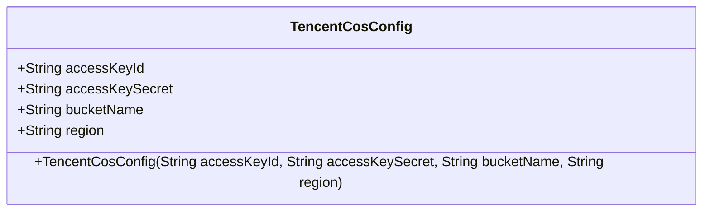
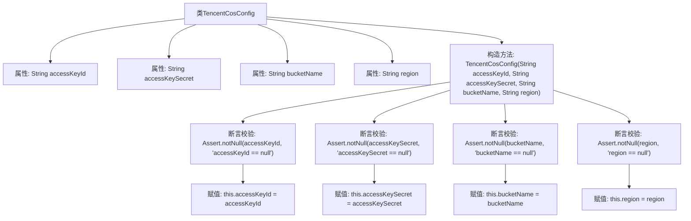

# 基础信息

|      |      |
|------|------|
| 名称 | TencentCosConfig |
| 编码语言 | .java |
| 代码路径 | WeFe/common/java/common-data-storage/src/main/java/com/welab/wefe/common/data/storage/service/fc/tencent/TencentCosConfig.java |
| 包名 | com.welab.wefe.common.data.storage.service.fc.tencent |
| 依赖项 | ['org.springframework.util.Assert'] |
| 概述说明 | 腾讯云COS配置类，包含密钥ID、密钥、桶名和区域字段，构造时校验非空并赋值。 |

# 说明

这是一个腾讯云对象存储配置类，包含四个关键字段：访问密钥ID、访问密钥、存储桶名称和区域。构造函数接收这四个参数并进行非空校验后赋值。类用于存储和管理腾讯云COS服务所需的认证和配置信息。

# 类列表 Class Summary

| 名称   | 类型  | 说明 |
|-------|------|-------------|
| TencentCosConfig | class | 腾讯云COS配置类，包含密钥ID、密钥、桶名和区域字段，构造函数校验非空后赋值。 |

## 类 TencentCosConfig

|      |      |
|------|------|
| 访问范围 | public |
| 类型 | class |
| 名称 | TencentCosConfig |
| 说明 | 腾讯云COS配置类，包含密钥ID、密钥、桶名和区域字段，构造函数校验非空后赋值。 |

### UML类图

这段代码定义了一个名为TencentCosConfig的类，用于存储腾讯云对象存储(COS)的配置信息。该类包含四个公有字符串字段：accessKeyId(访问密钥ID)、accessKeySecret(访问密钥)、bucketName(存储桶名称)和region(区域)。构造函数接收这四个参数，并通过Assert.notNull方法确保它们不为空后，将参数值赋给对应的字段。这个类主要用于集中管理COS服务所需的认证和位置信息，为后续的云存储操作提供基础配置支持。

### 内部方法调用关系图

这段代码定义了一个名为TencentCosConfig的类，用于存储腾讯云对象存储(COS)的配置信息。类中包含四个字符串属性：accessKeyId、accessKeySecret、bucketName和region。构造方法接收这四个参数，并通过Assert.notNull方法进行非空校验，确保所有配置项都不为空后，将参数值赋给对应的成员变量。该类的设计主要用于在初始化腾讯云COS客户端时提供必要的配置参数验证和存储功能。

### 字段列表 Field List

| 名称  | 类型  | 说明 |
|-------|-------|------|
| accessKeyId | String | 声明一个公共字符串变量accessKeyId。 |
| accessKeySecret | String | 声明了一个公开的字符串类型变量accessKeySecret。 |
| bucketName | String | 公共字符串变量bucketName，用于存储桶名称。 |
| region | String | 声明一个公共字符串变量region。 |

### 方法列表

| 名称  | 类型  | 说明 |
|-------|-------|------|

