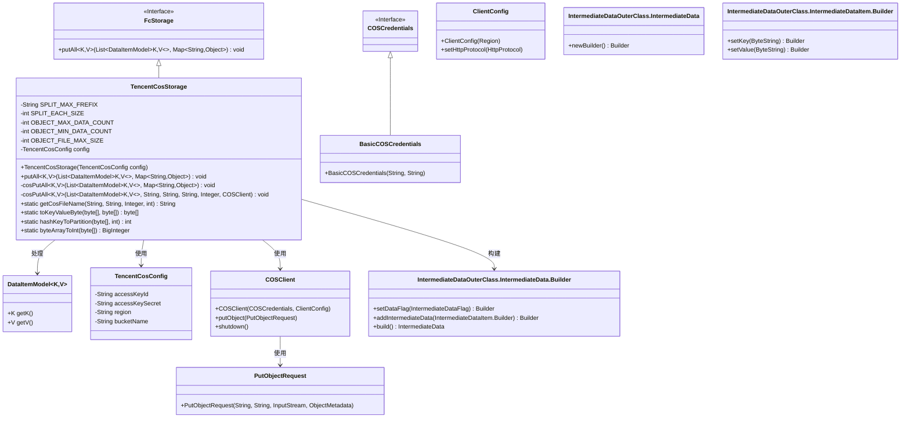
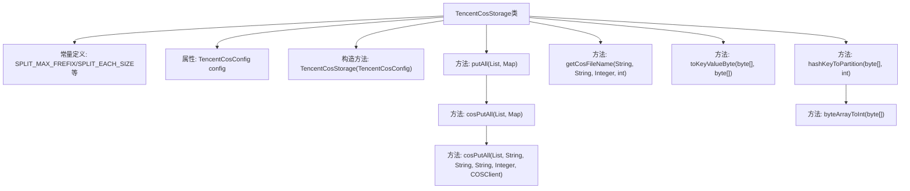
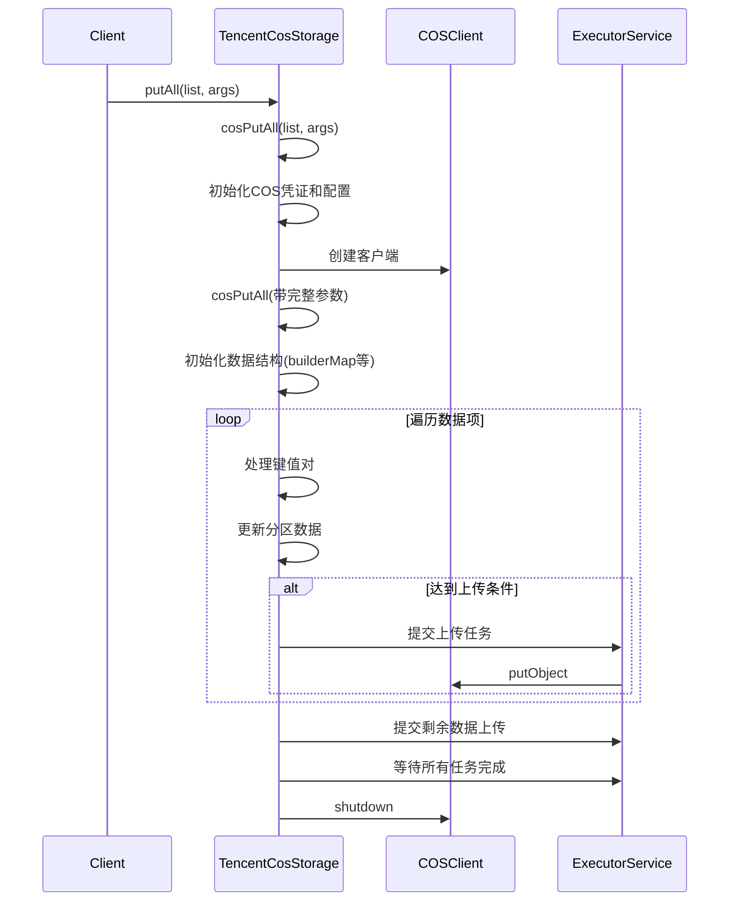

# 基础信息

|      |      |
|------|------|
| 名称 | TencentCosStorage |
| 编码语言 | .java |
| 代码路径 | WeFe/common/java/common-data-storage/src/main/java/com/welab/wefe/common/data/storage/service/fc/tencent/TencentCosStorage.java |
| 包名 | com.welab.wefe.common.data.storage.service.fc.tencent |
| 依赖项 | ['com.google.protobuf.ByteString', 'com.qcloud.cos.COSClient', 'com.qcloud.cos.ClientConfig', 'com.qcloud.cos.auth.BasicCOSCredentials', 'com.qcloud.cos.auth.COSCredentials', 'com.qcloud.cos.http.HttpProtocol', 'com.qcloud.cos.model.ObjectMetadata', 'com.qcloud.cos.model.PutObjectRequest', 'com.qcloud.cos.region.Region', 'com.welab.wefe.common.data.storage.common.IntermediateDataFlag', 'com.welab.wefe.common.data.storage.model.DataItemModel', 'com.welab.wefe.common.data.storage.service.fc.FcStorage', 'com.welab.wefe.common.proto.IntermediateDataOuterClass', 'net.razorvine.pickle.Pickler', 'org.apache.commons.codec.digest.DigestUtils', 'org.apache.commons.lang.ArrayUtils', 'java.io.ByteArrayInputStream', 'java.math.BigDecimal', 'java.math.BigInteger', 'java.nio.charset.StandardCharsets', 'java.security.MessageDigest', 'java.util', 'java.util.concurrent'] |
| 概述说明 | TencentCosStorage类继承FcStorage，用于将数据分批上传至腾讯云COS。支持按分区存储，单文件最大4MB，行数限制500-1000。使用多线程上传，包含密钥配置、数据序列化及哈希分区逻辑。 |

# 说明

TencentCosStorage类继承自FcStorage，用于将数据批量存储到腾讯云COS。主要功能包括初始化COS客户端、数据分片处理和多线程上传。类中定义了文件分割大小、最大最小行数限制和文件大小限制等常量。通过cosPutAll方法实现数据分批处理，根据分区、行数和文件大小动态生成文件名并上传。数据序列化使用Pickler工具，支持键值对合并为字节数组。哈希分区算法确保数据均匀分布，采用SHA1和特定数学计算实现。上传过程使用线程池优化性能，确保文件不超过4MB且行数在500-1000之间。最后清理资源并关闭客户端。

# 类列表 Class Summary

| 名称   | 类型  | 说明 |
|-------|------|-------------|
| TencentCosStorage | class | TencentCosStorage类继承FcStorage，用于将数据分批上传至腾讯云COS。支持多线程上传，单文件最大4MB，行数限制500-1000。包含密钥配置、分区计算及数据序列化功能。 |

## 类 TencentCosStorage

|      |      |
|------|------|
| 访问范围 | public |
| 类型 | class |
| 名称 | TencentCosStorage |
| 说明 | TencentCosStorage类继承FcStorage，用于将数据分批上传至腾讯云COS。支持多线程上传，单文件最大4MB，行数限制500-1000。包含密钥配置、分区计算及数据序列化功能。 |

### UML类图

这段代码描述了一个腾讯云COS存储实现类TencentCosStorage，它继承自FcStorage接口。主要功能是将数据分片后上传到腾讯云COS存储服务。类图中展示了核心类及其关系：TencentCosStorage通过COSClient与腾讯云交互，使用IntermediateData.Builder构建数据，并依赖TencentCosConfig获取配置信息。代码实现了数据分片、序列化、并发上传等复杂逻辑，通过线程池提高上传效率，同时严格控制单个文件大小和行数限制。

### 内部方法调用关系图

这段代码实现了一个腾讯云COS存储服务的数据批量上传功能。流程图展示了类结构关系，时序图详细描述了从调用putAll方法到最终数据上传的完整过程。代码通过智能分片策略处理大数据量上传，根据数据大小和行数动态决定何时触发上传，并使用线程池并行处理多个分区的数据上传，确保高效可靠地将数据存储到COS服务中。

### 字段列表 Field List

| 名称  | 类型  | 说明 |
|-------|-------|------|
| OBJECT_MIN_DATA_COUNT = 500 | int | 私有静态常量，最小数据对象数为500。 |
| config | TencentCosConfig | 私有腾讯云COS配置对象。 |
| SPLIT_EACH_SIZE = 1024 * 1024 | int | 定义常量SPLIT_EACH_SIZE，值为1MB（1048576字节）。 |
| SPLIT_MAX_FREFIX = "MAX_" | String | 定义静态常量字符串SPLIT_MAX_FREFIX，值为"MAX_"，用于前缀标识。 |
| OBJECT_MAX_DATA_COUNT = 1000 | int | 静态常量OBJECT_MAX_DATA_COUNT定义最大数据量为1000。 |
| OBJECT_FILE_MAX_SIZE = 1024 * 1024 * 4 | int | 定义私有静态常量，限制对象文件最大为4MB。 |

### 方法列表

| 名称  | 类型  | 说明 |
|-------|-------|------|
| cosPutAll | void | 方法cosPutAll将数据按分区存储并分批上传至COS，根据数据大小和行数动态调整上传条件，使用多线程提高效率，最后清理资源。 |
| cosPutAll | void | 方法cosPutAll接收数据列表和参数，初始化腾讯云COS客户端，设置HTTPS协议，并调用同名方法处理数据存储。关键参数包括命名空间、函数名和分区数。 |
| putAll | void | 该方法重写父类方法，接收数据项列表和参数映射，调用cosPutAll处理批量插入操作，可能抛出异常。 |
| getCosFileName | String | 生成COS文件名：命名空间/名称/分区/UUID_cnt文件数 |
| toKeyValueByte | byte[] | 将key和value拼接为字节数组，中间和末尾添加换行符。 |
| hashKeyToPartition | int | 静态方法hashKeyToPartition通过SHA1哈希和复杂计算将字节数组key映射到指定分区数partitions的范围内，分区数需为正数，否则抛出异常。 |
| byteArrayToInt | BigInteger | 该方法将字节数组转换为大整数。首先复制数组，反转字节顺序（大端转小端），然后使用BigInteger构造器生成无符号整数。 |

