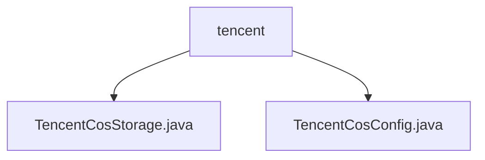

# 基础信息

|      |      |
|------|------|
| 名称 | tencent |
| 编码语言 | .java |
| 代码路径 | WeFe/common/java/common-data-storage/src/main/java/com/welab/wefe/common/data/storage/service/fc/tencent |
| 包名 | docs.common.java.common-data-storage.src.main.java.com.welab.wefe.common.data.storage.service.fc.tencent |
| 概述说明 | TencentCosStorage类继承FcStorage，实现腾讯云COS数据批量存储，支持分片处理、多线程上传和哈希分区。TencentCosConfig类管理COS认证配置，含密钥、桶名和区域。 |

# 说明

## 概述  
该模块核心职责是实现腾讯云COS的批量数据存储，支持数据分片处理、多线程上传和哈希分区。接口规范包括初始化COS客户端、动态分批上传（如cosPutAll方法）和资源清理。关键数据结构涉及文件分割大小限制（4MB）、行数范围（500-1000）及序列化键值对字节数组。外部依赖为腾讯云COS SDK和Pickler序列化工具。例如通过SHA1算法实现数据均匀分布，线程池优化上传性能。

## 主要业务场景  
模块处理大规模数据存储场景，类似分片上传模式：先按行数和文件大小动态分片，再并行上传至COS。典型流程包括配置认证信息（如TencentCosConfig类管理密钥和存储桶）、数据序列化、哈希分区及多线程传输。例如根据分区规则生成文件名，确保单文件不超4MB且行数在500-1000间。集成案例展示从配置初始化到资源释放的完整生命周期管理。

### 包内部结构视图

该流程图展示了Tencent COS存储服务的两个核心配置文件关系。根节点"tencent"下包含两个Java类文件：TencentCosStorage.java实现存储服务功能，TencentCosConfig.java负责配置管理。这两个文件共同构成了腾讯云对象存储服务的基础实现模块。

# 文件列表

| 名称   | 类型  | 说明 |
|-------|------|-------------|
| [TencentCosStorage.java](TencentCosStorage.md) | file | TencentCosStorage类继承FcStorage，用于将数据分批上传至腾讯云COS。支持按分区存储，单文件最大4MB，行数限制500-1000。使用多线程上传，包含密钥配置、数据序列化及哈希分区逻辑。 |
| [TencentCosConfig.java](TencentCosConfig.md) | file | 腾讯云COS配置类，包含密钥ID、密钥、桶名和区域字段，构造时校验非空并赋值。 |

