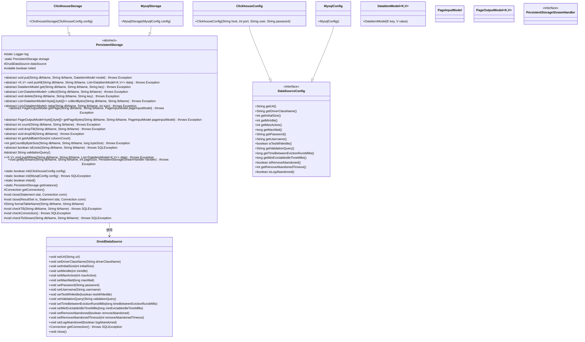

# 基础信息

|      |      |
|------|------|
| 名称 | PersistentStorage |
| 编码语言 | .java |
| 代码路径 | WeFe/common/java/common-data-storage/src/main/java/com/welab/wefe/common/data/storage/service/persistent/PersistentStorage.java |
| 包名 | com.welab.wefe.common.data.storage.service.persistent |
| 依赖项 | ['com.alibaba.druid.pool.DruidDataSource', 'com.welab.wefe.common.data.storage.model.DataItemModel', 'com.welab.wefe.common.data.storage.model.PageInputModel', 'com.welab.wefe.common.data.storage.model.PageOutputModel', 'com.welab.wefe.common.data.storage.service.persistent.clickhouse.ClickhouseStorage', 'com.welab.wefe.common.data.storage.service.persistent.mysql.MysqlConfig', 'com.welab.wefe.common.data.storage.service.persistent.mysql.MysqlStorage', 'com.welab.wefe.common.wefe.dto.storage.ClickhouseConfig', 'com.welab.wefe.common.wefe.dto.storage.DataSourceConfig', 'org.slf4j.Logger', 'org.slf4j.LoggerFactory', 'java.sql', 'java.util.List'] |
| 概述说明 | 抽象类PersistentStorage定义持久化存储操作，包含数据增删查改、分页查询、表库管理等方法，支持ClickHouse和MySQL初始化，使用Druid连接池管理数据库连接。 |

# 说明

这是一个名为PersistentStorage的抽象类，用于实现持久化存储功能。它包含多个抽象方法，如数据增删改查（put、delete、get、collect等）、分页查询（getPage）、表操作（dropTB、dropDB）等。类中提供了静态初始化方法，支持Clickhouse和MySQL两种数据库配置，使用Druid连接池管理数据源。包含连接管理、资源释放、表检查等辅助方法，通过单例模式提供全局访问。该类主要封装了数据库基本操作，支持批量处理和流式查询，具有连接池配置和初始化状态管理功能。

# 类列表 Class Summary

| 名称   | 类型  | 说明 |
|-------|------|-------------|
| PersistentStorage | class | 抽象类PersistentStorage定义持久化存储操作，包含数据增删查改、分页查询、表库管理等抽象方法，支持ClickHouse和MySQL初始化，使用Druid连接池管理数据库连接。 |

## 类 PersistentStorage

|      |      |
|------|------|
| 访问范围 | public abstract |
| 类型 | class |
| 名称 | PersistentStorage |
| 说明 | 抽象类PersistentStorage定义持久化存储操作，包含数据增删查改、分页查询、表库管理等抽象方法，支持ClickHouse和MySQL初始化，使用Druid连接池管理数据库连接。 |

### UML类图

这段代码描述了一个抽象类`PersistentStorage`，它定义了持久化存储的核心接口和基础功能，包括数据增删改查、分页查询、表管理等操作。该类有两个具体实现`ClickhouseStorage`和`MysqlStorage`，通过静态工厂方法初始化。类图中展示了其与数据源配置、连接池以及各种数据模型的关系，体现了多数据库支持的抽象设计。核心功能包括连接管理、表检查、资源释放等，通过泛型支持多种数据类型操作。

### 内部方法调用关系图

```mermaid
graph TD
    A["抽象类PersistentStorage"]
    B["静态属性: Logger log"]
    C["静态属性: PersistentStorage storage"]
    D["实例属性: DruidDataSource dataSource"]
    E["实例属性: boolean inited"]
    F["构造方法: protected PersistentStorage()"]
    G["静态方法: init(ClickhouseConfig)"]
    H["静态方法: init(MysqlConfig)"]
    I["静态方法: inited()"]
    J["静态方法: getInstance()"]
    K["静态方法: buildDruidDataSource()"]
    L["实例方法: getConnection()"]
    M["实例方法: close(Statement, Connection)"]
    N["实例方法: close(ResultSet, Statement, Connection)"]
    O["实例方法: formatTableName()"]
    P["实例方法: checkTB()"]
    Q["实例方法: checkConnection()"]
    R["实例方法: checkTbStream()"]
    S["抽象方法区域: put/putAll/get/collect等12个"]

    A --> B
    A --> C
    A --> D
    A --> E
    A --> F
    A --> G
    A --> H
    A --> I
    A --> J
    A --> K
    A --> L
    A --> M
    A --> N
    A --> O
    A --> P
    A --> Q
    A --> R
    A -.-> S
    G --> K
    H --> K
    P --> L
    P --> M
    Q --> L
    Q --> M
    R --> L
    R --> M
```

这段代码定义了一个抽象类PersistentStorage，主要用于数据库持久化操作。类中包含静态初始化方法、连接池管理、资源释放等基础功能，以及12个抽象方法定义具体存储操作。核心流程包括：通过init方法初始化不同数据库配置，使用连接池管理数据库连接，提供表检查和连接验证功能，并通过模板方法模式要求子类实现具体存储操作。类设计采用了单例模式，支持Clickhouse和MySQL两种数据库实现。

### 字段列表 Field List

| 名称  | 类型  | 说明 |
|-------|-------|------|
| inited = false | boolean | 声明一个公共易变布尔变量inited，初始值为false。 |
| storage | PersistentStorage | 私有静态持久化存储对象。 |
| log = LoggerFactory.getLogger(PersistentStorage.class) | Logger | 持久化存储类日志记录器初始化。 |
| dataSource | DruidDataSource | 声明一个名为dataSource的DruidDataSource类型公共变量。 |

### 方法列表

| 名称  | 类型  | 说明 |
|-------|-------|------|
| inited | boolean | 该方法检查存储是否已初始化，返回布尔值表示状态。 |
| main | void | Java代码初始化ClickHouse数据库连接，存储键值对数据并查询返回列表。 |
| collectBytes | List<DataItemModel<byte[], byte[]>> | 抽象方法：收集字节数据，参数为数据库名和表名，返回字节类型的数据项列表，可能抛出异常。 |
| take | List<DataItemModel> | 抽象方法：从指定数据库表获取指定数量数据项，返回列表，可能抛出异常。 |
| getCountByByteSize | int | 方法getCountByByteSize根据数据库名和表名及字节大小返回固定值1000，可能抛出异常。 |
| getByStream | void | 方法getByStream从指定数据库表获取数据流，参数包括库名、表名、每页大小和流处理器，可能抛出异常。 |
| isExists | boolean | 检查数据库表是否存在，参数为库名和表名，返回布尔值，可能抛出SQL异常。 |
| getConnection | Connection | 获取数据库连接的方法，尝试从数据源获取连接，捕获并记录SQL异常，最后返回连接对象。 |
| getPageBytes | PageOutputModel<byte[], byte[]> | 获取分页字节数据抽象方法：输入数据库名、表名和分页参数，返回字节数组分页结果，可能抛出异常。 |
| init | boolean | 同步静态方法初始化MySQL存储，检查配置并重建数据源，返回初始化状态。 |
| formatTableName | String | 该方法用于格式化数据库表名，返回格式为`数据库名`.`表名`的字符串。 |
| count | int | 抽象方法count，输入数据库名和表名，返回整型结果，可能抛出异常。 |
| getPage | PageOutputModel | 获取指定数据库表的页面数据，输入为分页参数，输出为页面模型，可能抛出异常。 |
| init | boolean | 同步静态方法init初始化Clickhouse存储，配置成功返回true，失败返回false并记录错误日志。 |
| checkTB | void | 方法checkTB用于检查并创建表，表结构包含eventDate、k、v、id字段，使用MergeTree引擎，按eventDate分区和id排序，最后关闭连接。 |
| collect | List<DataItemModel> | 抽象方法collect，输入数据库名和表名，返回DataItemModel列表，可能抛出异常。 |
| checkConnection | void | 检查数据库连接有效性：获取连接，执行验证SQL，最后关闭资源。 |
| dropDB | void | 抽象方法dropDB，接收数据库名参数，可能抛出异常。 |
| validationQuery | String | 抽象方法，返回用于验证的查询字符串。 |
| putAllNew | void | Java方法：向指定数据库表批量插入新数据，参数为库名、表名和数据项列表，可能抛出异常。 |
| getAddBatchSize | int | 抽象方法，返回基于列数的批量添加大小。 |
| getInstance | PersistentStorage | 这是一个静态方法，返回PersistentStorage类的单例实例storage。 |
| checkTbStream | void | 检查并创建表，若不存在则建表，包含eventDate、k、v字段，使用MergeTree引擎，按日期分区，无排序，索引粒度8192。 |
| buildDruidDataSource | DruidDataSource | 该方法根据配置构建DruidDataSource实例，设置URL、驱动、连接池参数、用户名密码及连接验证等属性。 |
| close | void | 关闭数据库资源的方法，接受Statement和Connection对象作为参数，内部调用重载方法处理关闭操作。 |
| put | void | 抽象方法：向指定数据库表插入数据模型，可能抛出异常。 |
| close | void | 关闭数据库资源方法，依次关闭ResultSet、Statement和Connection，捕获并记录SQLException异常。 |
| delete | void | 抽象方法delete，用于删除指定数据库和表中对应键的数据，可能抛出异常。 |
| putAll | void | 抽象方法putAll：向指定数据库表批量写入键值对数据，参数为库名、表名和数据项列表，可能抛出异常。 |
| dropTB | void | 抽象方法dropTB，用于删除指定数据库中的表，需传入数据库名和表名，可能抛出异常。 |
| get | DataItemModel | 抽象方法get，通过dbName、tbName和key获取DataItemModel，可能抛出异常。 |

