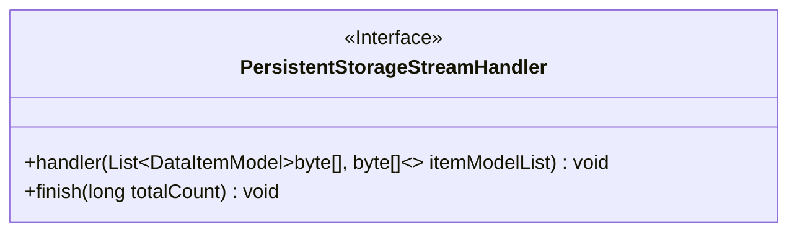
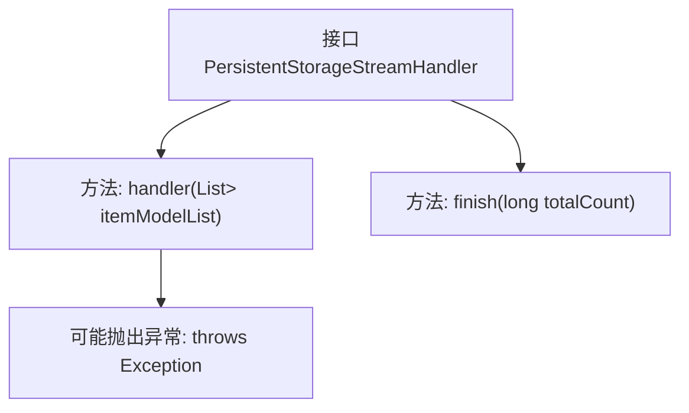

# 基础信息

|      |      |
|------|------|
| 名称 | PersistentStorageStreamHandler |
| 编码语言 | .java |
| 代码路径 | WeFe/common/java/common-data-storage/src/main/java/com/welab/wefe/common/data/storage/service/persistent/PersistentStorageStreamHandler.java |
| 包名 | com.welab.wefe.common.data.storage.service.persistent |
| 依赖项 | ['com.welab.wefe.common.data.storage.model.DataItemModel', 'java.util.List'] |
| 概述说明 | 接口PersistentStorageStreamHandler定义了两个方法：handler处理数据项列表可能抛出异常，finish在完成时通知总处理数量。 |

# 说明

该接口定义了一个持久化存储流处理器，包含两个核心方法。handler方法负责处理数据项列表，参数为包含键值对字节数组的数据模型列表，可能抛出异常。finish方法在流处理完成时被调用，接收总处理数据量作为参数。该接口适用于需要批量处理二进制数据并跟踪进度的场景。

# 类列表 Class Summary

| 名称   | 类型  | 说明 |
|-------|------|-------------|
| PersistentStorageStreamHandler | interface | 持久化存储流处理接口，包含批量处理数据项的方法和处理完成回调方法。处理可能抛出异常，完成时返回总数据量。 |

## 类 PersistentStorageStreamHandler

|      |      |
|------|------|
| 访问范围 | public |
| 类型 | interface |
| 名称 | PersistentStorageStreamHandler |
| 说明 | 持久化存储流处理接口，包含批量处理数据项的方法和处理完成回调方法。处理可能抛出异常，完成时返回总数据量。 |

### UML类图

这段代码定义了一个名为`PersistentStorageStreamHandler`的接口，包含两个方法：`handler`用于处理数据项列表（泛型为`DataItemModel<byte[], byte[]>`），可能抛出异常；`finish`用于在操作完成时通知总处理数量。该接口适用于需要持久化存储和流式处理的场景，强调批量数据处理和完成回调机制。

### 内部方法调用关系图

该流程图展示了PersistentStorageStreamHandler接口的结构，包含两个核心方法：handler用于处理二进制数据模型列表并可能抛出异常，finish用于在流处理完成后通知总记录数。箭头清晰地表示了接口与方法之间的从属关系，异常声明作为handler方法的附加属性单独列出。

### 字段列表 Field List

| 名称  | 类型  | 说明 |
|-------|-------|------|

### 方法列表

| 名称  | 类型  | 说明 |
|-------|-------|------|
| finish | void | 函数finish接收一个长整型参数totalCount，表示完成时的总计数。 |
| handler | void | 处理字节数组数据项列表的方法，可能抛出异常。 |

