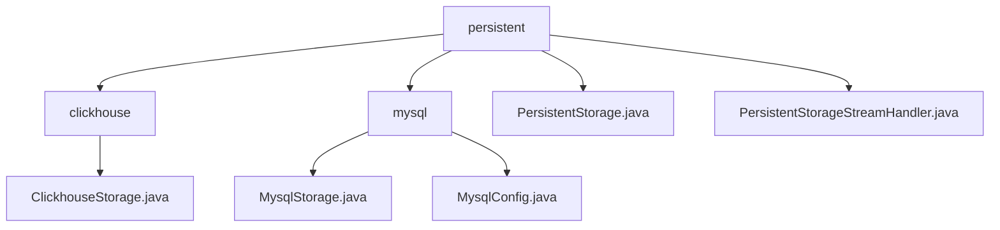

# 基础信息

|      |      |
|------|------|
| 名称 | persistent |
| 编码语言 | .java |
| 代码路径 | WeFe/common/java/common-data-storage/src/main/java/com/welab/wefe/common/data/storage/service/persistent |
| 包名 | docs.common.java.common-data-storage.src.main.java.com.welab.wefe.common.data.storage.service.persistent |
| 概述说明 | ClickhouseStorage继承PersistentStorage，实现CRUD、批量操作、分页查询及表管理，支持序列化和流式处理。MysqlStorage类似，依赖JDBC连接MySQL。PersistentStorage为抽象基类，封装数据库操作，支持ClickHouse和MySQL。PersistentStorageStreamHandler接口定义批量数据处理方法。 |

# 说明

## 概述  
该模块核心职责是实现多数据库（ClickHouse/MySQL）的通用持久化存储，提供标准CRUD、批量操作及表管理功能。接口规范统一为数据操作（put/get/delete）、批量处理（putAll/collect）、分页查询（getPage）和表维护（dropTB/dropDB），支持字节流处理（类似事件总线模式）。关键数据结构包括ClickhouseConfig和MysqlConfig，含连接参数与JDBC配置。外部依赖为ClickHouse和MySQL的JDBC驱动及Druid连接池。例如ClickhouseStorage支持对象序列化，PersistentStorageStreamHandler实现二进制流处理。

## 主要业务场景  
模块适用于异构数据库持久化场景，类似适配器模式。典型流程包括：通过*Config配置连接，继承PersistentStorage实现具体存储（如MySQL分页查询或ClickHouse流式处理）。例如使用putAll批量插入或getByStream处理大数据。集成案例为通过Druid连接池管理资源，混合原子操作与批量API。交互模式统一为配置初始化+单例访问，支持流处理器（如PersistentStorageStreamHandler）跟踪处理进度。

### 包内部结构视图

该流程图展示了数据存储服务中持久化层的结构关系。根节点"persistent"下包含两个数据库类型子目录（clickhouse和mysql）以及两个核心类文件。clickhouse目录包含其专属存储实现类，mysql目录则包含存储实现和配置类。整体结构清晰地反映了不同数据库类型的存储实现与核心抽象类之间的层级关系。

# 文件列表

| 名称   | 类型  | 说明 |
|-------|------|-------------|
| [mysql](mysql/_module.md) | package | MysqlStorage类继承PersistentStorage，实现MySQL数据库CRUD、批量操作、分页查询及表管理功能。MysqlConfig类继承DataSourceConfig，配置MySQL连接参数并构建JDBC连接字符串。 |
| [PersistentStorage.java](PersistentStorage.md) | file | 抽象类PersistentStorage定义持久化存储操作，包含数据增删查改、分页查询、表库管理等方法，支持ClickHouse和MySQL初始化，使用Druid连接池管理数据库连接。 |
| [PersistentStorageStreamHandler.java](PersistentStorageStreamHandler.md) | file | 接口PersistentStorageStreamHandler定义了两个方法：handler处理数据项列表可能抛出异常，finish在完成时通知总处理数量。 |
| [clickhouse](clickhouse/_module.md) | package | ClickhouseStorage类继承PersistentStorage，实现数据库操作如增删改查、批量插入、分页查询及流式处理，支持字节和对象序列化。 |

