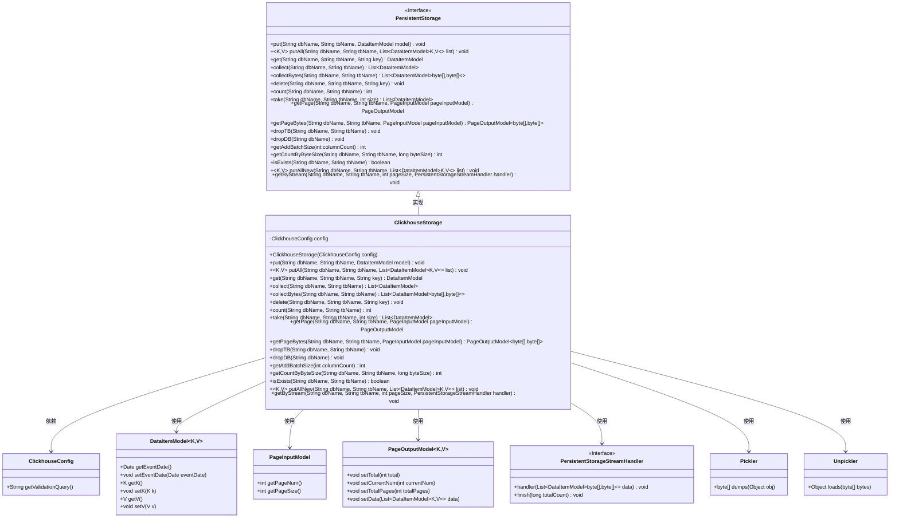
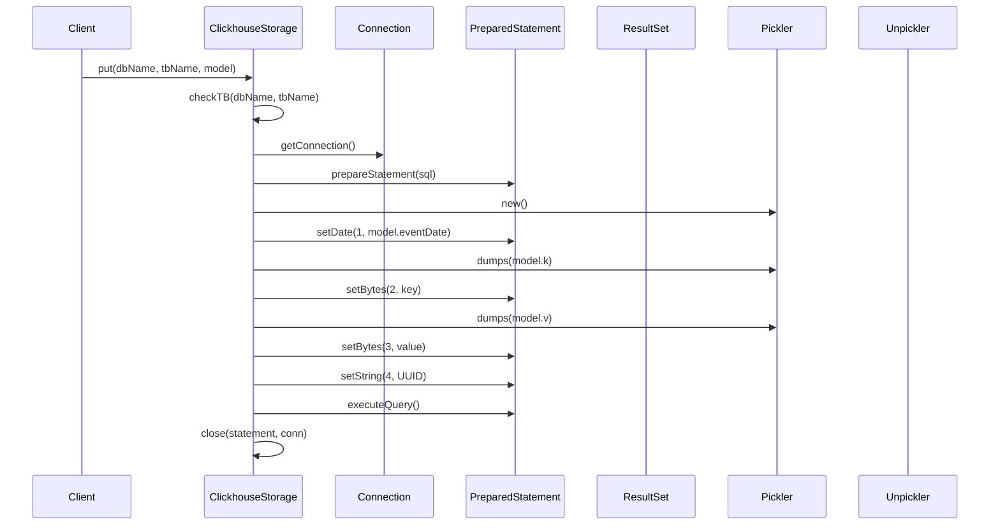

# 基础信息

|      |      |
|------|------|
| 名称 | ClickhouseStorage |
| 编码语言 | .java |
| 代码路径 | WeFe/common/java/common-data-storage/src/main/java/com/welab/wefe/common/data/storage/service/persistent/clickhouse/ClickhouseStorage.java |
| 包名 | com.welab.wefe.common.data.storage.service.persistent.clickhouse |
| 依赖项 | ['com.welab.wefe.common.data.storage.model.DataItemModel', 'com.welab.wefe.common.data.storage.model.PageInputModel', 'com.welab.wefe.common.data.storage.model.PageOutputModel', 'com.welab.wefe.common.data.storage.service.persistent.PersistentStorage', 'com.welab.wefe.common.data.storage.service.persistent.PersistentStorageStreamHandler', 'com.welab.wefe.common.wefe.dto.storage.ClickhouseConfig', 'net.razorvine.pickle.Pickler', 'net.razorvine.pickle.Unpickler', 'java.math.BigDecimal', 'java.math.RoundingMode', 'java.sql', 'java.util.ArrayList', 'java.util.List', 'java.util.UUID'] |
| 概述说明 | ClickhouseStorage类继承PersistentStorage，实现数据库操作如增删改查、批量插入、分页查询及流式处理，支持字节和对象序列化。 |

# 说明

ClickhouseStorage类继承自PersistentStorage，实现了多种数据库操作方法。主要功能包括单条数据插入put、批量插入putAll、数据查询get、collect、分页查询getPage、数据删除delete、表计数count、表删除dropTB、数据库删除dropDB等。支持字节数组和对象序列化处理，使用Pickler和Unpickler进行数据转换。提供流式查询getByStream处理大数据量，支持分页和批量操作。包含表存在性检查isExists、按字节大小计算数据量getCountByByteSize等功能。通过JDBC连接ClickHouse数据库，管理连接资源确保关闭。

# 类列表 Class Summary

| 名称   | 类型  | 说明 |
|-------|------|-------------|
| ClickhouseStorage | class | ClickhouseStorage类继承PersistentStorage，提供对Clickhouse数据库的增删改查操作，支持批量插入、分页查询、流式读取等功能。 |

## 类 ClickhouseStorage

|      |      |
|------|------|
| 访问范围 | public |
| 类型 | class |
| 名称 | ClickhouseStorage |
| 说明 | ClickhouseStorage类继承PersistentStorage，提供对Clickhouse数据库的增删改查操作，支持批量插入、分页查询、流式读取等功能。 |

### UML类图

这段类图展示了ClickhouseStorage类及其相关组件的关系。ClickhouseStorage继承自PersistentStorage接口，实现了对ClickHouse数据库的CRUD操作、分页查询、批量处理等功能。它依赖于ClickhouseConfig获取配置信息，使用DataItemModel作为数据载体，通过Pickler/Unpickler进行序列化操作，并支持分页(PageInputModel/PageOutputModel)和流式处理(PersistentStorageStreamHandler)。该设计体现了清晰的职责分离和模块化思想，通过接口定义规范了存储操作的行为契约。

### 内部方法调用关系图

```mermaid
graph TD
    A["类ClickhouseStorage"]
    B["属性: ClickhouseConfig config"]
    C["构造方法: ClickhouseStorage(ClickhouseConfig config)"]
    D["方法: void put(String dbName, String tbName, DataItemModel model)"]
    E["方法: void putAll(String dbName, String tbName, List<DataItemModel> list)"]
    F["方法: DataItemModel get(String dbName, String tbName, String key)"]
    G["方法: List<DataItemModel> collect(String dbName, String tbName)"]
    H["方法: List<DataItemModel> collectBytes(String dbName, String tbName)"]
    I["方法: void delete(String dbName, String tbName, String key)"]
    J["方法: int count(String dbName, String tbName)"]
    K["方法: List<DataItemModel> take(String dbName, String tbName, int size)"]
    L["方法: PageOutputModel getPage(String dbName, String tbName, PageInputModel pageInputModel)"]
    M["方法: PageOutputModel getPageBytes(String dbName, String tbName, PageInputModel pageInputModel)"]
    N["方法: void dropTB(String dbName, String tbName)"]
    O["方法: void dropDB(String dbName)"]
    P["方法: int getAddBatchSize(int columnCount)"]
    Q["方法: int getCountByByteSize(String dbName, String tbName, long byteSize)"]
    R["方法: boolean isExists(String dbName, String tbName)"]
    S["方法: String validationQuery()"]
    T["方法: void putAllNew(String dbName, String tbName, List<DataItemModel> list)"]
    U["方法: void getByStream(String dbName, String tbName, int pageSize, PersistentStorageStreamHandler handler)"]

    A --> B
    A --> C
    A --> D
    A --> E
    A --> F
    A --> G
    A --> H
    A --> I
    A --> J
    A --> K
    A --> L
    A --> M
    A --> N
    A --> O
    A --> P
    A --> Q
    A --> R
    A --> S
    A --> T
    A --> U
```

这段代码是ClickhouseStorage类的实现，继承自PersistentStorage，提供了对ClickHouse数据库的各种操作。流程图展示了类的主要方法和属性结构，包括数据插入、查询、删除等核心功能。时序图则具体展示了put方法的执行流程，从参数检查到连接获取、SQL准备、数据序列化、执行查询和资源释放的全过程。该类封装了ClickHouse的JDBC操作，提供了数据序列化、批量处理、分页查询等高级功能，同时确保资源正确释放。

### 字段列表 Field List

| 名称  | 类型  | 说明 |
|-------|-------|------|
| config | ClickhouseConfig | 私有Clickhouse配置对象。 |

### 方法列表

| 名称  | 类型  | 说明 |
|-------|-------|------|
| collect | List<DataItemModel> | 方法从数据库按ID倒序查询数据，解析为DataItemModel列表后返回。处理连接和资源关闭。 |
| count | int | 该方法用于统计指定数据库表的记录数，通过SQL查询获取结果，并在最后关闭相关资源。 |
| dropTB | void | 该方法用于删除指定数据库中的表，通过JDBC连接执行DROP TABLE语句，完成后关闭连接。异常时抛出Exception。 |
| take | List<DataItemModel> | 方法从指定数据库表获取最多size条数据，size为负时默认为0，返回数据列表。 |
| delete | void | 该方法通过JDBC连接数据库，执行SQL删除指定表中键为key的记录，使用Pickler序列化key，最后关闭连接。异常由调用方处理。 |
| getPage | PageOutputModel | 该方法根据分页参数查询数据库表数据，返回分页结果。先统计总数，再按ID降序分页查询，处理结果集后设置分页信息并返回。最后关闭数据库连接。 |
| put | void | 该方法向指定数据库表插入数据，检查表名后建立连接，执行SQL插入操作，处理键值序列化，生成随机ID，最后关闭资源。 |
| collectBytes | List<DataItemModel<byte[], byte[]>> | 该方法从指定数据库表查询数据，返回包含字节数组键值对的DataItemModel列表。通过JDBC连接执行SQL查询，遍历结果集构建模型对象，最后关闭资源。异常由调用方处理。 |
| dropDB | void | 该方法用于删除指定数据库，通过获取连接、执行SQL语句并关闭资源实现。异常时抛出，确保资源释放。 |
| get | DataItemModel | 该方法通过数据库查询获取指定表的数据项，使用Pickler处理键值，返回包含日期、键和值的DataItemModel对象。 |
| getPageBytes | PageOutputModel<byte[], byte[]> | 该方法根据分页参数查询数据库表数据，返回包含总记录数、当前页码、总页数和数据列表的分页结果。数据以字节数组形式存储，处理完成后关闭数据库连接。 |
| putAll | void | 该方法用于批量插入数据到指定数据库表，包含检查表、获取连接、设置事务、构建SQL、序列化键值、执行批处理和提交事务等步骤，最后关闭资源。 |
| getAddBatchSize | int | 该方法根据列数计算批量添加数据的大小，公式为15万除以列数。 |
| getCountByByteSize | int | 方法根据字节大小计算数据条数，查询表首条记录获取单条数据大小，计算最优页数，异常时调用父类方法。 |
| isExists | boolean | 该方法检查指定数据库和表是否存在，通过查询系统表system.parts中active记录数，若大于0则存在。最后关闭连接。 |
| validationQuery | String | 重写方法返回配置中的验证查询语句。 |
| putAllNew | void | 方法putAllNew批量插入数据到指定表，检查表存在后建立连接，使用预处理语句设置日期、序列化键值，最后提交事务并关闭资源。 |
| getByStream | void | 该方法通过流式查询数据库表数据，按页处理结果并调用回调函数。使用分页机制优化内存，处理完成后关闭资源。 |

