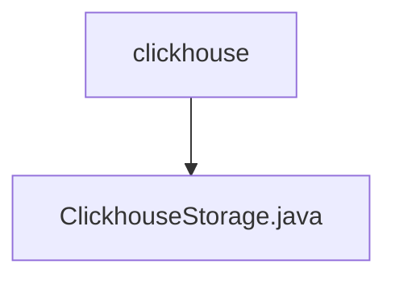

# 基础信息

|      |      |
|------|------|
| 名称 | clickhouse |
| 编码语言 | .java |
| 代码路径 | WeFe/common/java/common-data-storage/src/main/java/com/welab/wefe/common/data/storage/service/persistent/clickhouse |
| 包名 | docs.common.java.common-data-storage.src.main.java.com.welab.wefe.common.data.storage.service.persistent.clickhouse |
| 概述说明 | ClickhouseStorage类继承PersistentStorage，实现数据库操作如增删改查、批量插入、分页查询及流式处理，支持字节和对象序列化。 |

# 说明

ClickhouseStorage类继承自PersistentStorage，实现了多种数据库操作方法。主要功能包括单条数据插入put、批量插入putAll、数据查询get、collect、分页查询getPage、数据删除delete、表计数count、表删除dropTB、数据库删除dropDB等。支持字节数组和对象序列化处理，使用Pickler和Unpickler进行数据转换。提供流式查询getByStream处理大数据量，支持分页和批量操作。包含表存在性检查isExists、按字节大小计算数据量getCountByByteSize等功能。通过JDBC连接ClickHouse数据库，管理连接资源确保关闭。

### 包内部结构视图

该流程图展示了clickhouse目录与ClickhouseStorage.java文件之间的层级关系。clickhouse作为父级目录，包含一个子文件ClickhouseStorage.java，表示这是一个典型的单文件存储结构，常用于特定存储服务的实现类存放。这种简洁的层级关系在数据存储模块中较为常见，便于维护和扩展。

# 文件列表

| 名称   | 类型  | 说明 |
|-------|------|-------------|
| [ClickhouseStorage.java](ClickhouseStorage.md) | file | ClickhouseStorage类继承PersistentStorage，实现数据库操作如增删改查、批量插入、分页查询及流式处理，支持字节和对象序列化。 |

