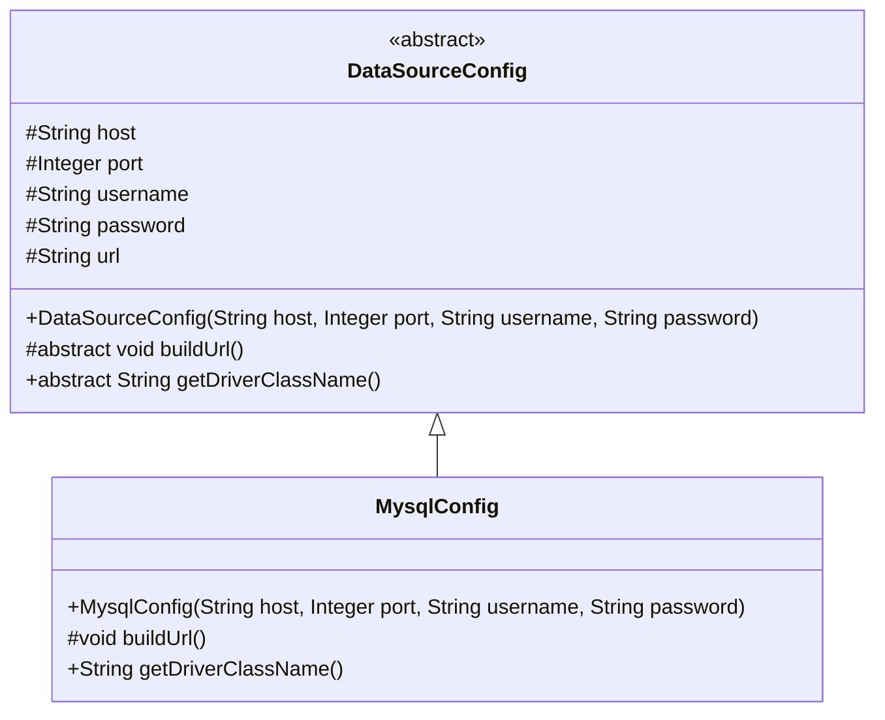
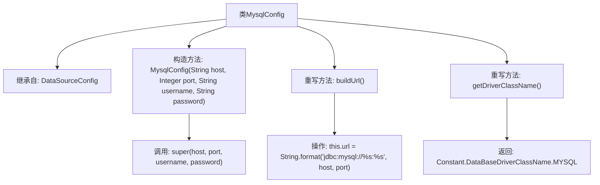

# 基础信息

|      |      |
|------|------|
| 名称 | MysqlConfig |
| 编码语言 | .java |
| 代码路径 | WeFe/common/java/common-data-storage/src/main/java/com/welab/wefe/common/data/storage/service/persistent/mysql/MysqlConfig.java |
| 包名 | com.welab.wefe.common.data.storage.service.persistent.mysql |
| 依赖项 | ['com.welab.wefe.common.data.storage.common.Constant', 'com.welab.wefe.common.wefe.dto.storage.DataSourceConfig'] |
| 概述说明 | MysqlConfig继承DataSourceConfig，通过构造函数初始化数据库连接参数，重写buildUrl生成MySQL连接URL，并返回MySQL驱动类名。 |

# 说明

MysqlConfig类继承自DataSourceConfig，用于配置MySQL数据库连接。构造函数接收主机地址、端口号、用户名和密码参数，并传递给父类。该类重写了buildUrl方法，构建MySQL的JDBC连接字符串，格式为jdbc:mysql://主机:端口。同时重写了getDriverClassName方法，返回MySQL的驱动类名常量。

# 类列表 Class Summary

| 名称   | 类型  | 说明 |
|-------|------|-------------|
| MysqlConfig | class | MysqlConfig继承DataSourceConfig，通过构造函数初始化数据库连接参数，重写buildUrl生成MySQL连接字符串，返回MySQL驱动类名。 |

## 类 MysqlConfig

|      |      |
|------|------|
| 访问范围 | public |
| 类型 | class |
| 名称 | MysqlConfig |
| 说明 | MysqlConfig继承DataSourceConfig，通过构造函数初始化数据库连接参数，重写buildUrl生成MySQL连接字符串，返回MySQL驱动类名。 |

### UML类图

这段代码展示了一个MySQL数据库配置类MysqlConfig继承自抽象基类DataSourceConfig。DataSourceConfig定义了数据库连接的基本参数(host, port等)和抽象方法，MysqlConfig实现了具体的MySQL连接URL构建方式和驱动类名获取。类图清晰地展示了这种继承关系，其中抽象类用<<abstract>>标记，保护成员用#表示，实现了模板方法模式的设计结构。

### 内部方法调用关系图

这段代码展示了一个MysqlConfig类，它继承自DataSourceConfig类。主要功能包括：通过构造方法初始化数据库连接参数，重写buildUrl()方法构建MySQL特定的JDBC连接字符串，以及重写getDriverClassName()方法返回MySQL驱动类名。流程图清晰地展示了类继承关系、方法重写逻辑和关键操作步骤，体现了对MySQL数据库连接配置的封装实现。

### 字段列表 Field List

| 名称  | 类型  | 说明 |
|-------|-------|------|

### 方法列表

| 名称  | 类型  | 说明 |
|-------|-------|------|
| getDriverClassName | String | 重写方法返回MySQL数据库驱动类名。 |
| buildUrl | void | 重写方法buildUrl，用host和port拼接MySQL数据库连接URL。 |

