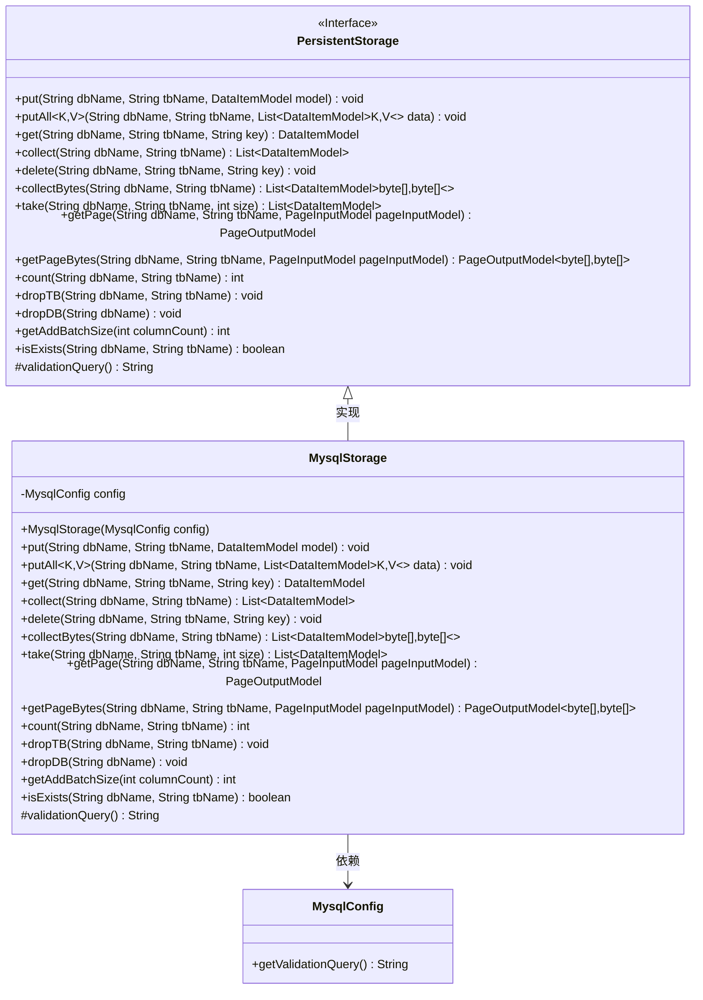

# 基础信息

|      |      |
|------|------|
| 名称 | MysqlStorage |
| 编码语言 | .java |
| 代码路径 | WeFe/common/java/common-data-storage/src/main/java/com/welab/wefe/common/data/storage/service/persistent/mysql/MysqlStorage.java |
| 包名 | com.welab.wefe.common.data.storage.service.persistent.mysql |
| 依赖项 | ['com.welab.wefe.common.data.storage.model.DataItemModel', 'com.welab.wefe.common.data.storage.model.PageInputModel', 'com.welab.wefe.common.data.storage.model.PageOutputModel', 'com.welab.wefe.common.data.storage.service.persistent.PersistentStorage', 'java.sql.SQLException', 'java.util.List'] |
| 概述说明 | MysqlStorage类继承PersistentStorage，实现数据库操作如增删改查、分页查询、批量操作等，依赖MysqlConfig配置。 |

# 说明

MysqlStorage类继承自PersistentStorage，用于实现MySQL数据库的持久化存储操作。该类通过构造函数接收MysqlConfig配置对象，包含数据库表的基本CRUD操作如put、get、delete，以及批量操作putAll、collect。支持分页查询getPage和字节数据操作collectBytes/getPageBytes，提供表存在性检查isExists和统计count功能。包含数据库表管理方法dropTB/dropDB，以及批量大小计算getAddBatchSize和连接验证查询validationQuery。所有方法默认空实现或返回null/0/false。

# 类列表 Class Summary

| 名称   | 类型  | 说明 |
|-------|------|-------------|
| MysqlStorage | class | MysqlStorage继承PersistentStorage，实现数据库操作如增删查改、分页查询、表存在检查等，使用MysqlConfig配置。 |

## 类 MysqlStorage

|      |      |
|------|------|
| 访问范围 | public |
| 类型 | class |
| 名称 | MysqlStorage |
| 说明 | MysqlStorage继承PersistentStorage，实现数据库操作如增删查改、分页查询、表存在检查等，使用MysqlConfig配置。 |

### UML类图

这段代码展示了一个MySQL存储实现类MysqlStorage，它继承自PersistentStorage接口。MysqlStorage提供了对MySQL数据库的基本操作功能，包括数据增删改查、分页查询、批量操作等。类中包含一个MysqlConfig配置对象，用于获取数据库验证查询语句。所有方法目前都是空实现或返回默认值，需要根据实际业务逻辑进行具体实现。该设计遵循了面向接口编程原则，通过泛型支持多种数据类型操作，并提供了字节流处理的特殊方法。

### 内部方法调用关系图

```mermaid
graph TD
    A["类MysqlStorage"]
    B["继承: PersistentStorage"]
    C["属性: MysqlConfig config"]
    D["构造方法: MysqlStorage(MysqlConfig config)"]
    E["方法: put(String dbName, String tbName, DataItemModel model)"]
    F["方法: putAll(String dbName, String tbName, List<DataItemModel<K, V>> data)"]
    G["方法: get(String dbName, String tbName, String key)"]
    H["方法: collect(String dbName, String tbName)"]
    I["方法: delete(String dbName, String tbName, String key)"]
    J["方法: collectBytes(String dbName, String tbName)"]
    K["方法: take(String dbName, String tbName, int size)"]
    L["方法: getPage(String dbName, String tbName, PageInputModel pageInputModel)"]
    M["方法: getPageBytes(String dbName, String tbName, PageInputModel pageInputModel)"]
    N["方法: count(String dbName, String tbName)"]
    O["方法: dropTB(String dbName, String tbName)"]
    P["方法: dropDB(String dbName)"]
    Q["方法: getAddBatchSize(int columnCount)"]
    R["方法: isExists(String dbName, String tbName)"]
    S["方法: validationQuery()"]

    A --> B
    A --> C
    A --> D
    A --> E
    A --> F
    A --> G
    A --> H
    A --> I
    A --> J
    A --> K
    A --> L
    A --> M
    A --> N
    A --> O
    A --> P
    A --> Q
    A --> R
    A --> S
    S --> T["调用: config.getValidationQuery()"]
```

该流程图展示了MysqlStorage类的结构及其方法调用关系。MysqlStorage继承自PersistentStorage，包含一个MysqlConfig类型的属性config，并通过构造方法初始化。类中定义了多个数据库操作方法，如put、get、delete等，以及一些辅助方法如count、isExists等。其中validationQuery方法调用了config对象的getValidationQuery方法。这些方法共同构成了一个完整的MySQL数据库存储操作接口。

### 字段列表 Field List

| 名称  | 类型  | 说明 |
|-------|-------|------|
| config | MysqlConfig | 私有Mysql配置对象 |

### 方法列表

| 名称  | 类型  | 说明 |
|-------|-------|------|
| collectBytes | List<DataItemModel<byte[], byte[]>> | 重写collectBytes方法，返回指定数据库表的字节数据项列表，当前返回空。 |
| delete | void | Java方法：删除指定数据库和表中对应键的数据，可能抛出异常。 |
| count | int | 重写count方法，接收数据库名和表名参数，返回固定值0，可能抛出异常。 |
| dropDB | void | Java方法：删除指定数据库，可能抛出异常。 |
| dropTB | void | 重写方法dropTB，用于删除指定数据库中的表，可能抛出异常。 |
| get | DataItemModel | 这是一个Java方法，重写get方法，接收数据库名、表名和键值参数，返回DataItemModel对象，当前实现返回null。 |
| getAddBatchSize | int | 方法重写，返回添加批处理大小为0，不考虑列数。 |
| getPageBytes | PageOutputModel<byte[], byte[]> | 方法getPageBytes接收数据库名、表名和分页输入模型，返回分页字节数据，当前返回空。 |
| take | List<DataItemModel> | 方法重写，从指定数据库表获取数据项列表，参数为库名、表名、数量，暂返回空，可能抛出异常。 |
| putAll | void | 重写putAll方法，接收数据库名、表名和数据项列表，可能抛出异常。 |
| collect | List<DataItemModel> | Java方法：收集数据库表数据，返回DataItemModel列表，参数为dbName和tbName，暂未实现返回null。 |
| put | void | 这是一个Java方法重写，用于向指定数据库表插入数据模型，可能抛出异常。 |
| getPage | PageOutputModel | 方法getPage接收数据库名、表名和分页参数，返回分页结果，当前返回null。 |
| isExists | boolean | 检查数据库表是否存在的方法，默认返回false。 |
| validationQuery | String | 重写方法返回配置中的验证查询语句。 |

