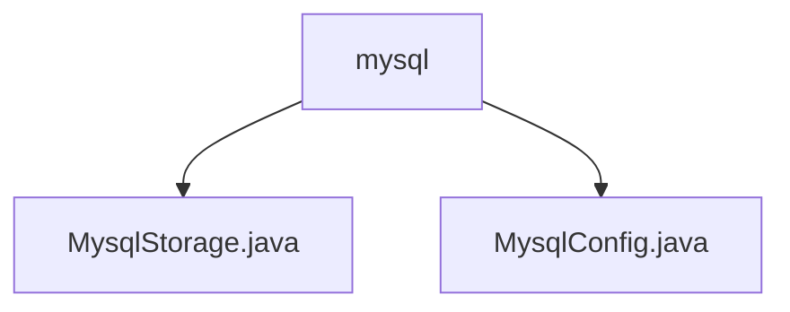

# 基础信息

|      |      |
|------|------|
| 名称 | mysql |
| 编码语言 | .java |
| 代码路径 | WeFe/common/java/common-data-storage/src/main/java/com/welab/wefe/common/data/storage/service/persistent/mysql |
| 包名 | docs.common.java.common-data-storage.src.main.java.com.welab.wefe.common.data.storage.service.persistent.mysql |
| 概述说明 | MysqlStorage类继承PersistentStorage，实现MySQL数据库CRUD、批量操作、分页查询及表管理功能。MysqlConfig类继承DataSourceConfig，配置MySQL连接参数并构建JDBC连接字符串。 |

# 说明

## 概述  
该模块核心职责是实现MySQL数据库的持久化存储操作，提供基础CRUD功能及表管理能力。接口规范包括数据操作（put/get/delete）、批量处理（putAll/collect）、分页查询（getPage/getPageBytes）和表维护（dropTB/dropDB）等。关键数据结构为MysqlConfig，包含主机、端口等连接参数。外部依赖仅为MySQL JDBC驱动。例如MysqlStorage支持字节数据操作，MysqlConfig自动构建JDBC连接串。

## 主要业务场景  
模块适用于需要MySQL持久化的场景，类似通用数据仓库模式。典型流程包括：通过MysqlConfig配置连接，使用MysqlStorage执行增删改查。例如分页查询数据或批量插入记录。集成案例为继承PersistentStorage基类实现MySQL适配，支持验证查询和批量大小计算。交互模式通过配置对象初始化，提供原子操作与批量处理混合API。

### 包内部结构视图

该流程图展示了MySQL持久化存储服务的文件结构。根节点为mysql目录，包含两个Java类文件：MysqlStorage.java实现存储功能，MysqlConfig.java处理配置信息。这种结构体现了典型的服务层实现模式，将核心功能与配置管理分离在同一个包路径下。

# 文件列表

| 名称   | 类型  | 说明 |
|-------|------|-------------|
| [MysqlStorage.java](MysqlStorage.md) | file | MysqlStorage类继承PersistentStorage，实现数据库操作如增删改查、分页查询、批量操作等，依赖MysqlConfig配置。 |
| [MysqlConfig.java](MysqlConfig.md) | file | MysqlConfig继承DataSourceConfig，通过构造函数初始化数据库连接参数，重写buildUrl生成MySQL连接URL，并返回MySQL驱动类名。 |

