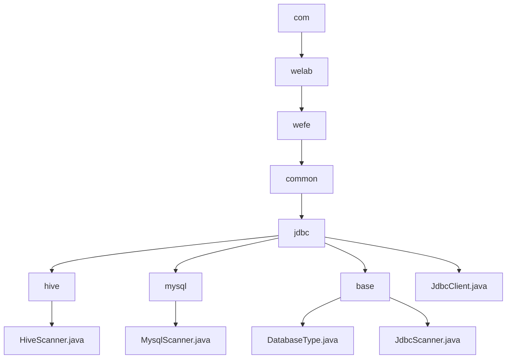

# 基础信息

|      |      |
|------|------|
| 名称 | com |
| 编码语言 | .java |
| 代码路径 | WeFe/common/java/common-jdbc/src/main/java/com |
| 包名 | docs.common.java.common-jdbc.src.main.java.com |
| 概述说明 | HiveScanner和MysqlScanner是JdbcScanner的子类，分别用于Hive和MySQL查询。JdbcScanner是抽象基类，封装JDBC查询流程，支持多数据库适配。JdbcClient封装JDBC操作，支持多种数据库，提供连接管理、批量写入和流式查询功能。 |

# 说明

## 概述  
该模块核心职责是提供统一的多数据库JDBC操作框架，包含类型标识、连接管理和数据扫描功能。DatabaseType枚举定义6种数据库类型，JdbcScanner作为抽象基类实现类似结果集迭代器的查询流程，JdbcClient则封装完整JDBC操作。关键数据结构包括DatabaseType枚举、含Connection/ResultSet的扫描器类及JdbcClient配置参数。外部依赖仅为标准JDBC接口。例如HiveScanner通过预处理语句优化查询，MysqlScanner设置特殊获取大小提升性能。

## 主要业务场景  
模块适用于跨数据库的批量数据操作场景，如ETL工具的多源数据同步。典型流程为：通过JdbcClient建立连接，使用JdbcScanner执行流式查询避免内存溢出，或批量写入提升效率。例如从Hive读取千万数据时，可通过maxRows分页控制。交互模式支持"连接-查询-遍历-关闭"标准流程和预处理语句优化，提供表结构获取、字段投影等功能。API包含工厂模式创建JdbcClient、模板方法模式实现扫描器子类（如MysqlScanner），以及Closeable资源管理接口。

### 包内部结构视图

该流程图展示了WeFe项目中common-jdbc模块的Java包结构层级关系。从根包com开始，逐级展开到welab、wefe、common和jdbc子包。jdbc包下包含hive、mysql和base三个子包，分别对应不同的数据库类型扫描器和基础类。最终展示了各子包中的关键类文件，如HiveScanner.java、MysqlScanner.java等。

# 文件列表

| 名称   | 类型  | 说明 |
|-------|------|-------------|
| [welab](welab/_module.md) | package | HiveScanner和MysqlScanner是JdbcScanner的子类，分别用于Hive和MySQL查询。JdbcScanner是抽象基类，封装JDBC查询流程，支持多数据库适配。JdbcClient封装JDBC操作，支持多种数据库，提供连接管理、批量写入和流式查询功能。 |

