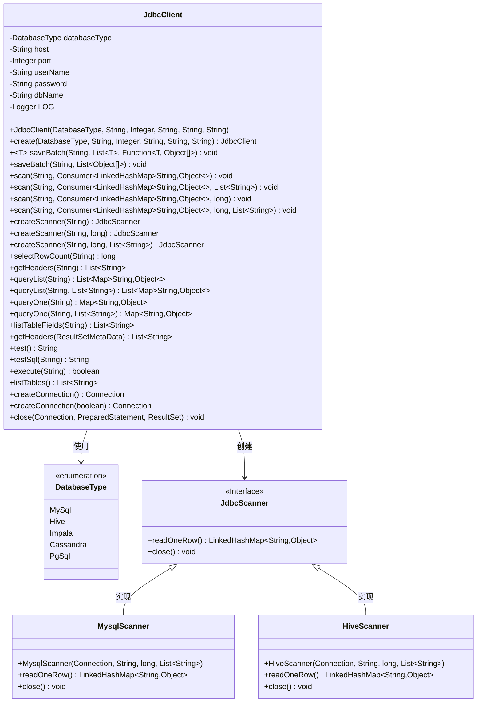

# 基础信息

|      |      |
|------|------|
| 名称 | JdbcClient |
| 编码语言 | .java |
| 代码路径 | WeFe/common/java/common-jdbc/src/main/java/com/welab/wefe/common/jdbc/JdbcClient.java |
| 包名 | com.welab.wefe.common.jdbc |
| 依赖项 | ['com.welab.wefe.common.StatusCode', 'com.welab.wefe.common.exception.StatusCodeWithException', 'com.welab.wefe.common.jdbc.base.DatabaseType', 'com.welab.wefe.common.jdbc.base.JdbcScanner', 'com.welab.wefe.common.jdbc.hive.HiveScanner', 'com.welab.wefe.common.jdbc.mysql.MysqlScanner', 'com.welab.wefe.common.util.StringUtil', 'org.slf4j.Logger', 'org.slf4j.LoggerFactory', 'java.sql', 'java.util.ArrayList', 'java.util.LinkedHashMap', 'java.util.List', 'java.util.Map', 'java.util.function.Consumer', 'java.util.function.Function'] |
| 概述说明 | JdbcClient是一个JDBC工具类，支持MySQL、Hive等数据库，提供批量写入、流式查询、表操作等功能，包含连接管理、异常处理和性能监控。 |

# 说明

JdbcClient是一个封装JDBC操作的类，支持多种数据库类型如MySQL、Hive、Impala等。它提供连接管理、批量数据写入、流式查询扫描、结果集处理等功能。主要方法包括创建连接、批量保存数据、执行查询并处理结果、获取表结构和字段信息等。支持流式读取大量数据，避免内存溢出。通过工厂方法创建实例，需指定数据库类型、主机、端口、用户名、密码和数据库名。内部使用预处理语句和连接池管理资源，包含完善的错误处理和日志记录。适用于需要高效、稳定操作多种数据库的场景。

# 类列表 Class Summary

| 名称   | 类型  | 说明 |
|-------|------|-------------|
| JdbcClient | class | JdbcClient是一个JDBC工具类，支持MySQL、Hive等数据库，提供批量写入、流式查询、表字段获取等功能，封装了连接管理和资源释放。 |

## 类 JdbcClient

|      |      |
|------|------|
| 访问范围 | public |
| 类型 | class |
| 名称 | JdbcClient |
| 说明 | JdbcClient是一个JDBC工具类，支持MySQL、Hive等数据库，提供批量写入、流式查询、表字段获取等功能，封装了连接管理和资源释放。 |

### UML类图

这段类图展示了JdbcClient的核心结构和关系。JdbcClient是一个数据库操作工具类，封装了多种数据库操作功能，包括批量写入、流式查询、结果集处理等。它通过DatabaseType枚举类支持多种数据库类型（MySQL/Hive/Impala等），并通过工厂方法创建对应的JdbcScanner实现类（MysqlScanner/HiveScanner）来执行流式查询。类图中清晰地呈现了JdbcClient与各组件间的依赖关系，以及接口与实现类之间的继承关系，体现了良好的分层设计。

### 内部方法调用关系图

```mermaid
graph TD
    A["类JdbcClient"]
    B["静态属性: Logger LOG"]
    C["静态方法: create(DatabaseType, String, Integer, String, String, String)"]
    D["私有属性: DatabaseType databaseType"]
    E["私有属性: String host"]
    F["私有属性: Integer port"]
    G["私有属性: String userName"]
    H["私有属性: String password"]
    I["私有属性: String dbName"]
    J["构造方法: JdbcClient(DatabaseType, String, Integer, String, String, String)"]
    K["方法: saveBatch(String, List<T>, Function<T, Object[]>)"]
    L["方法: saveBatch(String, List<Object[]>)"]
    M["方法: scan(String, Consumer<LinkedHashMap<String, Object>>)"]
    N["方法: scan(String, Consumer<LinkedHashMap<String, Object>>, List<String>)"]
    O["方法: scan(String, Consumer<LinkedHashMap<String, Object>>, long)"]
    P["方法: scan(String, Consumer<LinkedHashMap<String, Object>>, long, List<String>)"]
    Q["方法: createScanner(String)"]
    R["方法: createScanner(String, long)"]
    S["方法: createScanner(String, long, List<String>)"]
    T["方法: selectRowCount(String)"]
    U["方法: getHeaders(String)"]
    V["方法: queryList(String)"]
    W["方法: queryList(String, List<String>)"]
    X["方法: queryOne(String)"]
    Y["方法: queryOne(String, List<String>)"]
    Z["方法: listTableFields(String)"]
    AA["静态方法: getHeaders(ResultSetMetaData)"]
    AB["方法: test()"]
    AC["方法: testSql(String)"]
    AD["方法: execute(String)"]
    AE["方法: listTables()"]
    AF["方法: createConnection()"]
    AG["方法: createConnection(boolean)"]
    AH["静态方法: close(Connection, PreparedStatement, ResultSet)"]

    A --> B
    A --> C
    A --> D
    A --> E
    A --> F
    A --> G
    A --> H
    A --> I
    A --> J
    A --> K
    A --> L
    A --> M
    A --> N
    A --> O
    A --> P
    A --> Q
    A --> R
    A --> S
    A --> T
    A --> U
    A --> V
    A --> W
    A --> X
    A --> Y
    A --> Z
    A --> AA
    A --> AB
    A --> AC
    A --> AD
    A --> AE
    A --> AF
    A --> AG
    A --> AH

    K --> L
    M --> P
    N --> P
    O --> P
    Q --> R
    R --> S
    V --> W
    X --> Y
    Z --> U
    AB --> AC
    AC --> AD
    AF --> AG
```

这段代码展示了一个完整的JDBC客户端实现，主要功能包括数据库连接管理、批量数据操作、流式数据扫描、查询执行和结果处理。核心流程是通过createConnection建立数据库连接，然后通过不同方法实现CRUD操作，最后通过close方法释放资源。特别值得注意的是其批处理机制（每5万条提交一次）和流式扫描设计，能有效处理大数据量场景。类结构清晰，包含18个主要方法和4个静态工具方法，支持多种数据库类型并通过枚举进行区分。

### 字段列表 Field List

| 名称  | 类型  | 说明 |
|-------|-------|------|
| host | String | 私有字符串变量host |
| LOG = LoggerFactory.getLogger(JdbcClient.class) | Logger | 声明一个受保护的静态常量日志记录器，用于JdbcClient类的日志输出。 |
| databaseType | DatabaseType | 私有数据库类型变量databaseType。 |
| password | String | 私有字符串类型变量password。 |
| userName | String | 声明一个私有字符串变量userName。 |
| dbName | String | 私有字符串变量dbName，用于存储数据库名称。 |
| port | Integer | 私有整型端口变量。 |

### 方法列表

| 名称  | 类型  | 说明 |
|-------|-------|------|
| queryOne | Map<String, Object> | Java方法queryOne接收SQL字符串参数，无额外参数时调用重载方法，返回Map<String, Object>，可能抛出异常。 |
| scan | void | 这是一个Java方法，用于扫描SQL查询结果，接受SQL语句、返回字段列表和结果处理函数作为参数，可能抛出异常。 |
| testSql | String | 该方法测试SQL语句执行，成功返回null，失败捕获异常并记录日志，返回异常类名和消息。 |
| queryList | List<Map<String, Object>> | 该方法执行SQL查询并返回结果列表。参数为SQL语句和返回字段列表，结果以Map列表形式返回。异常时抛出Exception。 |
| scan | void | 扫描SQL查询结果，逐行读取数据并通过consumer处理，支持最大行数限制和指定返回字段，异常时记录日志并确保关闭扫描器。 |
| createScanner | JdbcScanner | 创建JdbcScanner实例，执行SQL查询并限制最大读取行数，可抛出异常。 |
| listTableFields | List<String> | 该方法通过执行SQL查询获取指定表的所有字段名，返回字段列表。参数为表名，可能抛出异常。 |
| create | JdbcClient | 创建JdbcClient静态方法，接收数据库类型、主机、端口、用户名、密码和数据库名参数，返回新实例。 |
| saveBatch | void | Java方法：批量保存模型数据。接收SQL语句、模型列表和转换函数，将模型转为数组后调用批量保存。异常可抛出。 |
| createScanner | JdbcScanner | 创建JdbcScanner实例的方法，接受SQL语句参数，默认偏移量为0，可能抛出异常。 |
| saveBatch | void | 批量执行SQL操作，每5万条提交一次事务，记录执行时间和日志，异常时回滚并关闭连接。 |
| scan | void | Java方法scan接收SQL字符串和消费者函数，调用重载方法scan并传入初始参数0。 |
| getHeaders | List<String> | 该方法通过SQL查询获取表头信息，设置fetchSize和maxRows为1避免内存溢出，最后关闭数据库连接。异常时返回null。 |
| createScanner | JdbcScanner | 创建数据库扫描器，根据类型返回MySQL或Hive/Impala扫描器实例，不支持类型则报错。 |
| test | String | 该方法名为test，调用testSql执行SQL查询"select 1"，可能抛出StatusCodeWithException异常。 |
| queryList | List<Map<String, Object>> | 该方法执行SQL查询并返回结果列表，每个结果以键值对形式存储。若无参数则传入null。可能抛出异常。 |
| execute | boolean | 该方法执行SQL查询，设置获取大小和最大行数为1防止内存溢出，处理异常并确保资源释放。 |
| listTables | List<String> | 该方法通过数据库连接查询并返回所有表名列表，处理异常后关闭资源。 |
| createConnection | Connection | 创建受保护的连接方法，默认不启用特殊参数，可能抛出异常。 |
| createConnection | Connection | 创建数据库连接方法，支持MySQL、Hive/Impala，根据类型加载驱动并构建URL，处理异常后返回连接。 |
| close | void | 关闭数据库连接、预处理语句和结果集，捕获并记录异常，最后置空对象。 |
| getHeaders | List<String> | 该方法从数据库结果集元数据中提取列名，处理带点的列名（取点后部分），返回列名列表。 |
| selectRowCount | long | Java方法：通过SQL查询获取行数，处理异常并关闭资源，返回计数结果。 |
| queryOne | Map<String, Object> | 查询数据库并返回第一条记录，若无结果返回null。方法接收SQL和返回字段列表，扫描结果存入列表后取首项。 |
| scan | void | Java方法scan接收SQL字符串、结果处理Consumer和最大读取行数，调用重载方法处理查询，可抛异常。 |

