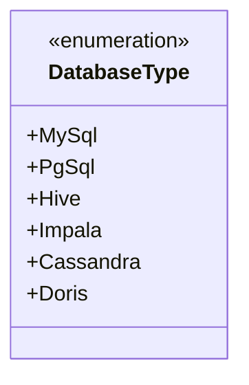
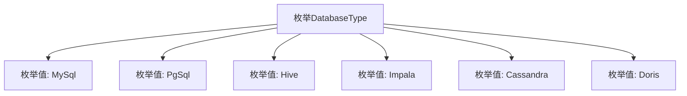

# 基础信息

|      |      |
|------|------|
| 名称 | DatabaseType |
| 编码语言 | .java |
| 代码路径 | WeFe/common/java/common-jdbc/src/main/java/com/welab/wefe/common/jdbc/base/DatabaseType.java |
| 包名 | com.welab.wefe.common.jdbc.base |
| 依赖项 | [] |
| 概述说明 | 定义数据库类型枚举，包含MySql、PgSql、Hive、Impala、Cassandra和Doris。 |

# 说明

该内容定义了一个名为DatabaseType的枚举类型，列举了多种数据库类型。具体包括MySql、PgSql、Hive、Impala、Cassandra和Doris。其中MySql、PgSql、Hive、Impala和Cassandra有对应的注释说明，而Doris没有注释。此外，Oracle和Db2被注释掉，未包含在枚举值中。该枚举可能用于标识或区分不同类型的数据库系统。

# 类列表 Class Summary

| 名称   | 类型  | 说明 |
|-------|------|-------------|
| DatabaseType | enum | 定义数据库类型枚举，包含MySql、PgSql、Hive、Impala、Cassandra和Doris。 |

## 类 DatabaseType

|      |      |
|------|------|
| 访问范围 | public |
| 类型 | enum |
| 名称 | DatabaseType |
| 说明 | 定义数据库类型枚举，包含MySql、PgSql、Hive、Impala、Cassandra和Doris。 |

### UML类图

这段代码定义了一个名为DatabaseType的枚举类型，包含6种数据库类型常量：MySql、PgSql、Hive、Impala、Cassandra和Doris。枚举类型用于表示一组固定的常量值，每个值对应一种特定的数据库类型。注释中显示原本还计划包含Oracle和Db2，但当前已被注释掉。该枚举可作为类型安全的数据库标识符在程序中使用。

### 内部方法调用关系图

该流程图展示了DatabaseType枚举的结构，包含7个预定义的数据库类型枚举值。每个枚举值通过独立节点表示，并与父节点DatabaseType建立层级关系。注释中标注了部分未启用的枚举值（Oracle、Db2），但未在流程图中体现。该设计用于标准化数据库类型标识，适用于需要明确区分不同数据库系统的场景。

### 字段列表 Field List

| 名称  | 类型  | 说明 |
|-------|-------|------|

### 方法列表

| 名称  | 类型  | 说明 |
|-------|-------|------|

