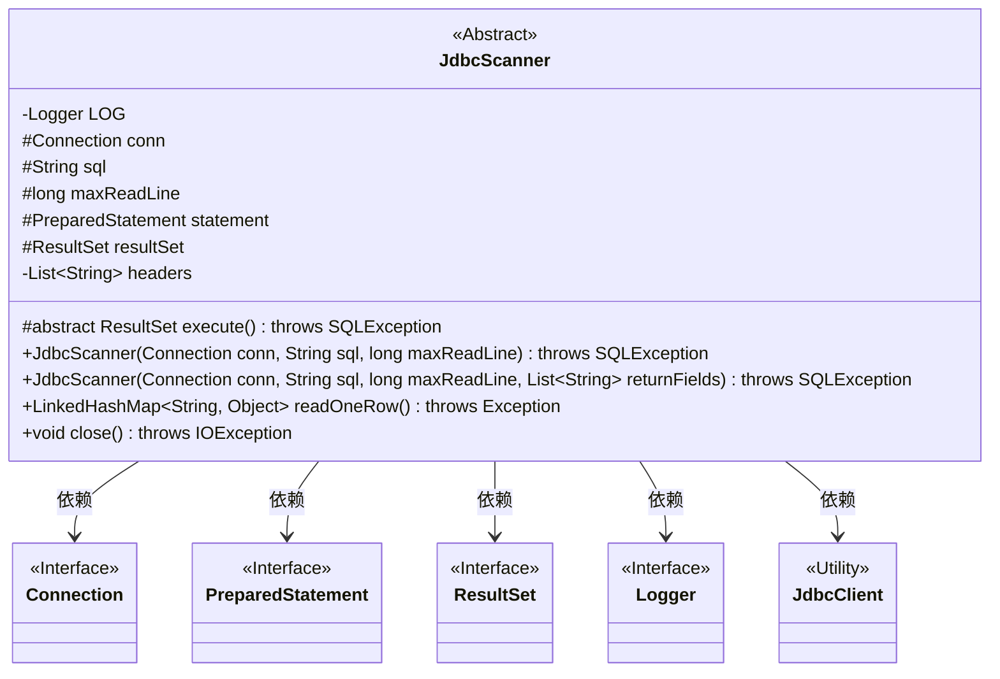
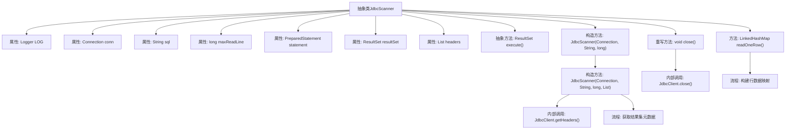

# 基础信息

|      |      |
|------|------|
| 名称 | JdbcScanner |
| 编码语言 | .java |
| 代码路径 | WeFe/common/java/common-jdbc/src/main/java/com/welab/wefe/common/jdbc/base/JdbcScanner.java |
| 包名 | com.welab.wefe.common.jdbc.base |
| 依赖项 | ['com.welab.wefe.common.jdbc.JdbcClient', 'org.apache.commons.collections4.CollectionUtils', 'org.slf4j.Logger', 'org.slf4j.LoggerFactory', 'java.io.Closeable', 'java.io.IOException', 'java.sql', 'java.util.LinkedHashMap', 'java.util.List'] |
| 概述说明 | 抽象类JdbcScanner实现Closeable接口，用于JDBC查询。包含连接、SQL、最大行数等属性，通过execute执行查询，readOneRow读取单行数据，close释放资源。支持自定义返回字段或默认全部字段。 |

# 说明

JdbcScanner是一个抽象类，实现了Closeable接口，用于JDBC数据库扫描操作。它包含连接对象、SQL语句、最大读取行数等属性，以及结果集和预编译语句。构造函数接受连接、SQL和行数参数，执行查询并初始化结果集和表头。若未指定返回字段，则获取全部字段。readOneRow方法读取下一行数据并返回键值映射，无数据时返回null。close方法用于关闭连接、语句和结果集。抽象方法execute需子类实现以执行查询。

# 类列表 Class Summary

| 名称   | 类型  | 说明 |
|-------|------|-------------|
| JdbcScanner | class | 抽象类JdbcScanner实现Closeable，封装JDBC查询逻辑，支持自定义返回字段，提供单行读取和资源关闭功能。 |

## 类 JdbcScanner

|      |      |
|------|------|
| 访问范围 | public abstract |
| 类型 | class |
| 名称 | JdbcScanner |
| 说明 | 抽象类JdbcScanner实现Closeable，封装JDBC查询逻辑，支持自定义返回字段，提供单行读取和资源关闭功能。 |

### UML类图

类图描述：
JdbcScanner是一个抽象类，用于从JDBC数据源中扫描数据，实现了Closeable接口以确保资源释放。它封装了数据库连接(Connection)、SQL语句、最大读取行数等核心属性，通过execute()抽象方法执行查询并获取结果集(ResultSet)。主要功能包括构造时初始化结果集和表头信息，通过readOneRow()逐行读取数据到LinkedHashMap，以及通过close()方法关闭所有数据库资源。该类依赖于JDBC核心接口(Connection/PreparedStatement/ResultSet)、日志接口(Logger)和工具类JdbcClient。

### 内部方法调用关系图

该流程图展示了JdbcScanner抽象类的完整结构，包含5个核心属性、2个构造方法和3个关键方法。通过execute()抽象方法实现多态查询，构造方法中自动初始化结果集并处理返回字段逻辑，readOneRow()方法实现结果集到LinkedHashMap的逐行转换，close()方法统一关闭数据库资源。流程重点突出了元数据获取和行数据构建两个核心操作环节。

### 字段列表 Field List

| 名称  | 类型  | 说明 |
|-------|-------|------|
| LOG = LoggerFactory.getLogger(this.getClass()) | Logger | 类中定义了一个受保护且不可变的日志记录器实例，用于当前类的日志输出。 |
| sql | String | 声明了一个受保护的字符串变量sql。 |
| maxReadLine | long | 保护型长整型变量，用于限制读取行的最大长度。 |
| conn | Connection | 类中受保护的数据库连接对象。 |
| statement = null | PreparedStatement | 声明一个受保护的PreparedStatement变量statement，初始值为null。 |
| resultSet = null | ResultSet | 声明一个受保护的ResultSet变量resultSet并初始化为null。 |
| headers | List<String> | 私有不可变字符串列表headers。 |

### 方法列表

| 名称  | 类型  | 说明 |
|-------|-------|------|
| readOneRow | LinkedHashMap<String, Object> | 该方法从数据库结果集读取一行数据，转换为LinkedHashMap，键为列名，值为对应数据。若无数据返回null。 |
| execute | ResultSet | 抽象方法execute()返回ResultSet，可能抛出SQLException。 |
| close | void | 重写close方法，调用JdbcClient关闭数据库连接、语句和结果集，可能抛出IOException。 |

