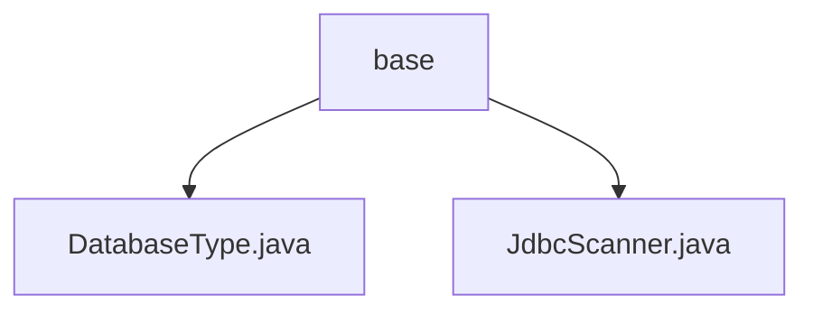

# 基础信息

|      |      |
|------|------|
| 名称 | base |
| 编码语言 | .java |
| 代码路径 | WeFe/common/java/common-jdbc/src/main/java/com/welab/wefe/common/jdbc/base |
| 包名 | docs.common.java.common-jdbc.src.main.java.com.welab.wefe.common.jdbc.base |
| 概述说明 | DatabaseType枚举定义多种数据库类型，部分有注释。JdbcScanner是抽象类，用于JDBC扫描，含查询、读取和关闭方法，需子类实现execute。 |

# 说明

## 概述  
该模块核心职责是提供数据库类型标识和JDBC扫描操作的通用实现。DatabaseType枚举定义了MySql、PgSql等6种数据库类型，用于系统间类型标识。JdbcScanner作为抽象基类封装了JDBC查询流程，类似结果集迭代器模式，支持连接管理、字段自动获取和逐行读取功能。关键数据结构包括DatabaseType枚举和包含Connection/ResultSet的扫描器类。外部依赖仅为标准JDBC接口。例如通过readOneRow方法实现行数据映射，子类需实现execute方法完成定制查询。

## 主要业务场景  
模块适用于需要多数据库适配的数据扫描场景，如ETL工具跨库抽取。典型流程为：初始化JdbcScanner时传入连接和SQL，自动获取结果集元数据，通过迭代readOneRow逐行处理数据。例如从MySql读取百万级数据时，可通过maxRows参数控制内存占用。交互模式遵循"连接-查询-遍历-关闭"标准流程，支持字段全量获取或指定列投影。API类型包含枚举定义、抽象扫描器基类及Closeable资源管理接口。

### 包内部结构视图

该流程图展示了WeFe项目中common-jdbc模块的基础包结构。base目录下包含两个核心类文件：DatabaseType.java定义数据库类型枚举，JdbcScanner.java实现JDBC扫描功能。这两个类共同构成了项目的基础数据库操作组件，层级关系清晰简洁。

# 文件列表

| 名称   | 类型  | 说明 |
|-------|------|-------------|
| [DatabaseType.java](DatabaseType.md) | file | 定义数据库类型枚举，包含MySql、PgSql、Hive、Impala、Cassandra和Doris。 |
| [JdbcScanner.java](JdbcScanner.md) | file | 抽象类JdbcScanner实现Closeable接口，用于JDBC查询。包含连接、SQL、最大行数等属性，通过execute执行查询，readOneRow读取单行数据，close释放资源。支持自定义返回字段或默认全部字段。 |

