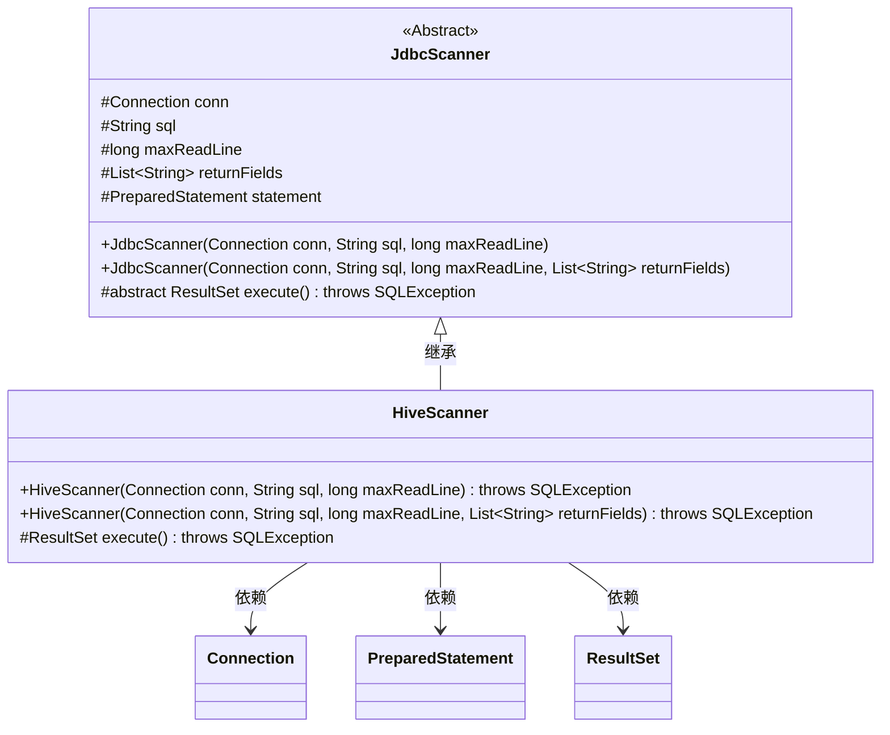
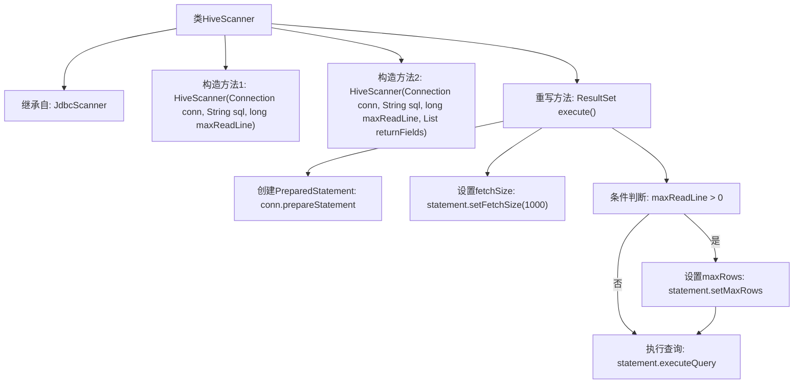

# 基础信息

|      |      |
|------|------|
| 名称 | HiveScanner |
| 编码语言 | .java |
| 代码路径 | WeFe/common/java/common-jdbc/src/main/java/com/welab/wefe/common/jdbc/hive/HiveScanner.java |
| 包名 | com.welab.wefe.common.jdbc.hive |
| 依赖项 | ['com.welab.wefe.common.Convert', 'com.welab.wefe.common.jdbc.base.JdbcScanner', 'java.sql.Connection', 'java.sql.ResultSet', 'java.sql.SQLException', 'java.util.List'] |
| 概述说明 | HiveScanner继承JdbcScanner，提供两种构造方法，重写execute方法设置结果集类型和获取大小，支持最大行数限制。 |

# 说明

HiveScanner是继承自JdbcScanner的类，用于执行Hive数据库查询。它提供了两个构造函数，分别接受数据库连接、SQL语句、最大读取行数，以及可选的返回字段列表。该类重写了execute方法，通过预处理语句设置结果集为只读且仅向前遍历，并配置了1000的获取大小。当maxReadLine大于0时，由于Hive不支持setLargeMaxRows，将其转换为整型设置最大行数。最后执行查询并返回结果集。

# 类列表 Class Summary

| 名称   | 类型  | 说明 |
|-------|------|-------------|
| HiveScanner | class | HiveScanner继承JdbcScanner，提供两种构造方法，重写execute方法设置Hive查询参数并执行。 |

## 类 HiveScanner

|      |      |
|------|------|
| 访问范围 | public |
| 类型 | class |
| 名称 | HiveScanner |
| 说明 | HiveScanner继承JdbcScanner，提供两种构造方法，重写execute方法设置Hive查询参数并执行。 |

### UML类图

这段代码展示了一个HiveScanner类继承自抽象类JdbcScanner的结构。HiveScanner专门用于处理Hive数据库查询，通过重写execute()方法实现了特定的查询执行逻辑，包括设置fetchSize和maxRows等参数。类图中清晰地展示了继承关系、类成员变量和方法，以及HiveScanner与JDBC相关类(Connection、PreparedStatement、ResultSet)的依赖关系。HiveScanner提供了两种构造方法，支持带返回字段列表和不带返回字段列表的初始化方式。

### 内部方法调用关系图

该流程图展示了HiveScanner类的继承关系和主要方法调用流程。作为JdbcScanner的子类，它包含两个构造方法和一个重写的execute()方法。execute()方法的核心流程包括：创建PreparedStatement对象、设置结果集获取大小、根据maxReadLine参数条件设置最大行数限制，最后执行SQL查询并返回结果集。特别值得注意的是对Hive特殊性的处理，即不支持setLargeMaxRows而改用setMaxRows方法。

### 字段列表 Field List

| 名称  | 类型  | 说明 |
|-------|-------|------|

### 方法列表

| 名称  | 类型  | 说明 |
|-------|-------|------|
| execute | ResultSet | 重写execute方法，创建只读游标SQL语句，设置获取行数1000，若maxReadLine大于0则限制最大行数，最后执行查询返回结果集。 |

