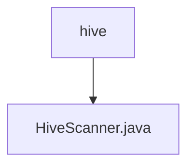

# 基础信息

|      |      |
|------|------|
| 名称 | hive |
| 编码语言 | .java |
| 代码路径 | WeFe/common/java/common-jdbc/src/main/java/com/welab/wefe/common/jdbc/hive |
| 包名 | docs.common.java.common-jdbc.src.main.java.com.welab.wefe.common.jdbc.hive |
| 概述说明 | HiveScanner继承JdbcScanner，提供两种构造方法，重写execute方法设置结果集类型和获取大小，支持最大行数限制。 |

# 说明

HiveScanner是继承自JdbcScanner的类，用于执行Hive数据库查询。它提供了两个构造函数，分别接受数据库连接、SQL语句、最大读取行数，以及可选的返回字段列表。该类重写了execute方法，通过预处理语句设置结果集为只读且仅向前遍历，并配置了1000的获取大小。当maxReadLine大于0时，由于Hive不支持setLargeMaxRows，将其转换为整型设置最大行数。最后执行查询并返回结果集。

### 包内部结构视图

该流程图展示了HiveScanner.java文件与hive目录之间的层级关系。HiveScanner.java是位于hive目录下的一个Java文件，两者构成简单的父子层级结构。图中清晰地呈现了文件在目录中的从属关系，符合给定的路径信息。

# 文件列表

| 名称   | 类型  | 说明 |
|-------|------|-------------|
| [HiveScanner.java](HiveScanner.md) | file | HiveScanner继承JdbcScanner，提供两种构造方法，重写execute方法设置结果集类型和获取大小，支持最大行数限制。 |

