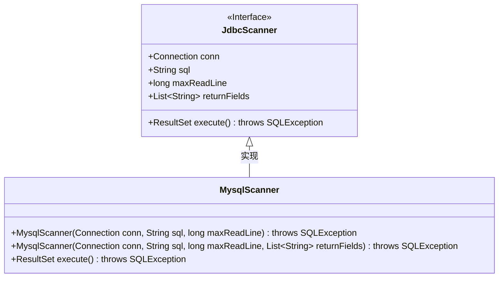
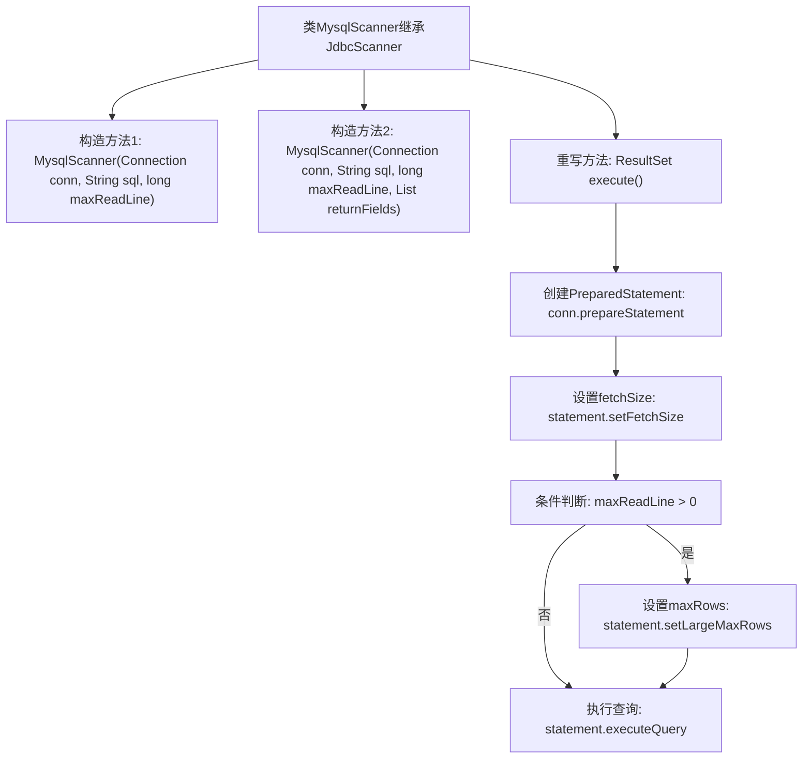

# 基础信息

|      |      |
|------|------|
| 名称 | MysqlScanner |
| 编码语言 | .java |
| 代码路径 | WeFe/common/java/common-jdbc/src/main/java/com/welab/wefe/common/jdbc/mysql/MysqlScanner.java |
| 包名 | com.welab.wefe.common.jdbc.mysql |
| 依赖项 | ['com.welab.wefe.common.jdbc.base.JdbcScanner', 'java.sql.Connection', 'java.sql.ResultSet', 'java.sql.SQLException', 'java.util.List'] |
| 概述说明 | MysqlScanner继承JdbcScanner，提供两种构造方法，支持设置最大读取行数和返回字段。execute方法执行SQL查询，设置游标类型为只读前移，并优化大结果集处理。 |

# 说明

MysqlScanner是继承自JdbcScanner的MySQL数据库扫描类，提供了两种构造方法。第一种构造方法接收数据库连接、SQL语句和最大读取行数参数；第二种构造方法额外接收返回字段列表参数。该类重写了execute方法，使用只读、仅向前类型的结果集，并设置特殊获取大小以优化性能。当maxReadLine大于0时，会限制最大返回行数。最终通过预处理语句执行查询并返回结果集。

# 类列表 Class Summary

| 名称   | 类型  | 说明 |
|-------|------|-------------|
| MysqlScanner | class | MysqlScanner继承JdbcScanner，提供两种构造方法，支持设置最大读取行数和返回字段。execute方法执行SQL查询，设置只读游标和最小fetchSize，可选限制最大行数。 |

## 类 MysqlScanner

|      |      |
|------|------|
| 访问范围 | public |
| 类型 | class |
| 名称 | MysqlScanner |
| 说明 | MysqlScanner继承JdbcScanner，提供两种构造方法，支持设置最大读取行数和返回字段。execute方法执行SQL查询，设置只读游标和最小fetchSize，可选限制最大行数。 |

### UML类图

这段代码展示了一个MySQL扫描器类`MysqlScanner`继承自`JdbcScanner`接口，实现了数据库查询功能。`MysqlScanner`通过两个构造函数初始化连接参数，并重写`execute()`方法执行SQL查询，其中设置了结果集类型为只读前向遍历，并优化了大数据量查询性能。类图清晰地反映了继承关系和核心方法，体现了对JDBC操作的封装与扩展。

### 内部方法调用关系图

这段代码展示了一个MySQL扫描器类，继承自JDBC扫描器基类。流程图清晰地描述了两种构造方法的重载关系和核心的execute()方法实现细节。execute()方法通过创建只进只读的结果集、设置特殊fetchSize优化大数据量读取，并根据maxReadLine参数动态控制最大返回行数，最后执行SQL查询返回结果集。该设计实现了高效可控的MySQL数据扫描功能。

### 字段列表 Field List

| 名称  | 类型  | 说明 |
|-------|-------|------|

### 方法列表

| 名称  | 类型  | 说明 |
|-------|-------|------|
| execute | ResultSet | 重写execute方法，创建只读前向结果集，设置最小获取行数，可选限制最大读取行数，返回查询结果。 |

