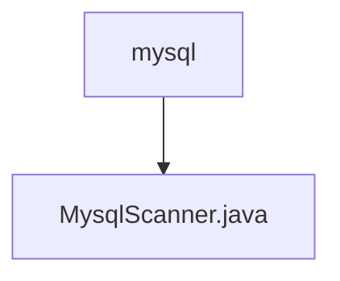

# 基础信息

|      |      |
|------|------|
| 名称 | mysql |
| 编码语言 | .java |
| 代码路径 | WeFe/common/java/common-jdbc/src/main/java/com/welab/wefe/common/jdbc/mysql |
| 包名 | docs.common.java.common-jdbc.src.main.java.com.welab.wefe.common.jdbc.mysql |
| 概述说明 | MysqlScanner继承JdbcScanner，提供两种构造方法，支持设置最大读取行数和返回字段。execute方法执行SQL查询，设置游标类型为只读前移，并优化大结果集处理。 |

# 说明

MysqlScanner是继承自JdbcScanner的MySQL数据库扫描类，提供了两种构造方法。第一种构造方法接收数据库连接、SQL语句和最大读取行数参数；第二种构造方法额外接收返回字段列表参数。该类重写了execute方法，使用只读、仅向前类型的结果集，并设置特殊获取大小以优化性能。当maxReadLine大于0时，会限制最大返回行数。最终通过预处理语句执行查询并返回结果集。

### 包内部结构视图

该流程图展示了MySQL相关代码的层级结构，根节点为mysql目录，其下包含一个具体的实现文件MysqlScanner.java。这种结构体现了典型的Java项目包组织方式，其中mysql作为功能模块目录，包含具体的数据库扫描器实现类。图表简洁清晰地呈现了单层级的包含关系，符合Mermaid语法规范且节点命名准确。

# 文件列表

| 名称   | 类型  | 说明 |
|-------|------|-------------|
| [MysqlScanner.java](MysqlScanner.md) | file | MysqlScanner继承JdbcScanner，提供两种构造方法，支持设置最大读取行数和返回字段。execute方法执行SQL查询，设置游标类型为只读前移，并优化大结果集处理。 |

