# 基础信息

|      |      |
|------|------|
| 名称 | wefe |
| 编码语言 | .java |
| 代码路径 | WeFe/common/java/common-lang/src/main/java/com/welab/wefe |
| 包名 | docs.common.java.common-lang.src.main.java.com.welab.wefe |
| 概述说明 | Java配置管理工具集，统一管理配置并提供类型安全接口。支持多环境配置加载和类型转换，依赖Log4j。数据处理工具集含Excel解析和文本批处理，支持ETL和日志分析。字段验证平台实现敏感数据脱敏和格式校验。基础常量模块定义密钥类型和压缩格式。通用工具库涵盖加密、集合操作等。HTTP通信模块管理文件下载和请求处理。压缩解压模块支持多格式处理。函数式接口支持Lambda操作。线程池管理工具提供任务执行功能。验证类检查数据类型合法性。状态码枚举定义系统错误码。安全工具生成随机盐值。时间间隔类处理时间计算。批量消费类实现数据批量处理。验证码生成类创建Base64验证码。信息大小类转换存储单位。数据类型转换类处理多种格式转换。采样日志类控制日志频率。计时工具类记录代码执行时间。 |

# 说明

## 概述  
该模块是Java基础工具与功能组件的综合库，核心职责包括配置管理、数据处理、字段验证、HTTP通信等基础服务支持。采用静态工具类设计模式，提供类型安全接口和函数式编程支持。关键数据结构涵盖CompositeConfiguration（组合配置）、Excel工作表/单元格、正则规则库、枚举常量等。外部依赖包括Log4j、Apache HttpClient、BouncyCastle等，例如配置模块依赖Log4j，加密模块使用BouncyCastle实现国密算法。  

模块实现多领域功能集成，类似基础设施中间件。例如Configurations类管理多环境配置，ExcelReader轻量封装POI操作，FieldValidateUtil完成敏感数据脱敏。技术特征包含注解驱动（如@Check）、策略枚举（如SecretKeyType）和流式处理（如BatchConsumer）。所有组件均遵循"开箱即用"原则，如SecurityUtil生成加密盐值，TimeSpan处理时间间隔计算。  

## 主要业务场景  
典型应用形成三大闭环：1) 配置与安全闭环，通过ConfigurationManager加载配置→FieldValidateUtil校验→SecurityUtil加密，例如读取数据库连接参数并校验敏感字段；2) 数据处理闭环，组合ExcelReader解析→BatchConsumer批量处理→File压缩存储，类似ETL流水线；3) 通信与调度闭环，HttpClient调用API→CommonThreadPool异步执行→Stopwatch监控性能。  

统一交互模式为链式调用与注解驱动结合。例如Excel模块采用"加载-遍历-关闭"流程，校验模块通过@Check注解触发规则。功能完整性体现在覆盖国密算法（SM2/SM4）、多协议支持（HTTP/ZIP）、全生命周期管理（如配置加载→使用→监控）。典型场景包括：金融级数据校验（身份证/手机号）、高并发文件处理（分片压缩/下载）、安全通信（HTTPS+签名验签）。例如HttpRequest自动处理302跳转，Validator验证日期时间格式。

### 包内部结构视图

```mermaid
graph TD
    wefe --> common
    common --> configuration
    common --> fastjson
    common --> enums
    common --> io
    common --> fieldvalidate
    common --> constant
    common --> util
    common --> exception
    common --> http
    common --> file
    common --> function
    common --> CommonThreadPool.java
    common --> Validator.java
    common --> StatusCode.java
    common --> SecurityUtil.java
    common --> TimeSpan.java
    common --> BatchConsumer.java
    common --> WeSpecCaptcha.java
    common --> InformationSize.java
    common --> Convert.java
    common --> SamplingLogger.java
    common --> Stopwatch.java
    configuration --> Configurations.java
    configuration --> ConfigurationManager.java
    fastjson --> LoggerValueFilter.java
    enums --> FilePublicLevel.java
    io --> excel
    io --> text
    excel --> ExcelReader.java
    text --> writer
    text --> reader
    writer --> delegate
    writer --> LocalTextFileWriter.java
    writer --> AbstractTextWriter.java
    delegate --> RecordToStringFunction.java
    delegate --> FileNameFunction.java
    reader --> TextFileIterator.java
    reader --> LocalTextFileReader.java
    reader --> AbstractTextReader.java
    fieldvalidate --> secret
    fieldvalidate --> annotation
    fieldvalidate --> StandardFieldType.java
    fieldvalidate --> FieldValidateUtil.java
    fieldvalidate --> FieldAssert.java
    fieldvalidate --> ReactionaryKeywords.java
    fieldvalidate --> AbstractCheckModel.java
    secret --> SecretValueFilter.java
    secret --> SecretUtil.java
    secret --> Secret.java
    secret --> MaskStrategy.java
    annotation --> Check.java
    constant --> SecretKeyType.java
    constant --> ZipType.java
    constant --> Constant.java
    util --> enums
    util --> MapUtil.java
    util --> ReflectionsUtil.java
    util --> IpAddressUtil.java
    util --> Sha1.java
    util --> ListUtil.java
    util --> StringUtil.java
    util --> EncryptUtils.java
    util --> SignUtil.java
    util --> UrlUtil.java
    util --> DateUtil.java
    util --> SM2Util.java
    util --> SM4Util.java
    util --> ClassUtils.java
    util --> JObject.java
    util --> Masker.java
    util --> OS.java
    util --> Base64Util.java
    util --> ZipUtil.java
    util --> Md5.java
    util --> ImageUtil.java
    util --> FileUtil.java
    util --> XmlUtil.java
    util --> CommentedProperties.java
    util --> AESUtil.java
    util --> RandomUtil.java
    util --> FileType.java
    util --> ThreadUtil.java
    util --> CopyUtil.java
    util --> GzipUtil.java
    util --> HostUtil.java
    util --> AsymmetricCryptoUtil.java
    util --> RSAUtil.java
    exception --> StatusCodeWithException.java
    http --> download
    http --> MyRedirectStrategy.java
    http --> HttpContentType.java
    http --> HttpMethod.java
    http --> HttpResponse.java
    http --> HttpRequest.java
    download --> DownloadResult.java
    download --> HttpDownloader.java
    download --> DownloadStatus.java
    file --> compression
    file --> decompression
    compression --> impl
    compression --> CompressionType.java
    compression --> AbstractCompression.java
    impl --> Zip.java
    impl --> Tgz.java
    decompression --> impl
    decompression --> dto
    decompression --> SuperDecompressor.java
    decompression --> AbstractDecompression.java
    impl --> Zip.java
    impl --> SevenZip.java
    impl --> Tgz.java
    dto --> DecompressionResult.java
    function --> CharFunction.java
    function --> ConsumerWithException.java
    function --> ToBooleanFunction.java
```

该流程图展示了WeFe项目中common-lang模块的完整目录结构，从根目录wefe开始，逐级展开至各个子模块和文件。图中包含配置管理、工具类、枚举、IO操作、字段验证、常量定义、HTTP处理、文件压缩解压等核心功能模块，以及大量实用工具类文件。整个结构层次清晰，展现了Java项目中典型的包组织方式，便于开发者快速定位功能模块和工具类。

# 文件列表

| 名称   | 类型  | 说明 |
|-------|------|-------------|
| [common](common/_module.md) | package | Java配置管理工具集，统一管理配置并提供类型安全接口。支持多环境配置加载和类型转换，依赖Log4j。数据处理工具集含Excel解析和文本批处理，支持ETL和日志分析。字段验证平台实现敏感数据脱敏和格式校验。基础常量模块定义密钥类型和压缩格式。通用工具库涵盖加密、集合操作等。HTTP通信模块管理文件下载和请求处理。压缩解压模块支持多格式处理。函数式接口支持Lambda操作。线程池管理工具提供任务执行功能。验证类检查数据类型合法性。状态码枚举定义系统错误码。安全工具生成随机盐值。时间间隔类处理时间计算。批量消费类实现数据批量处理。验证码生成类创建Base64验证码。信息大小类转换存储单位。数据类型转换类处理多种格式转换。采样日志类控制日志频率。计时工具类记录代码执行时间。 |

