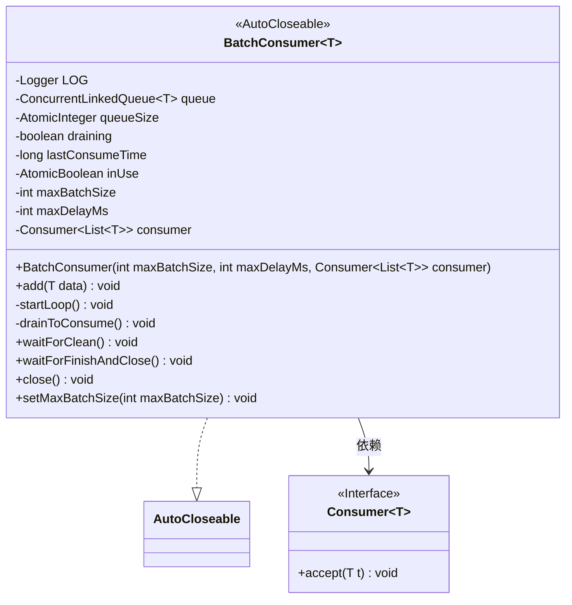
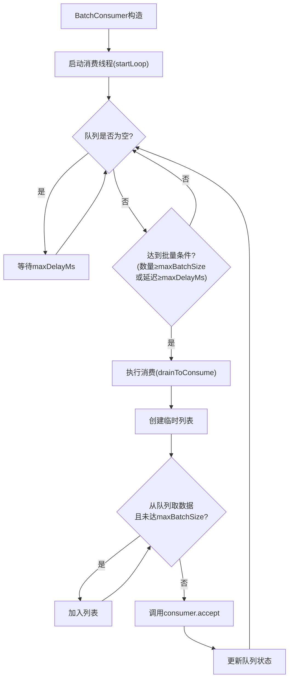
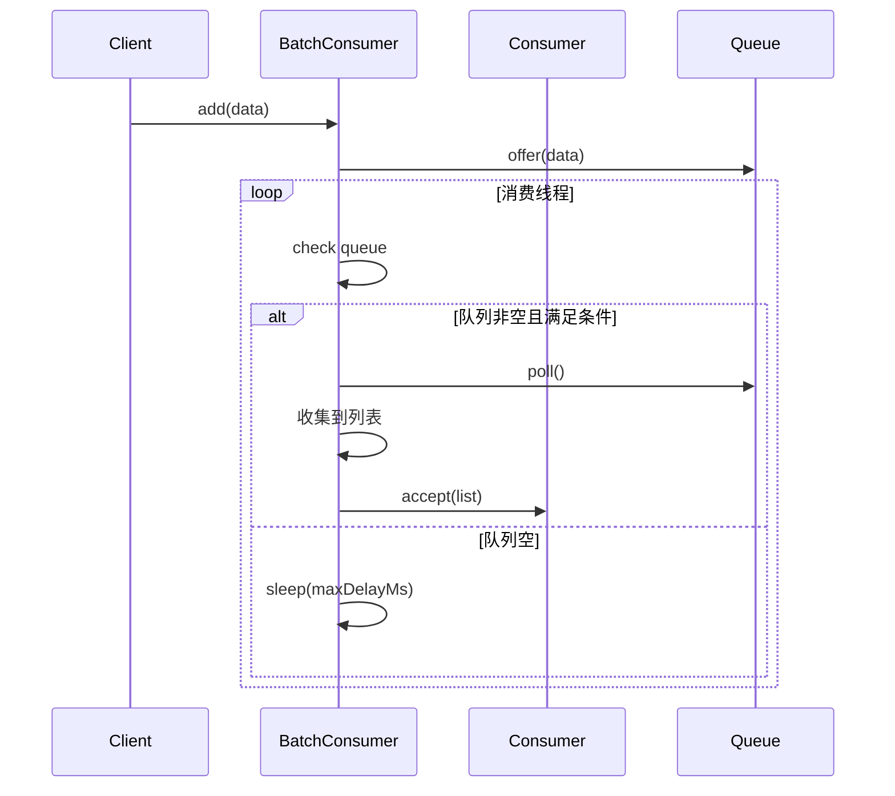
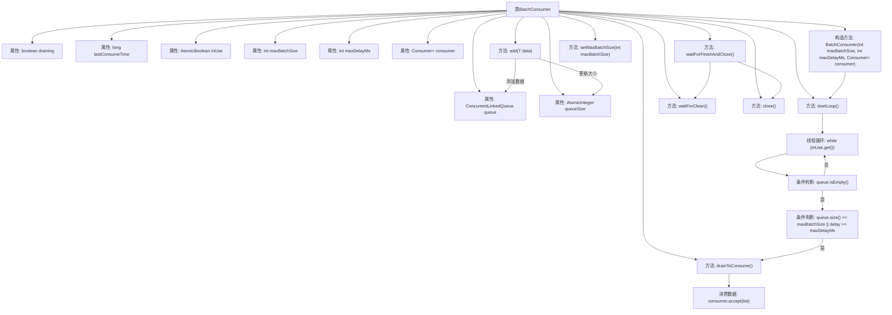
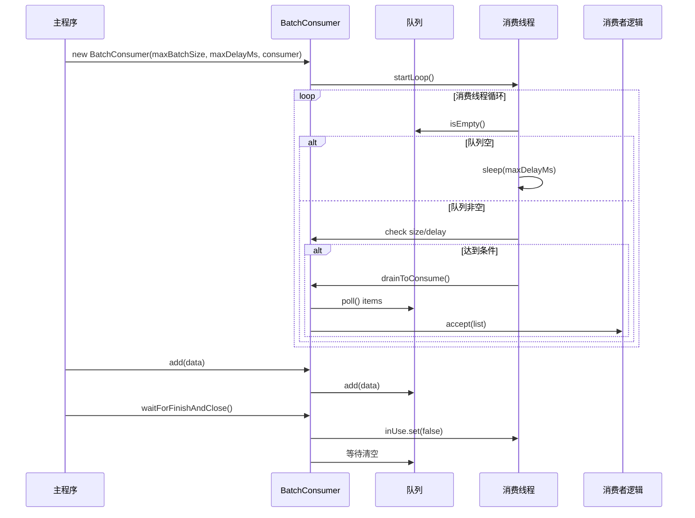

# 基础信息

|      |      |
|------|------|
| 名称 | BatchConsumer |
| 编码语言 | .java |
| 代码路径 | WeFe/common/java/common-lang/src/main/java/com/welab/wefe/common/BatchConsumer.java |
| 包名 | com.welab.wefe.common |
| 依赖项 | ['org.slf4j.Logger', 'org.slf4j.LoggerFactory', 'java.util.ArrayList', 'java.util.List', 'java.util.concurrent.ConcurrentLinkedQueue', 'java.util.concurrent.atomic.AtomicBoolean', 'java.util.concurrent.atomic.AtomicInteger', 'java.util.function.Consumer'] |
| 概述说明 | BatchConsumer是一个批量消费队列数据的工具类，支持设置最大批量和延迟，线程安全，可自动关闭。 |

# 说明

BatchConsumer是一个泛型类，实现了AutoCloseable接口，用于批量消费数据。它包含一个线程安全的队列，通过maxBatchSize和maxDelayMs控制批量消费的触发条件。当队列数据量达到maxBatchSize或等待时间超过maxDelayMs时，会触发消费逻辑。类提供了add方法添加数据，并通过后台线程监控队列状态。还提供了waitForClean和waitForFinishAndClose方法确保消费完成。通过inUse标志控制消费线程的生命周期，支持动态调整maxBatchSize。

# 类列表 Class Summary

| 名称   | 类型  | 说明 |
|-------|------|-------------|
| BatchConsumer | class | BatchConsumer是一个批量消费队列数据的工具类，支持设置最大批量和延迟时间，自动触发消费逻辑，线程安全且可关闭。 |

## 类 BatchConsumer

|      |      |
|------|------|
| 访问范围 | public |
| 类型 | class |
| 名称 | BatchConsumer |
| 说明 | BatchConsumer是一个批量消费队列数据的工具类，支持设置最大批量和延迟时间，自动触发消费逻辑，线程安全且可关闭。 |

### UML类图

该代码实现了一个泛型批量消费者(BatchConsumer)，采用生产者-消费者模式处理数据。核心是通过后台线程定时检查队列，当积累的数据量达到maxBatchSize或等待时间超过maxDelayMs时触发批量消费。类图显示其实现了AutoCloseable接口并依赖Consumer接口，包含线程安全的队列管理和状态控制机制。流程图清晰展示了主循环逻辑，时序图则呈现了添加数据和消费过程的交互。系统通过原子变量保证线程安全，提供等待队列清空和优雅关闭功能，适合高吞吐量场景下的批量处理需求。

### 内部方法调用关系图

该流程图展示了BatchConsumer类的核心结构和数据流。这是一个批量消费队列数据的处理器，包含线程安全的队列管理、定时/定量触发消费机制和资源清理功能。主流程包括：1)初始化时启动消费线程；2)添加数据时进行队列控制；3)消费线程根据数量或时间条件触发批量消费；4)关闭时确保队列清空。时序图则具体展现了初始化、数据添加和消费触发的交互过程，突出了多线程环境下的协作机制。

### 字段列表 Field List

| 名称  | 类型  | 说明 |
|-------|-------|------|
| inUse = new AtomicBoolean(true) | AtomicBoolean | 声明一个原子布尔变量inUse，初始值为true，用于线程安全的状态控制。 |
| LOG = LoggerFactory.getLogger(this.getClass()) | Logger | 类中定义了一个受保护的final日志对象LOG，用于记录当前类的日志信息。 |
| draining = false | boolean | 变量draining表示是否处于耗尽状态，初始值为false。 |
| lastConsumeTime | long | 私有长整型变量，记录最后一次消费时间。 |
| maxDelayMs | int | 私有整型常量maxDelayMs，表示最大延迟毫秒数。 |
| queueSize = new AtomicInteger() | AtomicInteger | 定义一个原子整型变量queueSize，用于线程安全的队列大小计数。 |
| maxBatchSize | int | 私有整型变量，用于存储最大批处理大小。 |
| consumer | Consumer<List<T>> | 私有常量consumer，类型为Consumer<List<T>>，用于处理T类型列表。 |
| queue = new ConcurrentLinkedQueue<>() | ConcurrentLinkedQueue<T> | 线程安全的无界非阻塞队列，基于链表实现，适用于高并发场景。 |

### 方法列表

| 名称  | 类型  | 说明 |
|-------|-------|------|
| waitForClean | void | 等待队列清空：循环检查队列是否为空且无排空操作，每次等待500毫秒，完成后记录日志。 |
| startLoop | void | 启动循环线程，检查队列为空则休眠，满足批量或时间条件时触发消费，极端情况下补充消费一次。 |
| add | void | 方法add接收数据，若数据为空则返回。若BatchConsumer已关闭则抛出异常。当队列长度超过最大批量的3倍时休眠等待。数据加入队列并更新队列大小。 |
| waitForFinishAndClose | void | 方法等待清理完成后关闭，标记为未使用。 |
| drainToConsume | void | 方法drainToConsume从队列批量取出最多maxBatchSize个元素，交给consumer处理。记录耗时和队列大小，异常时记录日志，最后重置draining标志。 |
| close | void | 方法close()将inUse标志设为false，释放资源。 |
| setMaxBatchSize | void | 该方法用于设置最大批量处理大小，参数maxBatchSize赋值给类的同名成员变量。 |

